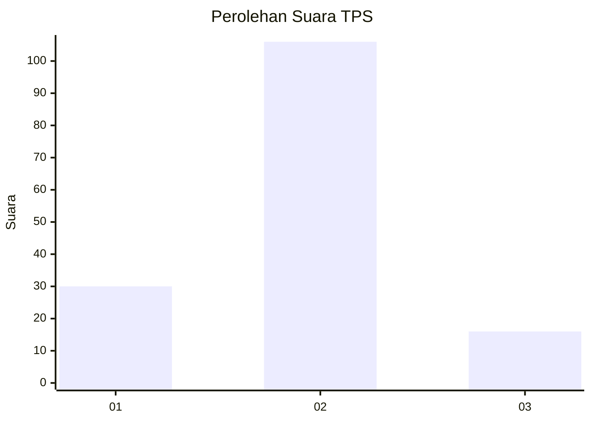
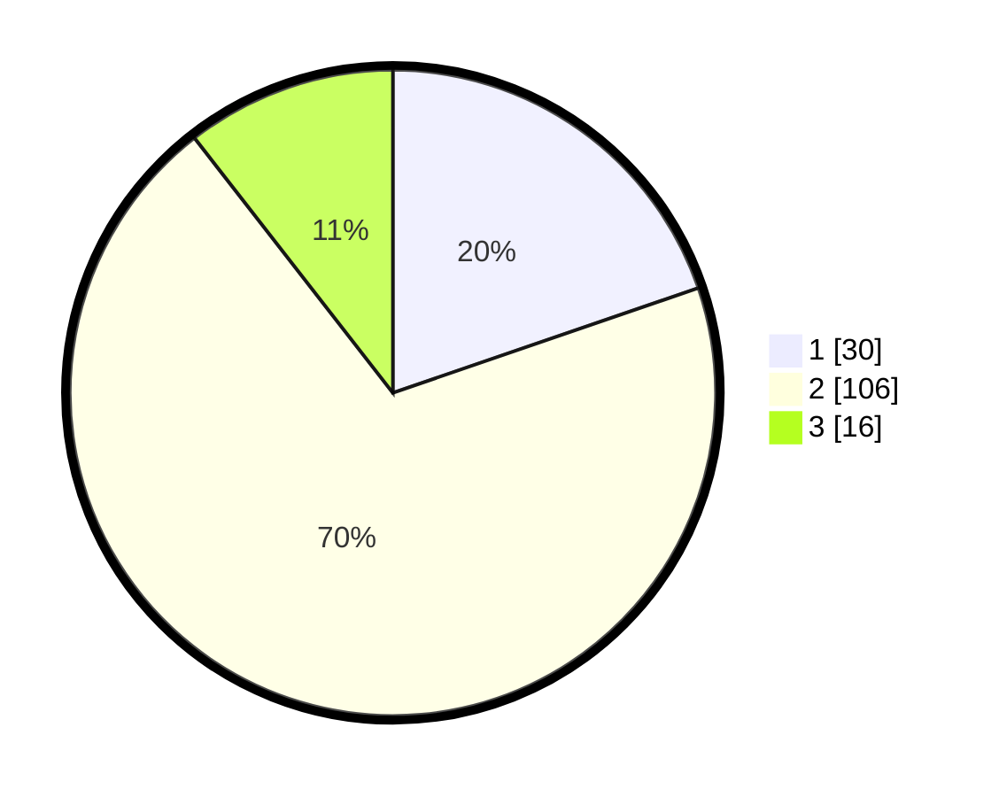

# Hasil

## Grafik

## Tabel

| No. | Nama Paslon    | Suara | Suara (raw) | Persentase |
|:--- |:-------------- | -----:| -----------:| ----------:|
| 1   | ANIES MUHAIMIN | 30    | [30][p-1]   | 19,74      |
| 2   | PRABOWO GIBRAN | 106   | [106][p-2]  | 69,74      |
| 3   | GANJAR MAHFUD  | 16    | [16][p-3]   | 10,53      |

[p-1]: https://github.com/gigit-pemilu/pemilu-2024-35-jawa-timur/blob/main/pilpres/hitung-suara/sub/35-jawa-timur/sub/09-jember/sub/21-sumbersari/sub/1006-wirolegi/sub/015-tps/sub/paslon-1.txt
[p-2]: https://github.com/gigit-pemilu/pemilu-2024-35-jawa-timur/blob/main/pilpres/hitung-suara/sub/35-jawa-timur/sub/09-jember/sub/21-sumbersari/sub/1006-wirolegi/sub/015-tps/sub/paslon-2.txt
[p-3]: https://github.com/gigit-pemilu/pemilu-2024-35-jawa-timur/blob/main/pilpres/hitung-suara/sub/35-jawa-timur/sub/09-jember/sub/21-sumbersari/sub/1006-wirolegi/sub/015-tps/sub/paslon-3.txt

## Foto C Plano

https://sirekap-obj-formc.kpu.go.id/6088/pemilu/ppwp/35/09/21/10/06/3509211006015-20240214-221621--ca654d4c-bb76-4c68-bcdf-d807382a441b.jpg

https://sirekap-obj-formc.kpu.go.id/6088/pemilu/ppwp/35/09/21/10/06/3509211006015-20240214-221712--6453ce7f-a75d-4128-9e98-93057388021d.jpg

https://sirekap-obj-formc.kpu.go.id/6088/pemilu/ppwp/35/09/21/10/06/3509211006015-20240214-221811--757c0f5c-d25e-4819-98e1-17f327c87034.jpg

## Metadata

| Key        | Value               |
| ---------- | ------------------- |
| Time Stamp | 2024-02-15 23:29:50 |

