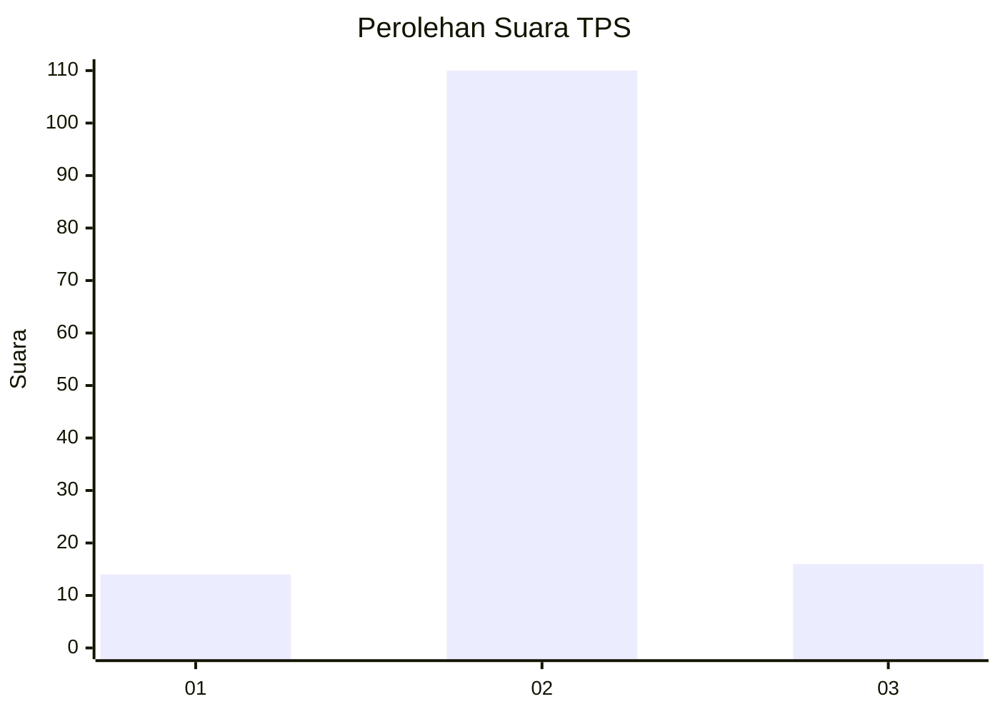
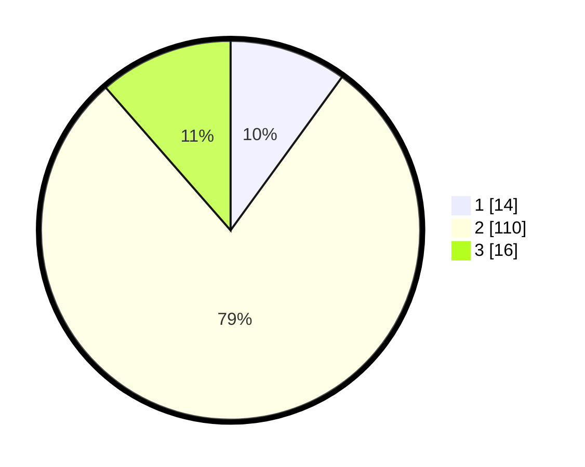

# Hasil

## Grafik

## Tabel

| No. | Nama Paslon    | Suara | Suara (raw) | Persentase |
|:--- |:-------------- | -----:| -----------:| ----------:|
| 1   | ANIES MUHAIMIN | 14    | [14][p-1]   | 10,00      |
| 2   | PRABOWO GIBRAN | 110   | [110][p-2]  | 78,57      |
| 3   | GANJAR MAHFUD  | 16    | [16][p-3]   | 11,43      |

[p-1]: https://github.com/gigit-pemilu/pemilu-2024-35-jawa-timur/blob/main/pilpres/hitung-suara/sub/35-jawa-timur/sub/09-jember/sub/21-sumbersari/sub/1006-wirolegi/sub/041-tps/sub/paslon-1.txt
[p-2]: https://github.com/gigit-pemilu/pemilu-2024-35-jawa-timur/blob/main/pilpres/hitung-suara/sub/35-jawa-timur/sub/09-jember/sub/21-sumbersari/sub/1006-wirolegi/sub/041-tps/sub/paslon-2.txt
[p-3]: https://github.com/gigit-pemilu/pemilu-2024-35-jawa-timur/blob/main/pilpres/hitung-suara/sub/35-jawa-timur/sub/09-jember/sub/21-sumbersari/sub/1006-wirolegi/sub/041-tps/sub/paslon-3.txt

## Foto C Plano

https://sirekap-obj-formc.kpu.go.id/bd14/pemilu/ppwp/35/09/21/10/06/3509211006041-20240214-141253--0e83ca0d-6bca-49bd-a807-a524f3bee83a.jpg

https://sirekap-obj-formc.kpu.go.id/bd14/pemilu/ppwp/35/09/21/10/06/3509211006041-20240214-141622--2281a8b4-8461-45ea-8cd7-7043e2978149.jpg

https://sirekap-obj-formc.kpu.go.id/bd14/pemilu/ppwp/35/09/21/10/06/3509211006041-20240214-141854--2d1a9c46-1578-4cf1-b0bc-15139b22d4de.jpg

## Metadata

| Key        | Value               |
| ---------- | ------------------- |
| Time Stamp | 2024-02-15 15:00:29 |

