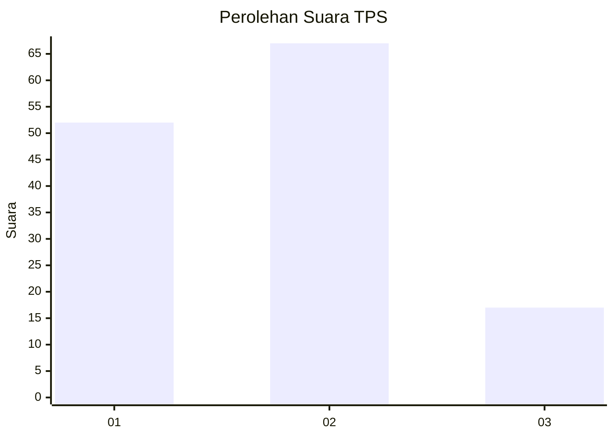
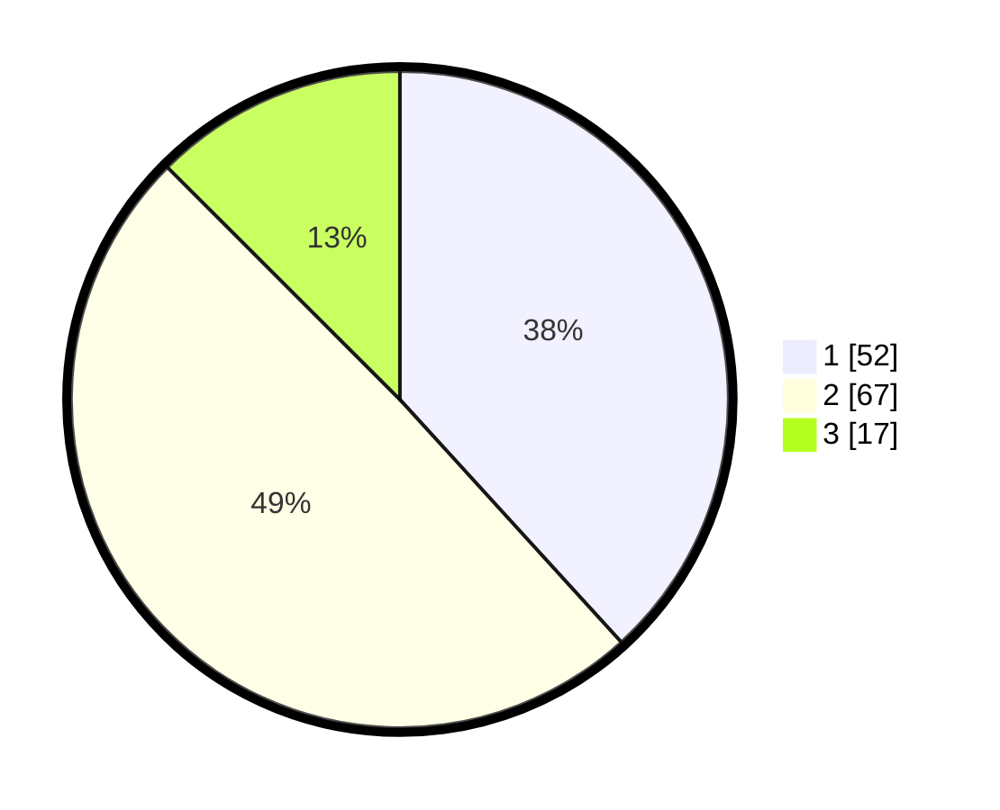

# Hasil

## Grafik

## Tabel

| No. | Nama Paslon    | Suara | Suara (raw) | Persentase |
|:--- |:-------------- | -----:| -----------:| ----------:|
| 1   | ANIES MUHAIMIN | 52    | [52][p-1]   | 38,24      |
| 2   | PRABOWO GIBRAN | 67    | [67][p-2]   | 49,26      |
| 3   | GANJAR MAHFUD  | 17    | [17][p-3]   | 12,50      |

[p-1]: https://github.com/gigit-pemilu/pemilu-2024/blob/main/pilpres/hitung-suara/sub/35-jawa-timur/sub/09-jember/sub/21-sumbersari/sub/1007-antirogo/sub/014-tps/sub/paslon-1.txt
[p-2]: https://github.com/gigit-pemilu/pemilu-2024/blob/main/pilpres/hitung-suara/sub/35-jawa-timur/sub/09-jember/sub/21-sumbersari/sub/1007-antirogo/sub/014-tps/sub/paslon-2.txt
[p-3]: https://github.com/gigit-pemilu/pemilu-2024/blob/main/pilpres/hitung-suara/sub/35-jawa-timur/sub/09-jember/sub/21-sumbersari/sub/1007-antirogo/sub/014-tps/sub/paslon-3.txt

## Foto C Plano

https://sirekap-obj-formc.kpu.go.id/7359/pemilu/ppwp/35/09/21/10/07/3509211007014-20240214-194634--199524ce-6e86-40ac-a66c-e005ec1686fa.jpg

https://sirekap-obj-formc.kpu.go.id/7359/pemilu/ppwp/35/09/21/10/07/3509211007014-20240214-194905--11c26348-6dcc-4e9f-a0a7-ff70d636b7cc.jpg

https://sirekap-obj-formc.kpu.go.id/7359/pemilu/ppwp/35/09/21/10/07/3509211007014-20240214-200945--a3e5c637-be82-4b3d-a7b4-6f8dca3a9fe0.jpg

## Metadata

| Key        | Value               |
| ---------- | ------------------- |
| Time Stamp | 2024-02-25 12:00:00 |

