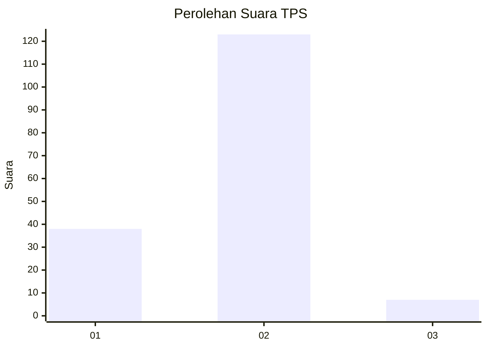
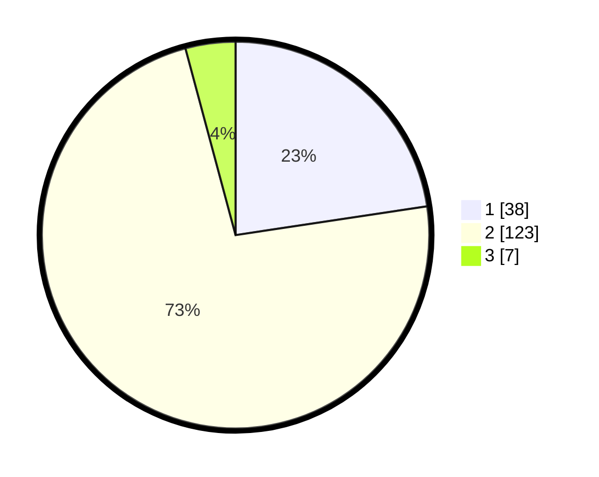

# Hasil

## Grafik

## Tabel

| No. | Nama Paslon    | Suara | Suara (raw) | Persentase |
|:--- |:-------------- | -----:| -----------:| ----------:|
| 1   | ANIES MUHAIMIN | 38    | [38][p-1]   | 22,62      |
| 2   | PRABOWO GIBRAN | 123   | [123][p-2]  | 73,21      |
| 3   | GANJAR MAHFUD  | 7     | [7][p-3]    | 4,17       |

[p-1]: https://github.com/gigit-pemilu/pemilu-2024-35-jawa-timur/blob/main/pilpres/hitung-suara/sub/35-jawa-timur/sub/09-jember/sub/21-sumbersari/sub/1007-antirogo/sub/016-tps/sub/paslon-1.txt
[p-2]: https://github.com/gigit-pemilu/pemilu-2024-35-jawa-timur/blob/main/pilpres/hitung-suara/sub/35-jawa-timur/sub/09-jember/sub/21-sumbersari/sub/1007-antirogo/sub/016-tps/sub/paslon-2.txt
[p-3]: https://github.com/gigit-pemilu/pemilu-2024-35-jawa-timur/blob/main/pilpres/hitung-suara/sub/35-jawa-timur/sub/09-jember/sub/21-sumbersari/sub/1007-antirogo/sub/016-tps/sub/paslon-3.txt

## Foto C Plano

https://sirekap-obj-formc.kpu.go.id/ccca/pemilu/ppwp/35/09/21/10/07/3509211007016-20240214-221824--b8617d4b-9288-4872-b332-fdf5596fccc9.jpg

https://sirekap-obj-formc.kpu.go.id/ccca/pemilu/ppwp/35/09/21/10/07/3509211007016-20240214-222148--598a49a2-6cf7-43a4-afbf-d61565013c3e.jpg

## Metadata

| Key        | Value               |
| ---------- | ------------------- |
| Time Stamp | 2024-02-25 18:00:00 |

