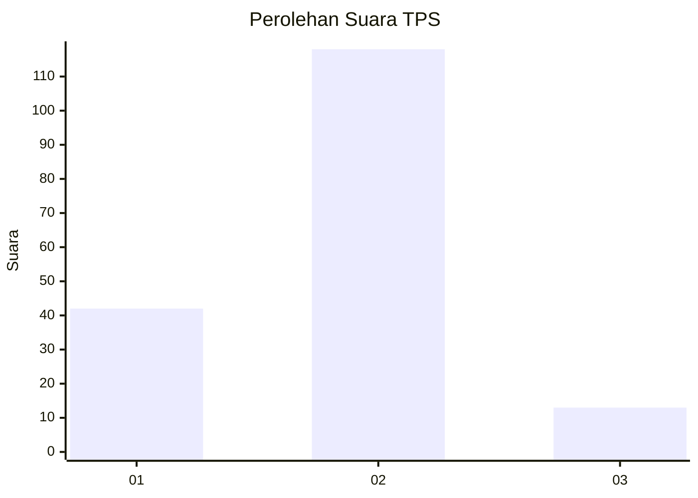
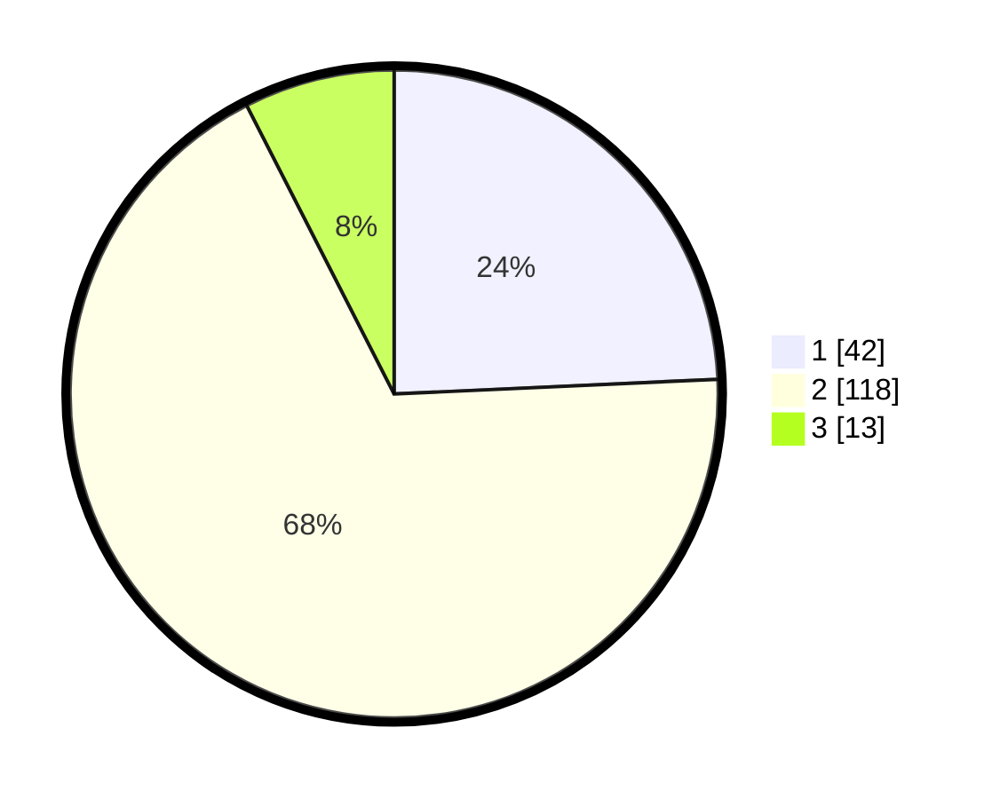

# Hasil

## Grafik

## Tabel

| No. | Nama Paslon    | Suara | Suara (raw) | Persentase |
|:--- |:-------------- | -----:| -----------:| ----------:|
| 1   | ANIES MUHAIMIN | 42    | [42][p-1]   | 24,28      |
| 2   | PRABOWO GIBRAN | 118   | [118][p-2]  | 68,21      |
| 3   | GANJAR MAHFUD  | 13    | [13][p-3]   | 7,51       |

[p-1]: https://github.com/gigit-pemilu/pemilu-2024/blob/main/pilpres/hitung-suara/sub/35-jawa-timur/sub/09-jember/sub/21-sumbersari/sub/1007-antirogo/sub/025-tps/sub/paslon-1.txt
[p-2]: https://github.com/gigit-pemilu/pemilu-2024/blob/main/pilpres/hitung-suara/sub/35-jawa-timur/sub/09-jember/sub/21-sumbersari/sub/1007-antirogo/sub/025-tps/sub/paslon-2.txt
[p-3]: https://github.com/gigit-pemilu/pemilu-2024/blob/main/pilpres/hitung-suara/sub/35-jawa-timur/sub/09-jember/sub/21-sumbersari/sub/1007-antirogo/sub/025-tps/sub/paslon-3.txt

## Foto C Plano

https://sirekap-obj-formc.kpu.go.id/61c2/pemilu/ppwp/35/09/21/10/07/3509211007025-20240215-072332--eaa43e7d-ce71-4969-9694-253aea3f512f.jpg

https://sirekap-obj-formc.kpu.go.id/61c2/pemilu/ppwp/35/09/21/10/07/3509211007025-20240215-072412--5af11a87-39b8-487e-9e78-cab193b97c92.jpg

https://sirekap-obj-formc.kpu.go.id/61c2/pemilu/ppwp/35/09/21/10/07/3509211007025-20240215-072731--8facca0b-0a06-4652-bae4-ab8f59459940.jpg

## Metadata

| Key        | Value               |
| ---------- | ------------------- |
| Time Stamp | 2024-02-15 15:00:29 |

