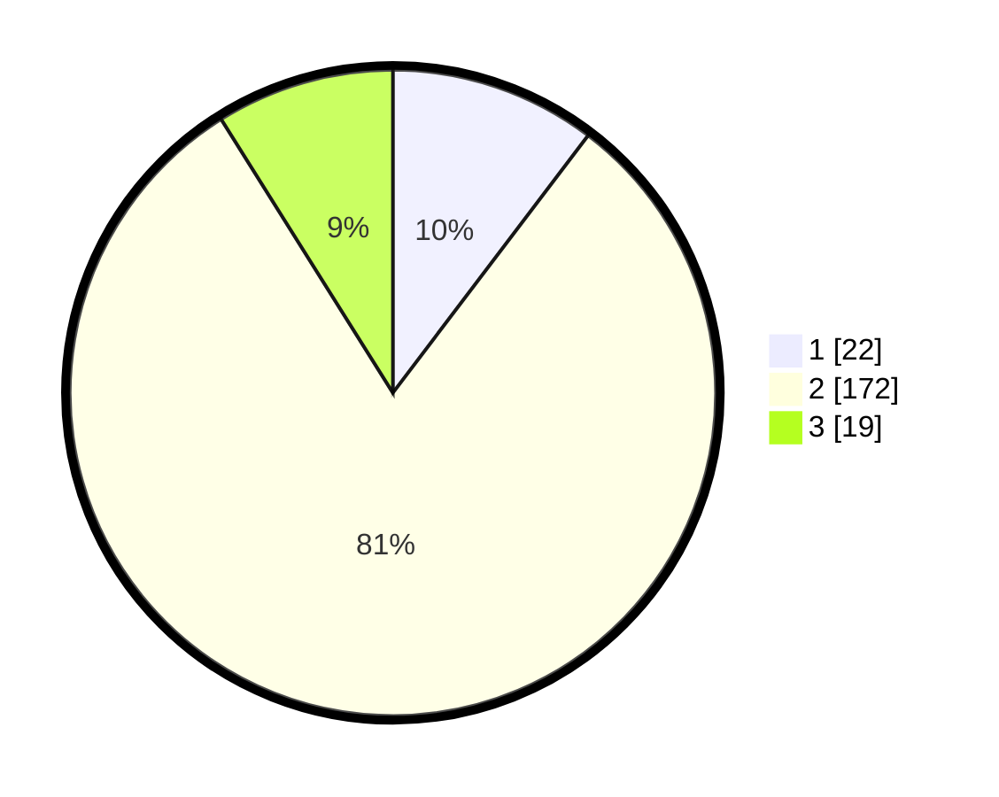

# Hasil

## Grafik

## Tabel

| No. | Nama Paslon    | Suara | Suara (raw) | Persentase |
|:--- |:-------------- | -----:| -----------:| ----------:|
| 1   | ANIES MUHAIMIN | 22    | [22][p-1]   | 10,33      |
| 2   | PRABOWO GIBRAN | 172   | [172][p-2]  | 80,75      |
| 3   | GANJAR MAHFUD  | 19    | [19][p-3]   | 8,92       |

[p-1]: https://github.com/gigit-pemilu/pemilu-2024/blob/main/pilpres/hitung-suara/sub/35-jawa-timur/sub/09-jember/sub/22-arjasa/sub/2003-arjasa/sub/001-tps/sub/paslon-1.txt
[p-2]: https://github.com/gigit-pemilu/pemilu-2024/blob/main/pilpres/hitung-suara/sub/35-jawa-timur/sub/09-jember/sub/22-arjasa/sub/2003-arjasa/sub/001-tps/sub/paslon-2.txt
[p-3]: https://github.com/gigit-pemilu/pemilu-2024/blob/main/pilpres/hitung-suara/sub/35-jawa-timur/sub/09-jember/sub/22-arjasa/sub/2003-arjasa/sub/001-tps/sub/paslon-3.txt

## Foto C Plano

https://sirekap-obj-formc.kpu.go.id/0ca0/pemilu/ppwp/35/09/22/20/03/3509222003001-20240218-200456--f044d146-285f-42b5-af18-3497f0d80fab.jpg

https://sirekap-obj-formc.kpu.go.id/0ca0/pemilu/ppwp/35/09/22/20/03/3509222003001-20240218-212952--778f65ce-1c54-47a5-8496-def236385a08.jpg

https://sirekap-obj-formc.kpu.go.id/0ca0/pemilu/ppwp/35/09/22/20/03/3509222003001-20240218-213259--755f5d9b-acaa-4a2a-9151-af114705a081.jpg

## Metadata

| Key        | Value               |
| ---------- | ------------------- |
| Time Stamp | 2024-02-22 01:00:00 |

