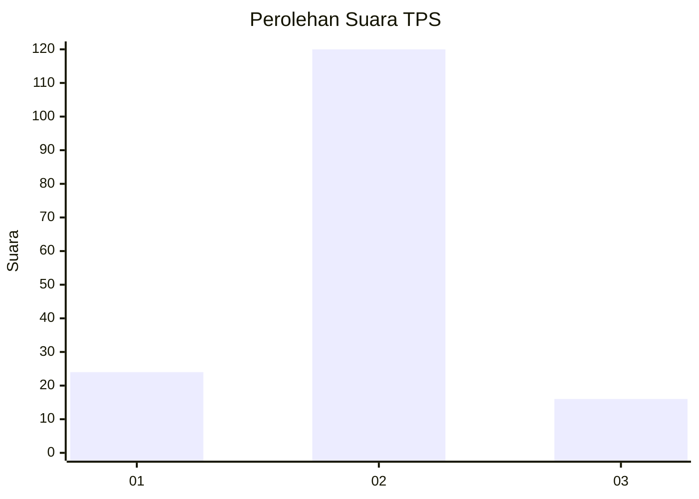
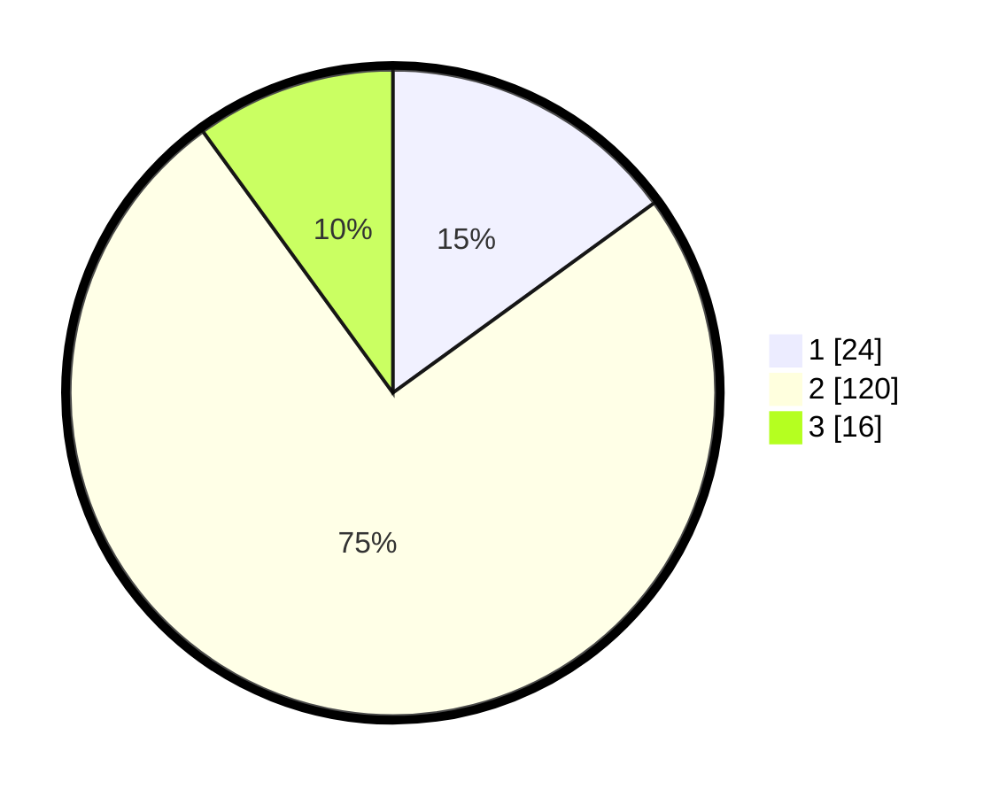

# Hasil

## Grafik

## Tabel

| No. | Nama Paslon    | Suara | Suara (raw) | Persentase |
|:--- |:-------------- | -----:| -----------:| ----------:|
| 1   | ANIES MUHAIMIN | 24    | [24][p-1]   | 15,00      |
| 2   | PRABOWO GIBRAN | 120   | [120][p-2]  | 75,00      |
| 3   | GANJAR MAHFUD  | 16    | [16][p-3]   | 10,00      |

[p-1]: https://github.com/gigit-pemilu/pemilu-2024-35-jawa-timur/blob/main/pilpres/hitung-suara/sub/35-jawa-timur/sub/09-jember/sub/22-arjasa/sub/2003-arjasa/sub/002-tps/sub/paslon-1.txt
[p-2]: https://github.com/gigit-pemilu/pemilu-2024-35-jawa-timur/blob/main/pilpres/hitung-suara/sub/35-jawa-timur/sub/09-jember/sub/22-arjasa/sub/2003-arjasa/sub/002-tps/sub/paslon-2.txt
[p-3]: https://github.com/gigit-pemilu/pemilu-2024-35-jawa-timur/blob/main/pilpres/hitung-suara/sub/35-jawa-timur/sub/09-jember/sub/22-arjasa/sub/2003-arjasa/sub/002-tps/sub/paslon-3.txt

## Foto C Plano

https://sirekap-obj-formc.kpu.go.id/303c/pemilu/ppwp/35/09/22/20/03/3509222003002-20240215-030744--7c5c7422-65c4-46bc-b4cd-56db749f82ce.jpg

https://sirekap-obj-formc.kpu.go.id/303c/pemilu/ppwp/35/09/22/20/03/3509222003002-20240215-030808--091ff380-4722-413d-b510-d76379ad7033.jpg

https://sirekap-obj-formc.kpu.go.id/303c/pemilu/ppwp/35/09/22/20/03/3509222003002-20240215-030855--690d6396-d013-49f2-a219-cf3f96133279.jpg

## Metadata

| Key        | Value               |
| ---------- | ------------------- |
| Time Stamp | 2024-02-25 12:00:00 |

