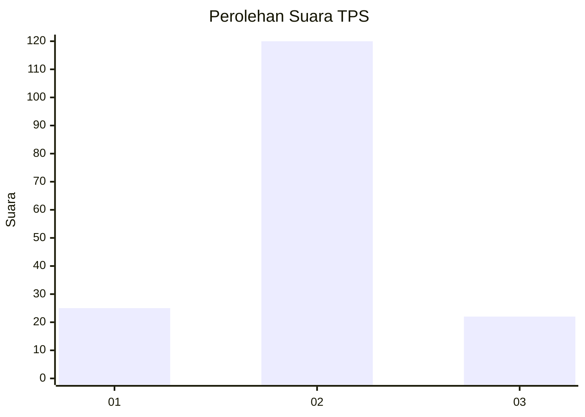
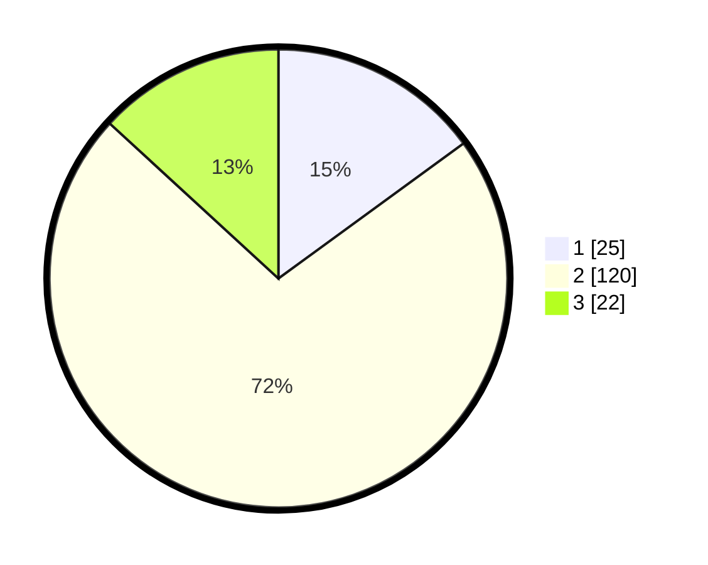

# Hasil

## Grafik

## Tabel

| No. | Nama Paslon    | Suara | Suara (raw) | Persentase |
|:--- |:-------------- | -----:| -----------:| ----------:|
| 1   | ANIES MUHAIMIN | 25    | [25][p-1]   | 14,97      |
| 2   | PRABOWO GIBRAN | 120   | [120][p-2]  | 71,86      |
| 3   | GANJAR MAHFUD  | 22    | [22][p-3]   | 13,17      |

[p-1]: https://github.com/gigit-pemilu/pemilu-2024-35-jawa-timur/blob/main/pilpres/hitung-suara/sub/35-jawa-timur/sub/09-jember/sub/22-arjasa/sub/2003-arjasa/sub/004-tps/sub/paslon-1.txt
[p-2]: https://github.com/gigit-pemilu/pemilu-2024-35-jawa-timur/blob/main/pilpres/hitung-suara/sub/35-jawa-timur/sub/09-jember/sub/22-arjasa/sub/2003-arjasa/sub/004-tps/sub/paslon-2.txt
[p-3]: https://github.com/gigit-pemilu/pemilu-2024-35-jawa-timur/blob/main/pilpres/hitung-suara/sub/35-jawa-timur/sub/09-jember/sub/22-arjasa/sub/2003-arjasa/sub/004-tps/sub/paslon-3.txt

## Foto C Plano

https://sirekap-obj-formc.kpu.go.id/959b/pemilu/ppwp/35/09/22/20/03/3509222003004-20240222-101028--5c6001d0-88a7-4753-8b78-52d694cbecc2.jpg

https://sirekap-obj-formc.kpu.go.id/959b/pemilu/ppwp/35/09/22/20/03/3509222003004-20240223-013542--143a65b4-ff62-48dc-965c-bbf89e0a85ce.jpg

https://sirekap-obj-formc.kpu.go.id/959b/pemilu/ppwp/35/09/22/20/03/3509222003004-20240223-013541--c0aa0c62-3ef0-4ac6-8985-d38234cdb7b6.jpg

## Metadata

| Key        | Value               |
| ---------- | ------------------- |
| Time Stamp | 2024-02-24 22:31:28 |

## DATA PEMILIH TETAP

Jumlah pemilih dalam DPT: **77**.
 * L: **0**.
 * P: **0**.

## DATA PENGGUNA HAK PILIH

Jumlah pengguna hak pilih dalam DPT: **77**.
 * L: **600**.
 * P: **5**.

Jumlah pengguna hak pilih dalam DPTb: **449**.
 * L: **655**.
 * P: **521**.

Jumlah pengguna hak pilih dalam DPK: **0**.
 * L: **620**.
 * P: **0**.

Jumlah pengguna hak pilih: **7**.
 * L: **0**.
 * P: **0**.

## JUMLAH SUARA SAH DAN TIDAK SAH

JUMLAH SELURUH SUARA SAH: **167**.

JUMLAH SUARA TIDAK SAH: **4**.

JUMLAH SELURUH SUARA SAH DAN SUARA TIDAK SAH: **171**.

