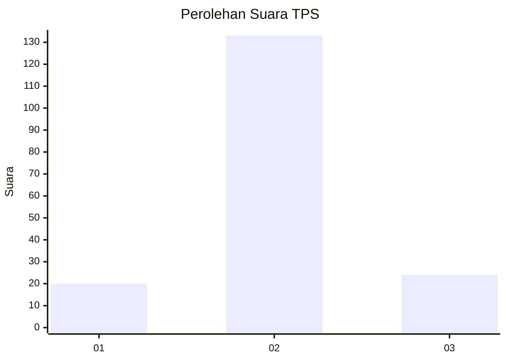
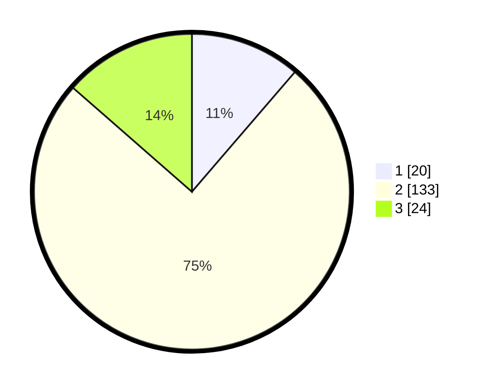

# Hasil

## Grafik

## Tabel

| No. | Nama Paslon    | Suara | Suara (raw) | Persentase |
|:--- |:-------------- | -----:| -----------:| ----------:|
| 1   | ANIES MUHAIMIN | 20    | [20][p-1]   | 11,30      |
| 2   | PRABOWO GIBRAN | 133   | [133][p-2]  | 75,14      |
| 3   | GANJAR MAHFUD  | 24    | [24][p-3]   | 13,56      |

[p-1]: https://github.com/gigit-pemilu/pemilu-2024-35-jawa-timur/blob/main/pilpres/hitung-suara/sub/35-jawa-timur/sub/09-jember/sub/22-arjasa/sub/2003-arjasa/sub/018-tps/sub/paslon-1.txt
[p-2]: https://github.com/gigit-pemilu/pemilu-2024-35-jawa-timur/blob/main/pilpres/hitung-suara/sub/35-jawa-timur/sub/09-jember/sub/22-arjasa/sub/2003-arjasa/sub/018-tps/sub/paslon-2.txt
[p-3]: https://github.com/gigit-pemilu/pemilu-2024-35-jawa-timur/blob/main/pilpres/hitung-suara/sub/35-jawa-timur/sub/09-jember/sub/22-arjasa/sub/2003-arjasa/sub/018-tps/sub/paslon-3.txt

## Foto C Plano

https://sirekap-obj-formc.kpu.go.id/178b/pemilu/ppwp/35/09/22/20/03/3509222003018-20240218-200051--b8e1b983-0b46-4460-971e-ca394e39f449.jpg

https://sirekap-obj-formc.kpu.go.id/178b/pemilu/ppwp/35/09/22/20/03/3509222003018-20240220-233707--899dade4-e975-4880-9062-1abe1014f2b1.jpg

https://sirekap-obj-formc.kpu.go.id/178b/pemilu/ppwp/35/09/22/20/03/3509222003018-20240220-233935--c8ca6ee6-03f0-49bb-9a84-2db260da0bf7.jpg

## Metadata

| Key        | Value               |
| ---------- | ------------------- |
| Time Stamp | 2024-02-24 22:31:28 |

