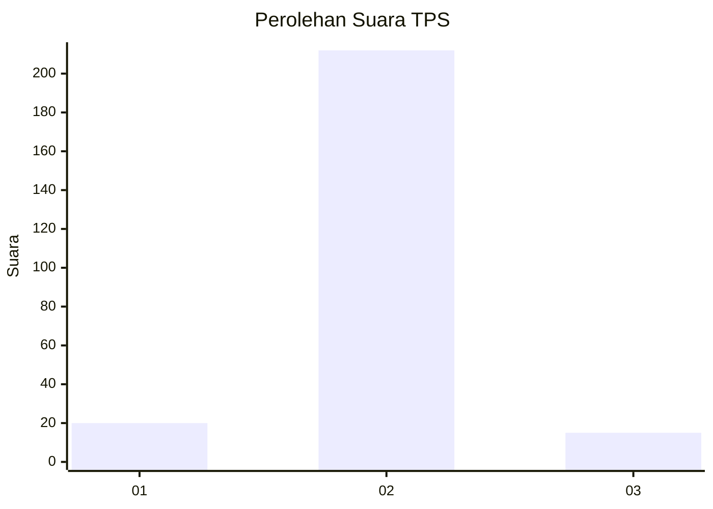
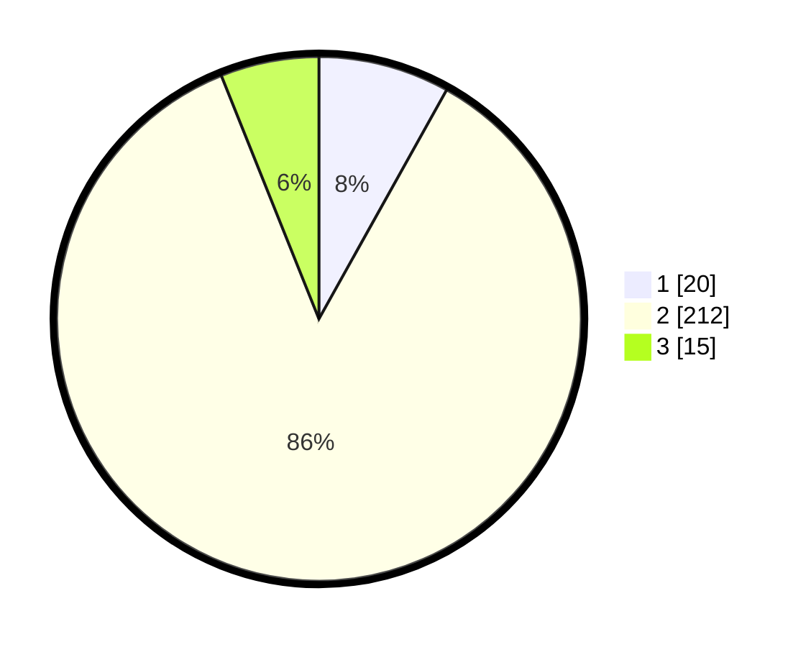

# Hasil

## Grafik

## Tabel

| No. | Nama Paslon    | Suara | Suara (raw) | Persentase |
|:--- |:-------------- | -----:| -----------:| ----------:|
| 1   | ANIES MUHAIMIN | 20    | [20][p-1]   | 8,10       |
| 2   | PRABOWO GIBRAN | 212   | [212][p-2]  | 85,83      |
| 3   | GANJAR MAHFUD  | 15    | [15][p-3]   | 6,07       |

[p-1]: https://github.com/gigit-pemilu/pemilu-2024-35-jawa-timur/blob/main/pilpres/hitung-suara/sub/35-jawa-timur/sub/09-jember/sub/22-arjasa/sub/2005-biting/sub/002-tps/sub/paslon-1.txt
[p-2]: https://github.com/gigit-pemilu/pemilu-2024-35-jawa-timur/blob/main/pilpres/hitung-suara/sub/35-jawa-timur/sub/09-jember/sub/22-arjasa/sub/2005-biting/sub/002-tps/sub/paslon-2.txt
[p-3]: https://github.com/gigit-pemilu/pemilu-2024-35-jawa-timur/blob/main/pilpres/hitung-suara/sub/35-jawa-timur/sub/09-jember/sub/22-arjasa/sub/2005-biting/sub/002-tps/sub/paslon-3.txt

## Foto C Plano

https://sirekap-obj-formc.kpu.go.id/68b4/pemilu/ppwp/35/09/22/20/05/3509222005002-20240214-221104--3f666fd4-e11b-4f0b-ae8c-4cf5729bc396.jpg

https://sirekap-obj-formc.kpu.go.id/68b4/pemilu/ppwp/35/09/22/20/05/3509222005002-20240214-221416--a28e97ee-3c5e-4116-9da1-e0ae5bd6143e.jpg

https://sirekap-obj-formc.kpu.go.id/68b4/pemilu/ppwp/35/09/22/20/05/3509222005002-20240214-234632--a9d39cef-b675-47bc-9f54-68853d21d601.jpg

## Metadata

| Key        | Value               |
| ---------- | ------------------- |
| Time Stamp | 2024-02-15 15:30:25 |

