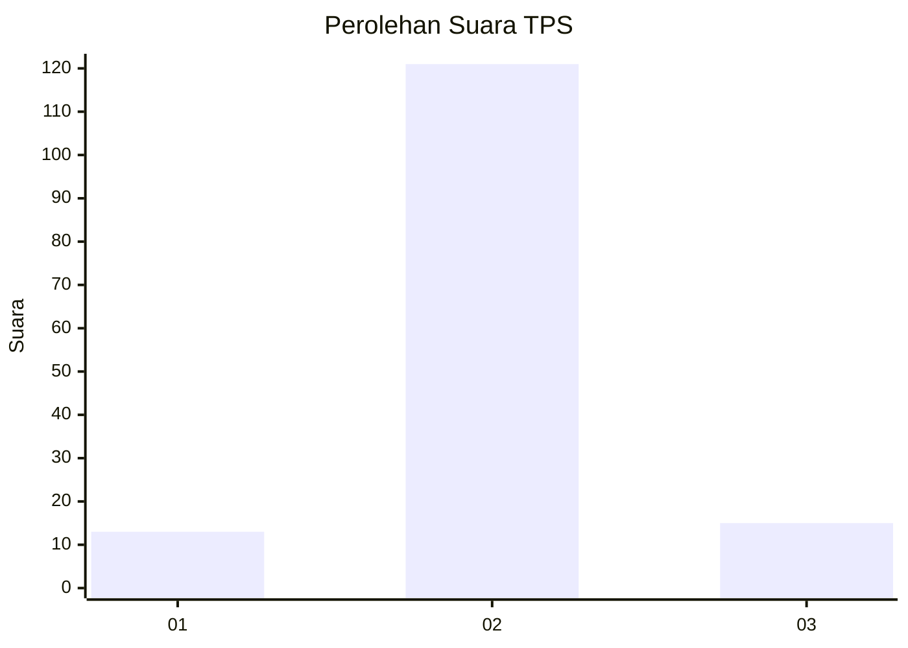
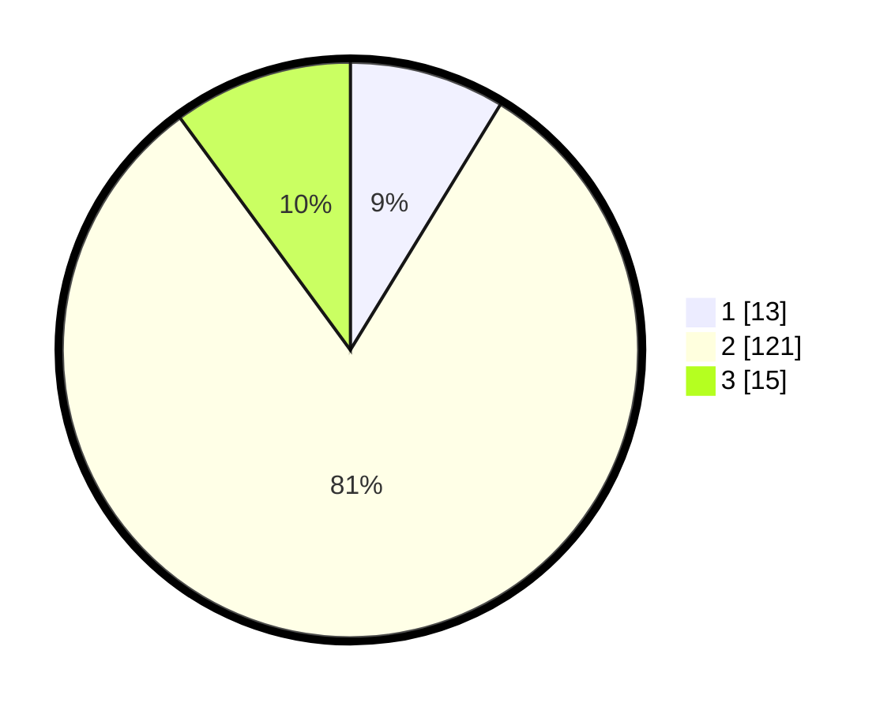

# Hasil

## Grafik

## Tabel

| No. | Nama Paslon    | Suara | Suara (raw) | Persentase |
|:--- |:-------------- | -----:| -----------:| ----------:|
| 1   | ANIES MUHAIMIN | 13    | [13][p-1]   | 8,72       |
| 2   | PRABOWO GIBRAN | 121   | [121][p-2]  | 81,21      |
| 3   | GANJAR MAHFUD  | 15    | [15][p-3]   | 10,07      |

[p-1]: https://github.com/gigit-pemilu/pemilu-2024/blob/main/pilpres/hitung-suara/sub/35-jawa-timur/sub/09-jember/sub/22-arjasa/sub/2005-biting/sub/005-tps/sub/paslon-1.txt
[p-2]: https://github.com/gigit-pemilu/pemilu-2024/blob/main/pilpres/hitung-suara/sub/35-jawa-timur/sub/09-jember/sub/22-arjasa/sub/2005-biting/sub/005-tps/sub/paslon-2.txt
[p-3]: https://github.com/gigit-pemilu/pemilu-2024/blob/main/pilpres/hitung-suara/sub/35-jawa-timur/sub/09-jember/sub/22-arjasa/sub/2005-biting/sub/005-tps/sub/paslon-3.txt

## Foto C Plano

https://sirekap-obj-formc.kpu.go.id/7f63/pemilu/ppwp/35/09/22/20/05/3509222005005-20240215-005504--968cde4a-8177-404b-bfba-335e501298b5.jpg

https://sirekap-obj-formc.kpu.go.id/7f63/pemilu/ppwp/35/09/22/20/05/3509222005005-20240215-005648--72961f38-adcd-492b-bb01-21fd65031992.jpg

https://sirekap-obj-formc.kpu.go.id/7f63/pemilu/ppwp/35/09/22/20/05/3509222005005-20240215-005830--3a1eb25e-82bd-4244-a25a-7c0c6d71884a.jpg

## Metadata

| Key        | Value               |
| ---------- | ------------------- |
| Time Stamp | 2024-02-24 23:00:00 |

