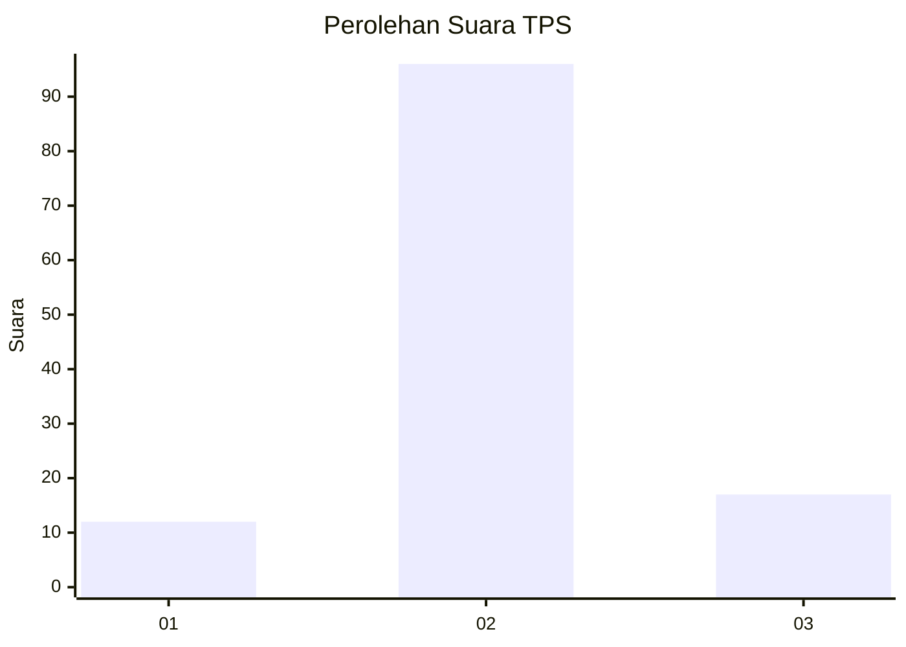
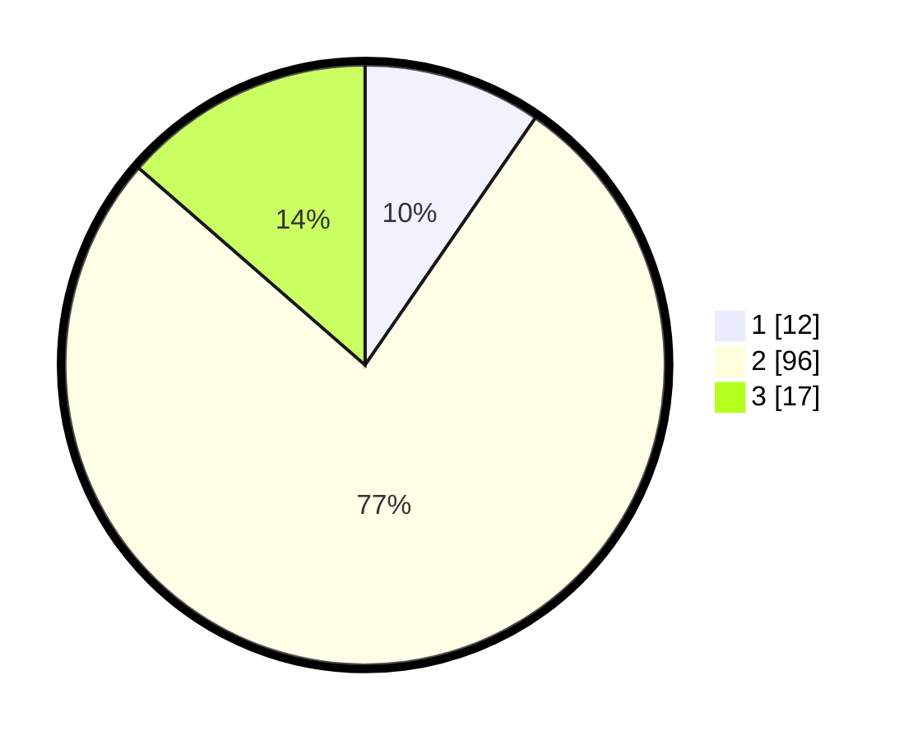

# Hasil

## Grafik

## Tabel

| No. | Nama Paslon    | Suara | Suara (raw) | Persentase |
|:--- |:-------------- | -----:| -----------:| ----------:|
| 1   | ANIES MUHAIMIN | 12    | [12][p-1]   | 9,60       |
| 2   | PRABOWO GIBRAN | 96    | [96][p-2]   | 76,80      |
| 3   | GANJAR MAHFUD  | 17    | [17][p-3]   | 13,60      |

[p-1]: https://github.com/gigit-pemilu/pemilu-2024-35-jawa-timur/blob/main/pilpres/hitung-suara/sub/35-jawa-timur/sub/09-jember/sub/22-arjasa/sub/2005-biting/sub/007-tps/sub/paslon-1.txt
[p-2]: https://github.com/gigit-pemilu/pemilu-2024-35-jawa-timur/blob/main/pilpres/hitung-suara/sub/35-jawa-timur/sub/09-jember/sub/22-arjasa/sub/2005-biting/sub/007-tps/sub/paslon-2.txt
[p-3]: https://github.com/gigit-pemilu/pemilu-2024-35-jawa-timur/blob/main/pilpres/hitung-suara/sub/35-jawa-timur/sub/09-jember/sub/22-arjasa/sub/2005-biting/sub/007-tps/sub/paslon-3.txt

## Foto C Plano

https://sirekap-obj-formc.kpu.go.id/d787/pemilu/ppwp/35/09/22/20/05/3509222005007-20240214-231334--fbe7568c-726b-4f5e-99ba-07aab9761ffe.jpg

https://sirekap-obj-formc.kpu.go.id/d787/pemilu/ppwp/35/09/22/20/05/3509222005007-20240214-232226--5a329982-fe13-4293-b622-909e58157b39.jpg

https://sirekap-obj-formc.kpu.go.id/d787/pemilu/ppwp/35/09/22/20/05/3509222005007-20240214-232328--e575a0dc-664c-4535-b03e-ada4486488b6.jpg

## Metadata

| Key        | Value               |
| ---------- | ------------------- |
| Time Stamp | 2024-02-25 11:00:00 |

