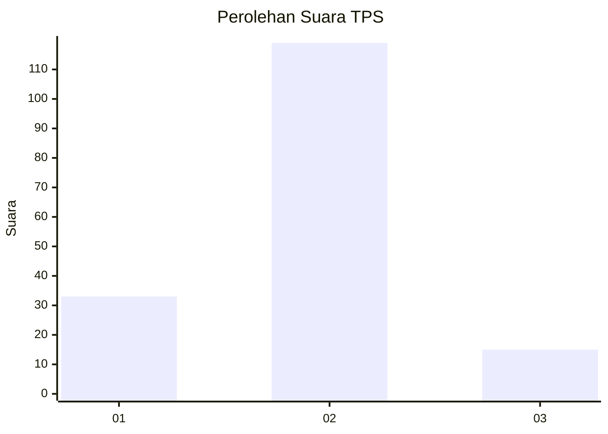

# Hasil

## Grafik

## Tabel

| No. | Nama Paslon    | Suara | Suara (raw) | Persentase |
|:--- |:-------------- | -----:| -----------:| ----------:|
| 1   | ANIES MUHAIMIN | 33    | [33][p-1]   | 19,76      |
| 2   | PRABOWO GIBRAN | 119   | [119][p-2]  | 71,26      |
| 3   | GANJAR MAHFUD  | 15    | [15][p-3]   | 8,98       |

[p-1]: https://github.com/gigit-pemilu/pemilu-2024-35-jawa-timur/blob/main/pilpres/hitung-suara/sub/35-jawa-timur/sub/09-jember/sub/22-arjasa/sub/2005-biting/sub/010-tps/sub/paslon-1.txt
[p-2]: https://github.com/gigit-pemilu/pemilu-2024-35-jawa-timur/blob/main/pilpres/hitung-suara/sub/35-jawa-timur/sub/09-jember/sub/22-arjasa/sub/2005-biting/sub/010-tps/sub/paslon-2.txt
[p-3]: https://github.com/gigit-pemilu/pemilu-2024-35-jawa-timur/blob/main/pilpres/hitung-suara/sub/35-jawa-timur/sub/09-jember/sub/22-arjasa/sub/2005-biting/sub/010-tps/sub/paslon-3.txt

## Foto C Plano

https://sirekap-obj-formc.kpu.go.id/37ec/pemilu/ppwp/35/09/22/20/05/3509222005010-20240214-234057--7cf2f19f-eb67-49d6-8c9b-4ee555941de6.jpg

https://sirekap-obj-formc.kpu.go.id/37ec/pemilu/ppwp/35/09/22/20/05/3509222005010-20240215-022244--896322bf-41a2-47be-b5f0-ecf0186b59f5.jpg

https://sirekap-obj-formc.kpu.go.id/37ec/pemilu/ppwp/35/09/22/20/05/3509222005010-20240215-024152--6c5fa46b-a8af-4518-b54e-80bbe32a56b5.jpg

## Metadata

| Key        | Value               |
| ---------- | ------------------- |
| Time Stamp | 2024-02-15 16:00:26 |

