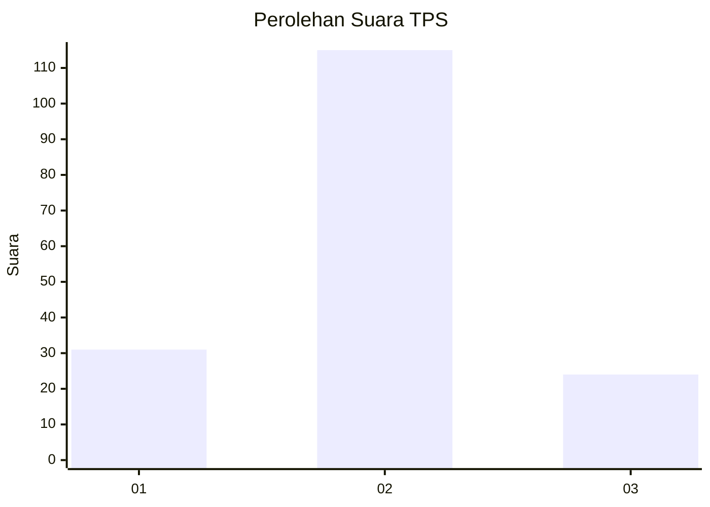
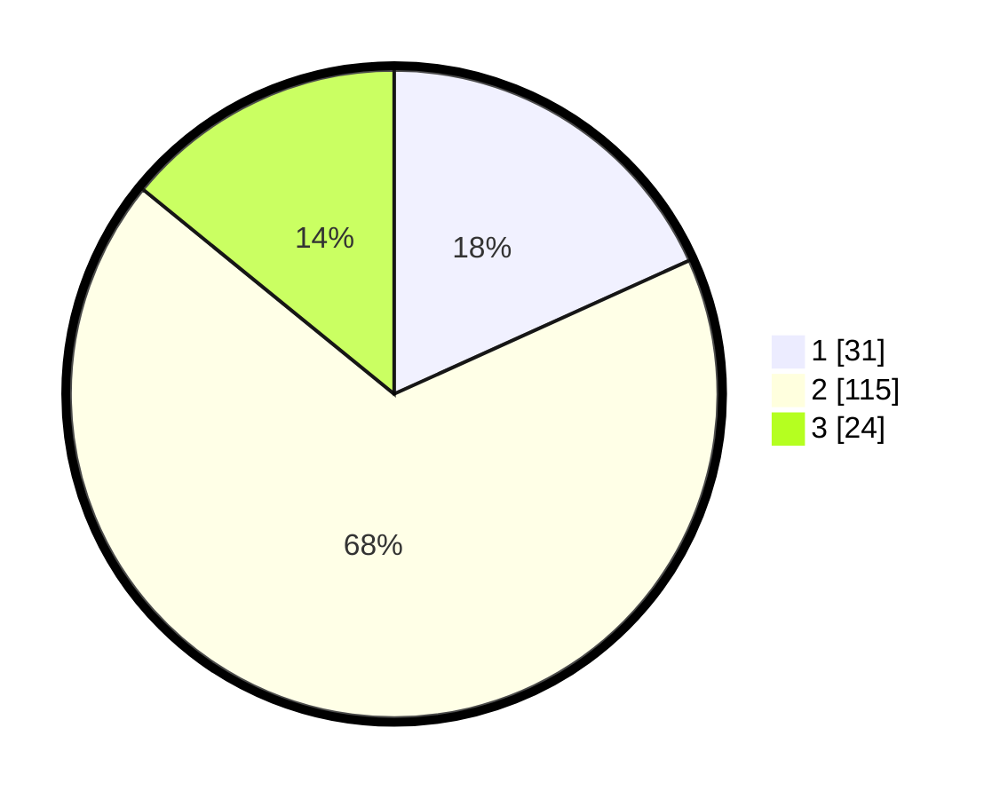

# Hasil

## Grafik

## Tabel

| No. | Nama Paslon    | Suara | Suara (raw) | Persentase |
|:--- |:-------------- | -----:| -----------:| ----------:|
| 1   | ANIES MUHAIMIN | 31    | [31][p-1]   | 18,24      |
| 2   | PRABOWO GIBRAN | 115   | [115][p-2]  | 67,65      |
| 3   | GANJAR MAHFUD  | 24    | [24][p-3]   | 14,12      |

[p-1]: https://github.com/gigit-pemilu/pemilu-2024/blob/main/pilpres/hitung-suara/sub/35-jawa-timur/sub/09-jember/sub/22-arjasa/sub/2005-biting/sub/012-tps/sub/paslon-1.txt
[p-2]: https://github.com/gigit-pemilu/pemilu-2024/blob/main/pilpres/hitung-suara/sub/35-jawa-timur/sub/09-jember/sub/22-arjasa/sub/2005-biting/sub/012-tps/sub/paslon-2.txt
[p-3]: https://github.com/gigit-pemilu/pemilu-2024/blob/main/pilpres/hitung-suara/sub/35-jawa-timur/sub/09-jember/sub/22-arjasa/sub/2005-biting/sub/012-tps/sub/paslon-3.txt

## Foto C Plano

https://sirekap-obj-formc.kpu.go.id/d4b2/pemilu/ppwp/35/09/22/20/05/3509222005012-20240215-005218--0b3adb16-8b07-47ad-9f5b-f0c9e0e0936e.jpg

https://sirekap-obj-formc.kpu.go.id/d4b2/pemilu/ppwp/35/09/22/20/05/3509222005012-20240215-004905--1266e636-55ce-4a25-88cf-8cc1629d8c6d.jpg

https://sirekap-obj-formc.kpu.go.id/d4b2/pemilu/ppwp/35/09/22/20/05/3509222005012-20240215-005445--ac394d83-58a4-44b9-875b-4fc404dafd7e.jpg

## Metadata

| Key        | Value               |
| ---------- | ------------------- |
| Time Stamp | 2024-02-25 15:00:00 |

