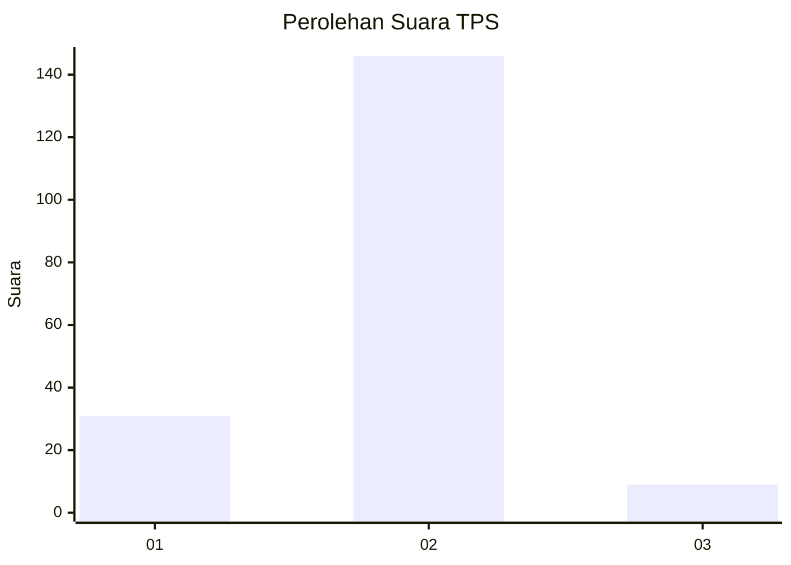
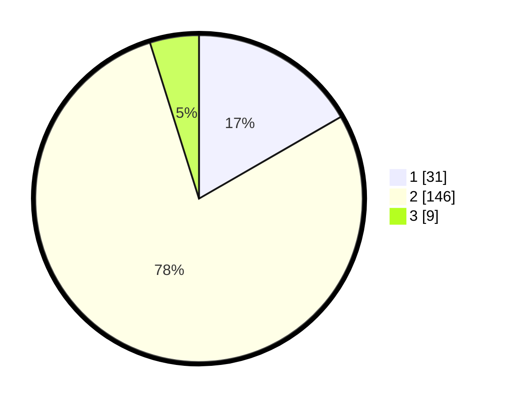

# Hasil

## Grafik

## Tabel

| No. | Nama Paslon    | Suara | Suara (raw) | Persentase |
|:--- |:-------------- | -----:| -----------:| ----------:|
| 1   | ANIES MUHAIMIN | 31    | [31][p-1]   | 16,67      |
| 2   | PRABOWO GIBRAN | 146   | [146][p-2]  | 78,49      |
| 3   | GANJAR MAHFUD  | 9     | [9][p-3]    | 4,84       |

[p-1]: https://github.com/gigit-pemilu/pemilu-2024/blob/main/pilpres/hitung-suara/sub/35-jawa-timur/sub/09-jember/sub/22-arjasa/sub/2005-biting/sub/017-tps/sub/paslon-1.txt
[p-2]: https://github.com/gigit-pemilu/pemilu-2024/blob/main/pilpres/hitung-suara/sub/35-jawa-timur/sub/09-jember/sub/22-arjasa/sub/2005-biting/sub/017-tps/sub/paslon-2.txt
[p-3]: https://github.com/gigit-pemilu/pemilu-2024/blob/main/pilpres/hitung-suara/sub/35-jawa-timur/sub/09-jember/sub/22-arjasa/sub/2005-biting/sub/017-tps/sub/paslon-3.txt

## Foto C Plano

https://sirekap-obj-formc.kpu.go.id/4098/pemilu/ppwp/35/09/22/20/05/3509222005017-20240214-200949--d5dbd0a8-144b-47dc-b7eb-142f3c09dce3.jpg

https://sirekap-obj-formc.kpu.go.id/4098/pemilu/ppwp/35/09/22/20/05/3509222005017-20240218-164453--0e4d2b8c-7874-4039-8479-97db57a90957.jpg

https://sirekap-obj-formc.kpu.go.id/4098/pemilu/ppwp/35/09/22/20/05/3509222005017-20240218-164836--49885b6d-c5d5-4a80-95f8-1e7dde17dc74.jpg

## Metadata

| Key        | Value               |
| ---------- | ------------------- |
| Time Stamp | 2024-02-25 20:00:00 |

