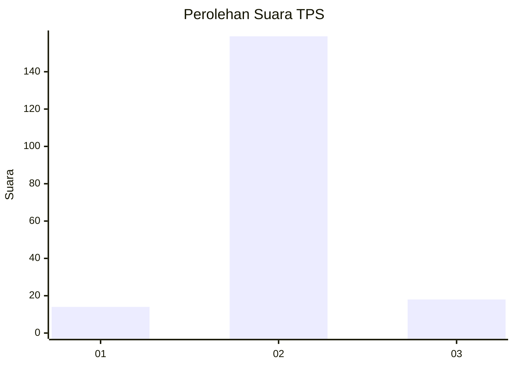
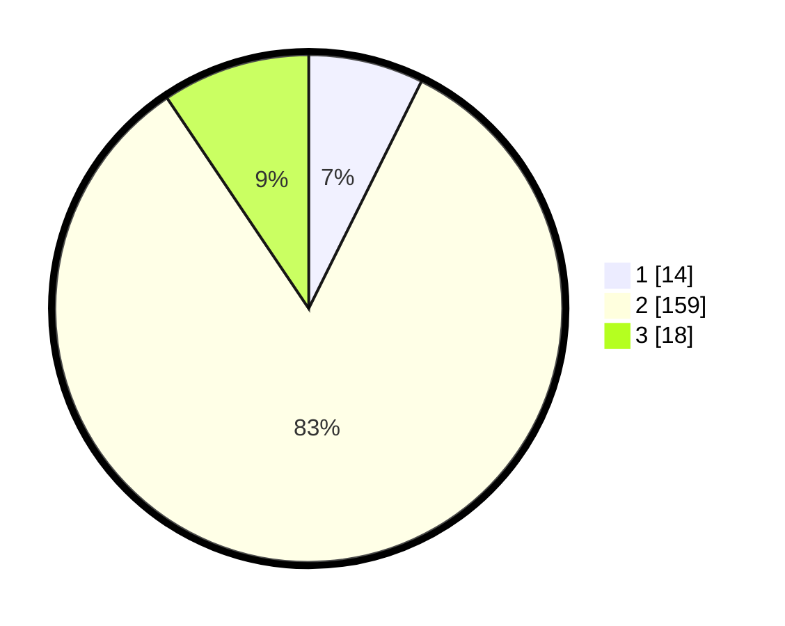

# Hasil

## Grafik

## Tabel

| No. | Nama Paslon    | Suara | Suara (raw) | Persentase |
|:--- |:-------------- | -----:| -----------:| ----------:|
| 1   | ANIES MUHAIMIN | 14    | [14][p-1]   | 7,33       |
| 2   | PRABOWO GIBRAN | 159   | [159][p-2]  | 83,25      |
| 3   | GANJAR MAHFUD  | 18    | [18][p-3]   | 9,42       |

[p-1]: https://github.com/gigit-pemilu/pemilu-2024-35-jawa-timur/blob/main/pilpres/hitung-suara/sub/35-jawa-timur/sub/09-jember/sub/23-mumbulsari/sub/2001-lengkong/sub/011-tps/sub/paslon-1.txt
[p-2]: https://github.com/gigit-pemilu/pemilu-2024-35-jawa-timur/blob/main/pilpres/hitung-suara/sub/35-jawa-timur/sub/09-jember/sub/23-mumbulsari/sub/2001-lengkong/sub/011-tps/sub/paslon-2.txt
[p-3]: https://github.com/gigit-pemilu/pemilu-2024-35-jawa-timur/blob/main/pilpres/hitung-suara/sub/35-jawa-timur/sub/09-jember/sub/23-mumbulsari/sub/2001-lengkong/sub/011-tps/sub/paslon-3.txt

## Foto C Plano

https://sirekap-obj-formc.kpu.go.id/75d0/pemilu/ppwp/35/09/23/20/01/3509232001011-20240214-230444--41c80b43-d11c-400a-8797-a40c4fb6373b.jpg

https://sirekap-obj-formc.kpu.go.id/75d0/pemilu/ppwp/35/09/23/20/01/3509232001011-20240214-231019--1ff889d7-7cab-45b8-b245-bb93c21e8624.jpg

https://sirekap-obj-formc.kpu.go.id/75d0/pemilu/ppwp/35/09/23/20/01/3509232001011-20240214-230930--75d106f2-1cfb-4dc6-9fad-62ce9432bedf.jpg

## Metadata

| Key        | Value               |
| ---------- | ------------------- |
| Time Stamp | 2024-02-25 23:00:00 |

