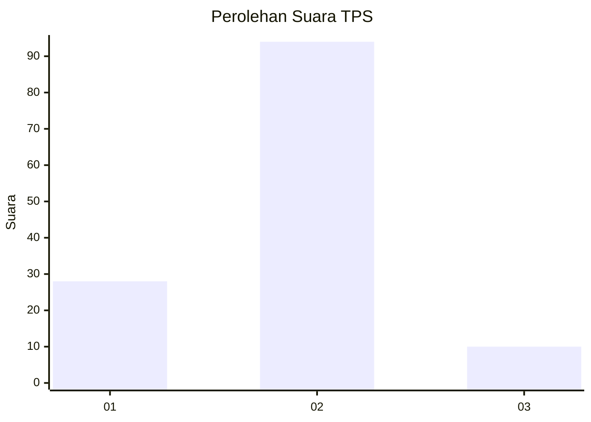

# Hasil

## Grafik

## Tabel

| No. | Nama Paslon    | Suara | Suara (raw) | Persentase |
|:--- |:-------------- | -----:| -----------:| ----------:|
| 1   | ANIES MUHAIMIN | 28    | [28][p-1]   | 21,21      |
| 2   | PRABOWO GIBRAN | 94    | [94][p-2]   | 71,21      |
| 3   | GANJAR MAHFUD  | 10    | [10][p-3]   | 7,58       |

[p-1]: https://github.com/gigit-pemilu/pemilu-2024/blob/main/pilpres/hitung-suara/sub/35-jawa-timur/sub/09-jember/sub/23-mumbulsari/sub/2002-kawangrejo/sub/004-tps/sub/paslon-1.txt
[p-2]: https://github.com/gigit-pemilu/pemilu-2024/blob/main/pilpres/hitung-suara/sub/35-jawa-timur/sub/09-jember/sub/23-mumbulsari/sub/2002-kawangrejo/sub/004-tps/sub/paslon-2.txt
[p-3]: https://github.com/gigit-pemilu/pemilu-2024/blob/main/pilpres/hitung-suara/sub/35-jawa-timur/sub/09-jember/sub/23-mumbulsari/sub/2002-kawangrejo/sub/004-tps/sub/paslon-3.txt

## Foto C Plano

https://sirekap-obj-formc.kpu.go.id/c24b/pemilu/ppwp/35/09/23/20/02/3509232002004-20240214-215657--1f58b858-22a7-48c4-9957-478b5016c5b6.jpg

https://sirekap-obj-formc.kpu.go.id/c24b/pemilu/ppwp/35/09/23/20/02/3509232002004-20240214-215800--5b53c74c-145e-4b3c-884e-902b371fdd9e.jpg

https://sirekap-obj-formc.kpu.go.id/c24b/pemilu/ppwp/35/09/23/20/02/3509232002004-20240214-215853--ddcea885-2444-441b-9e0b-7979c51f4b34.jpg

## Metadata

| Key        | Value               |
| ---------- | ------------------- |
| Time Stamp | 2024-02-15 12:00:28 |

