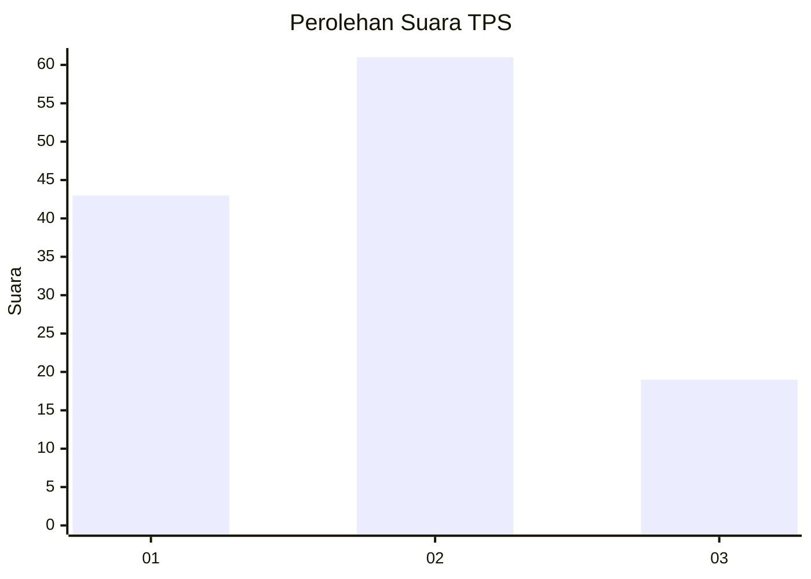
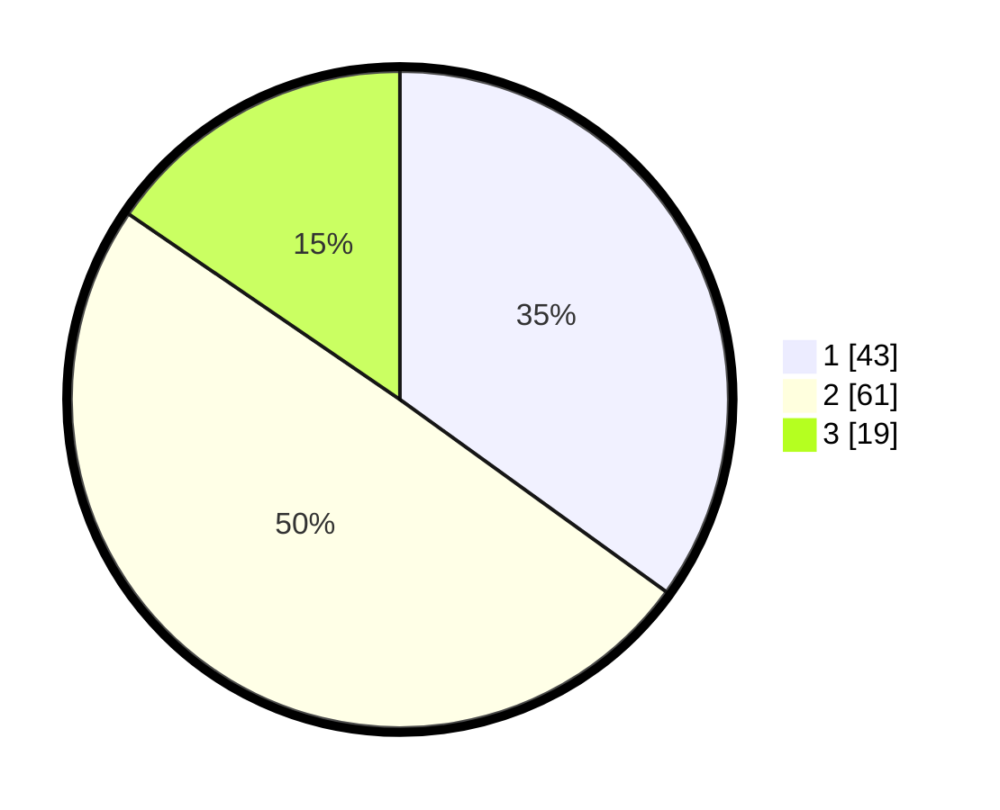

# Hasil

## Grafik

## Tabel

| No. | Nama Paslon    | Suara | Suara (raw) | Persentase |
|:--- |:-------------- | -----:| -----------:| ----------:|
| 1   | ANIES MUHAIMIN | 43    | [43][p-1]   | 34,96      |
| 2   | PRABOWO GIBRAN | 61    | [61][p-2]   | 49,59      |
| 3   | GANJAR MAHFUD  | 19    | [19][p-3]   | 15,45      |

[p-1]: https://github.com/gigit-pemilu/pemilu-2024/blob/main/pilpres/hitung-suara/sub/35-jawa-timur/sub/09-jember/sub/23-mumbulsari/sub/2002-kawangrejo/sub/005-tps/sub/paslon-1.txt
[p-2]: https://github.com/gigit-pemilu/pemilu-2024/blob/main/pilpres/hitung-suara/sub/35-jawa-timur/sub/09-jember/sub/23-mumbulsari/sub/2002-kawangrejo/sub/005-tps/sub/paslon-2.txt
[p-3]: https://github.com/gigit-pemilu/pemilu-2024/blob/main/pilpres/hitung-suara/sub/35-jawa-timur/sub/09-jember/sub/23-mumbulsari/sub/2002-kawangrejo/sub/005-tps/sub/paslon-3.txt

## Foto C Plano

https://sirekap-obj-formc.kpu.go.id/64a4/pemilu/ppwp/35/09/23/20/02/3509232002005-20240215-025230--563fc1dc-50a3-4064-b6d5-c2acf6940c01.jpg

https://sirekap-obj-formc.kpu.go.id/64a4/pemilu/ppwp/35/09/23/20/02/3509232002005-20240215-025010--e7bd3470-d34e-44d9-98e8-a2a066647a18.jpg

https://sirekap-obj-formc.kpu.go.id/64a4/pemilu/ppwp/35/09/23/20/02/3509232002005-20240215-020550--bbf8f716-b27d-477a-9925-b6d758576e93.jpg

## Metadata

| Key        | Value               |
| ---------- | ------------------- |
| Time Stamp | 2024-02-15 12:00:28 |

