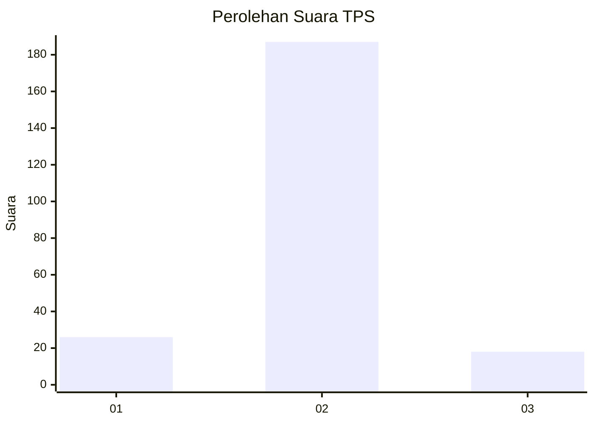
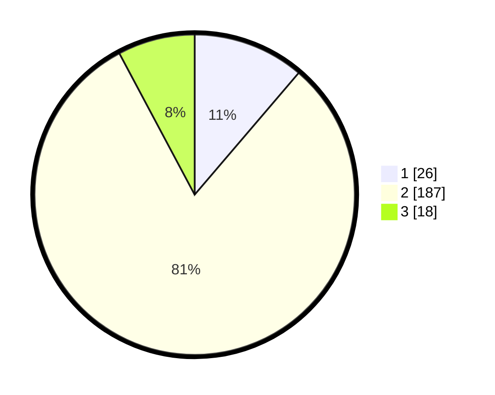

# Hasil

## Grafik

## Tabel

| No. | Nama Paslon    | Suara | Suara (raw) | Persentase |
|:--- |:-------------- | -----:| -----------:| ----------:|
| 1   | ANIES MUHAIMIN | 26    | [26][p-1]   | 11,26      |
| 2   | PRABOWO GIBRAN | 187   | [187][p-2]  | 80,95      |
| 3   | GANJAR MAHFUD  | 18    | [18][p-3]   | 7,79       |

[p-1]: https://github.com/gigit-pemilu/pemilu-2024/blob/main/pilpres/hitung-suara/sub/35-jawa-timur/sub/09-jember/sub/23-mumbulsari/sub/2002-kawangrejo/sub/016-tps/sub/paslon-1.txt
[p-2]: https://github.com/gigit-pemilu/pemilu-2024/blob/main/pilpres/hitung-suara/sub/35-jawa-timur/sub/09-jember/sub/23-mumbulsari/sub/2002-kawangrejo/sub/016-tps/sub/paslon-2.txt
[p-3]: https://github.com/gigit-pemilu/pemilu-2024/blob/main/pilpres/hitung-suara/sub/35-jawa-timur/sub/09-jember/sub/23-mumbulsari/sub/2002-kawangrejo/sub/016-tps/sub/paslon-3.txt

## Foto C Plano

https://sirekap-obj-formc.kpu.go.id/59f2/pemilu/ppwp/35/09/23/20/02/3509232002016-20240214-232824--4d494067-9626-42d7-a621-bc4c4413f0c8.jpg

https://sirekap-obj-formc.kpu.go.id/59f2/pemilu/ppwp/35/09/23/20/02/3509232002016-20240214-233017--b39f8eac-374f-4544-b5ae-ab87db92f566.jpg

https://sirekap-obj-formc.kpu.go.id/59f2/pemilu/ppwp/35/09/23/20/02/3509232002016-20240214-233159--311315b9-412d-4096-ae3e-526ff771402a.jpg

## Metadata

| Key        | Value               |
| ---------- | ------------------- |
| Time Stamp | 2024-02-15 12:00:28 |

