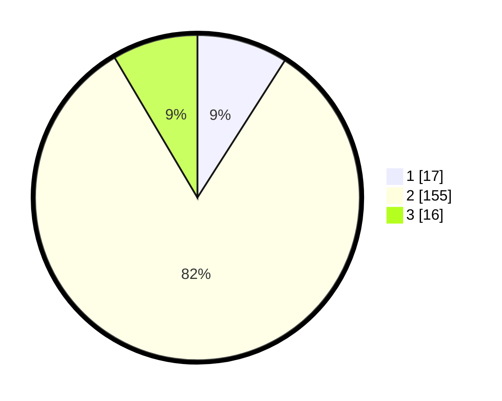

# Hasil

## Grafik

## Tabel

| No. | Nama Paslon    | Suara | Suara (raw) | Persentase |
|:--- |:-------------- | -----:| -----------:| ----------:|
| 1   | ANIES MUHAIMIN | 17    | [17][p-1]   | 9,04       |
| 2   | PRABOWO GIBRAN | 155   | [155][p-2]  | 82,45      |
| 3   | GANJAR MAHFUD  | 16    | [16][p-3]   | 8,51       |

[p-1]: https://github.com/gigit-pemilu/pemilu-2024/blob/main/pilpres/hitung-suara/sub/35-jawa-timur/sub/09-jember/sub/23-mumbulsari/sub/2002-kawangrejo/sub/017-tps/sub/paslon-1.txt
[p-2]: https://github.com/gigit-pemilu/pemilu-2024/blob/main/pilpres/hitung-suara/sub/35-jawa-timur/sub/09-jember/sub/23-mumbulsari/sub/2002-kawangrejo/sub/017-tps/sub/paslon-2.txt
[p-3]: https://github.com/gigit-pemilu/pemilu-2024/blob/main/pilpres/hitung-suara/sub/35-jawa-timur/sub/09-jember/sub/23-mumbulsari/sub/2002-kawangrejo/sub/017-tps/sub/paslon-3.txt

## Foto C Plano

https://sirekap-obj-formc.kpu.go.id/c12d/pemilu/ppwp/35/09/23/20/02/3509232002017-20240214-202713--e130005d-0fb1-4e37-9a6e-947ad7f7847b.jpg

https://sirekap-obj-formc.kpu.go.id/c12d/pemilu/ppwp/35/09/23/20/02/3509232002017-20240214-203617--a354b7d5-8441-4216-8efd-e0b2c50b414d.jpg

https://sirekap-obj-formc.kpu.go.id/c12d/pemilu/ppwp/35/09/23/20/02/3509232002017-20240214-204134--ee480efc-af4f-4cdf-8c04-c1d54b63fdb6.jpg

## Metadata

| Key        | Value               |
| ---------- | ------------------- |
| Time Stamp | 2024-02-15 15:00:29 |

