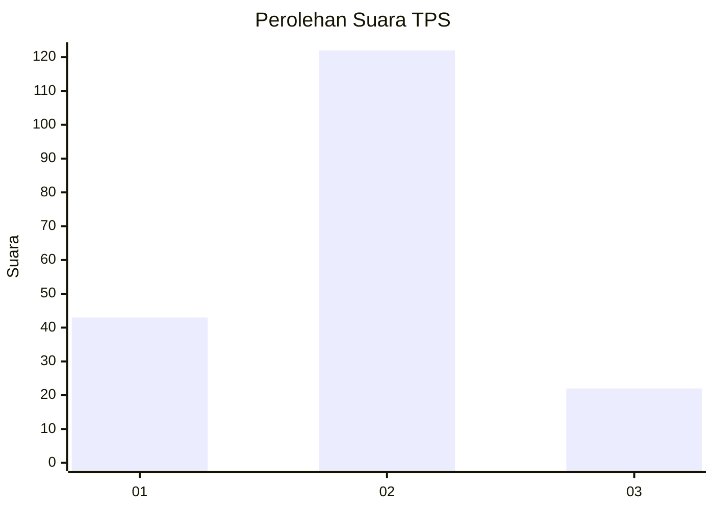
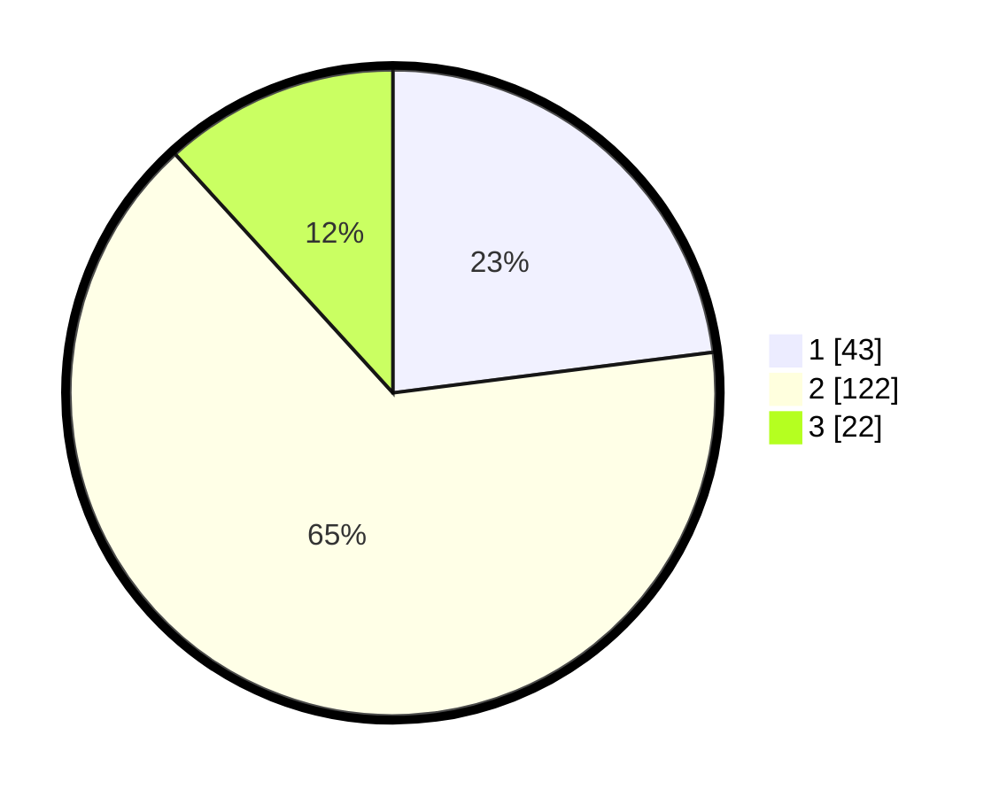

# Hasil

## Grafik

## Tabel

| No. | Nama Paslon    | Suara | Suara (raw) | Persentase |
|:--- |:-------------- | -----:| -----------:| ----------:|
| 1   | ANIES MUHAIMIN | 43    | [43][p-1]   | 22,99      |
| 2   | PRABOWO GIBRAN | 122   | [122][p-2]  | 65,24      |
| 3   | GANJAR MAHFUD  | 22    | [22][p-3]   | 11,76      |

[p-1]: https://github.com/gigit-pemilu/pemilu-2024-35-jawa-timur/blob/main/pilpres/hitung-suara/sub/35-jawa-timur/sub/09-jember/sub/23-mumbulsari/sub/2003-tamansari/sub/006-tps/sub/paslon-1.txt
[p-2]: https://github.com/gigit-pemilu/pemilu-2024-35-jawa-timur/blob/main/pilpres/hitung-suara/sub/35-jawa-timur/sub/09-jember/sub/23-mumbulsari/sub/2003-tamansari/sub/006-tps/sub/paslon-2.txt
[p-3]: https://github.com/gigit-pemilu/pemilu-2024-35-jawa-timur/blob/main/pilpres/hitung-suara/sub/35-jawa-timur/sub/09-jember/sub/23-mumbulsari/sub/2003-tamansari/sub/006-tps/sub/paslon-3.txt

## Foto C Plano

https://sirekap-obj-formc.kpu.go.id/67d3/pemilu/ppwp/35/09/23/20/03/3509232003006-20240215-000159--7c055cad-a60d-4fd5-86dd-4b7374aa0579.jpg

https://sirekap-obj-formc.kpu.go.id/67d3/pemilu/ppwp/35/09/23/20/03/3509232003006-20240215-000432--10a5e62a-0f67-41c7-804f-5b6cf1728736.jpg

https://sirekap-obj-formc.kpu.go.id/67d3/pemilu/ppwp/35/09/23/20/03/3509232003006-20240215-000641--902069bb-b790-4eae-bd3c-1785674858e8.jpg

## Metadata

| Key        | Value               |
| ---------- | ------------------- |
| Time Stamp | 2024-02-25 15:00:00 |

