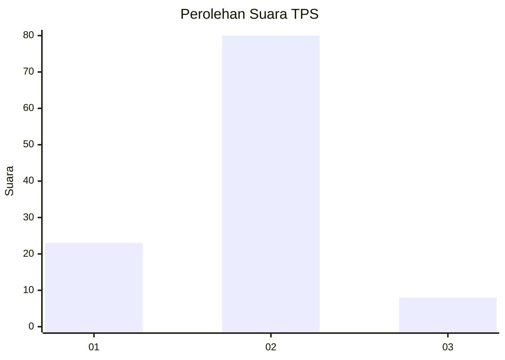

# Hasil

## Grafik

## Tabel

| No. | Nama Paslon    | Suara | Suara (raw) | Persentase |
|:--- |:-------------- | -----:| -----------:| ----------:|
| 1   | ANIES MUHAIMIN | 23    | [23][p-1]   | 20,72      |
| 2   | PRABOWO GIBRAN | 80    | [80][p-2]   | 72,07      |
| 3   | GANJAR MAHFUD  | 8     | [8][p-3]    | 7,21       |

[p-1]: https://github.com/gigit-pemilu/pemilu-2024/blob/main/pilpres/hitung-suara/sub/35-jawa-timur/sub/09-jember/sub/23-mumbulsari/sub/2003-tamansari/sub/008-tps/sub/paslon-1.txt
[p-2]: https://github.com/gigit-pemilu/pemilu-2024/blob/main/pilpres/hitung-suara/sub/35-jawa-timur/sub/09-jember/sub/23-mumbulsari/sub/2003-tamansari/sub/008-tps/sub/paslon-2.txt
[p-3]: https://github.com/gigit-pemilu/pemilu-2024/blob/main/pilpres/hitung-suara/sub/35-jawa-timur/sub/09-jember/sub/23-mumbulsari/sub/2003-tamansari/sub/008-tps/sub/paslon-3.txt

## Foto C Plano

https://sirekap-obj-formc.kpu.go.id/01c1/pemilu/ppwp/35/09/23/20/03/3509232003008-20240214-212329--17a4e332-4279-4e7f-8340-8133d791c04c.jpg

https://sirekap-obj-formc.kpu.go.id/01c1/pemilu/ppwp/35/09/23/20/03/3509232003008-20240214-212546--73535e70-0cf1-47c4-affb-e97134920b7c.jpg

https://sirekap-obj-formc.kpu.go.id/01c1/pemilu/ppwp/35/09/23/20/03/3509232003008-20240214-212745--98413252-edd4-4618-b881-b3bf5d2f3c0c.jpg

## Metadata

| Key        | Value               |
| ---------- | ------------------- |
| Time Stamp | 2024-02-25 21:00:00 |

