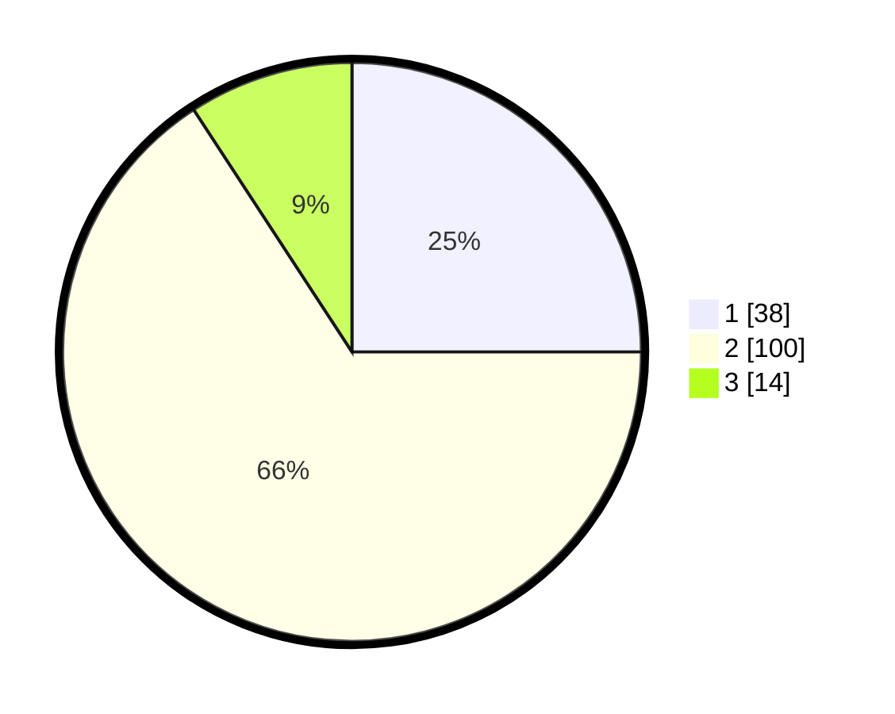

# Hasil

## Grafik

## Tabel

| No. | Nama Paslon    | Suara | Suara (raw) | Persentase |
|:--- |:-------------- | -----:| -----------:| ----------:|
| 1   | ANIES MUHAIMIN | 38    | [38][p-1]   | 25,00      |
| 2   | PRABOWO GIBRAN | 100   | [100][p-2]  | 65,79      |
| 3   | GANJAR MAHFUD  | 14    | [14][p-3]   | 9,21       |

[p-1]: https://github.com/gigit-pemilu/pemilu-2024/blob/main/pilpres/hitung-suara/sub/35-jawa-timur/sub/09-jember/sub/23-mumbulsari/sub/2003-tamansari/sub/011-tps/sub/paslon-1.txt
[p-2]: https://github.com/gigit-pemilu/pemilu-2024/blob/main/pilpres/hitung-suara/sub/35-jawa-timur/sub/09-jember/sub/23-mumbulsari/sub/2003-tamansari/sub/011-tps/sub/paslon-2.txt
[p-3]: https://github.com/gigit-pemilu/pemilu-2024/blob/main/pilpres/hitung-suara/sub/35-jawa-timur/sub/09-jember/sub/23-mumbulsari/sub/2003-tamansari/sub/011-tps/sub/paslon-3.txt

## Foto C Plano

https://sirekap-obj-formc.kpu.go.id/c4dd/pemilu/ppwp/35/09/23/20/03/3509232003011-20240214-232554--f86cab7b-e78f-4537-ae57-cc29a4f46354.jpg

https://sirekap-obj-formc.kpu.go.id/c4dd/pemilu/ppwp/35/09/23/20/03/3509232003011-20240214-232933--fdcc4890-6c9e-499e-9a97-13ff924e4d42.jpg

https://sirekap-obj-formc.kpu.go.id/c4dd/pemilu/ppwp/35/09/23/20/03/3509232003011-20240214-233138--9171f660-c58c-4a47-a42b-f0ac315676cd.jpg

## Metadata

| Key        | Value               |
| ---------- | ------------------- |
| Time Stamp | 2024-02-15 12:00:28 |

