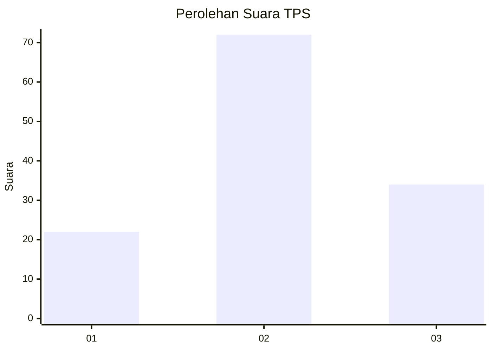
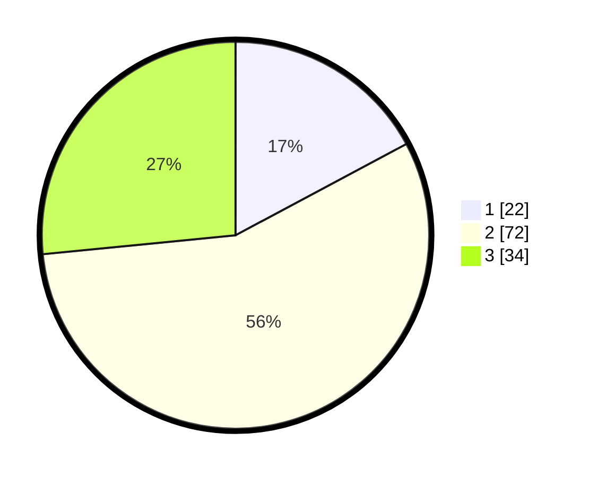

# Hasil

## Grafik

## Tabel

| No. | Nama Paslon    | Suara | Suara (raw) | Persentase |
|:--- |:-------------- | -----:| -----------:| ----------:|
| 1   | ANIES MUHAIMIN | 22    | [22][p-1]   | 17,19      |
| 2   | PRABOWO GIBRAN | 72    | [72][p-2]   | 56,25      |
| 3   | GANJAR MAHFUD  | 34    | [34][p-3]   | 26,56      |

[p-1]: https://github.com/gigit-pemilu/pemilu-2024-35-jawa-timur/blob/main/pilpres/hitung-suara/sub/35-jawa-timur/sub/09-jember/sub/23-mumbulsari/sub/2003-tamansari/sub/016-tps/sub/paslon-1.txt
[p-2]: https://github.com/gigit-pemilu/pemilu-2024-35-jawa-timur/blob/main/pilpres/hitung-suara/sub/35-jawa-timur/sub/09-jember/sub/23-mumbulsari/sub/2003-tamansari/sub/016-tps/sub/paslon-2.txt
[p-3]: https://github.com/gigit-pemilu/pemilu-2024-35-jawa-timur/blob/main/pilpres/hitung-suara/sub/35-jawa-timur/sub/09-jember/sub/23-mumbulsari/sub/2003-tamansari/sub/016-tps/sub/paslon-3.txt

## Foto C Plano

https://sirekap-obj-formc.kpu.go.id/e9a9/pemilu/ppwp/35/09/23/20/03/3509232003016-20240214-234910--0d870a7c-9440-4132-a28a-67146579d5e9.jpg

https://sirekap-obj-formc.kpu.go.id/e9a9/pemilu/ppwp/35/09/23/20/03/3509232003016-20240214-235103--446737f5-d5cb-4049-b710-798fa43a8e44.jpg

https://sirekap-obj-formc.kpu.go.id/e9a9/pemilu/ppwp/35/09/23/20/03/3509232003016-20240214-235303--acb7d0eb-ade0-4a93-bb60-50269592653c.jpg

## Metadata

| Key        | Value               |
| ---------- | ------------------- |
| Time Stamp | 2024-02-24 22:31:28 |

