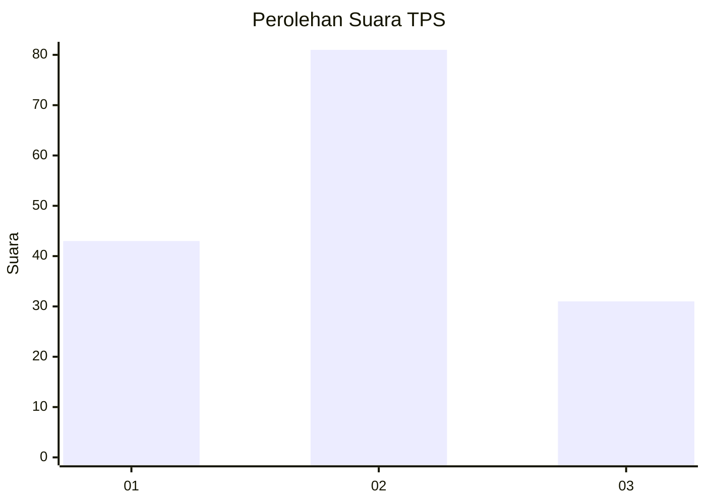
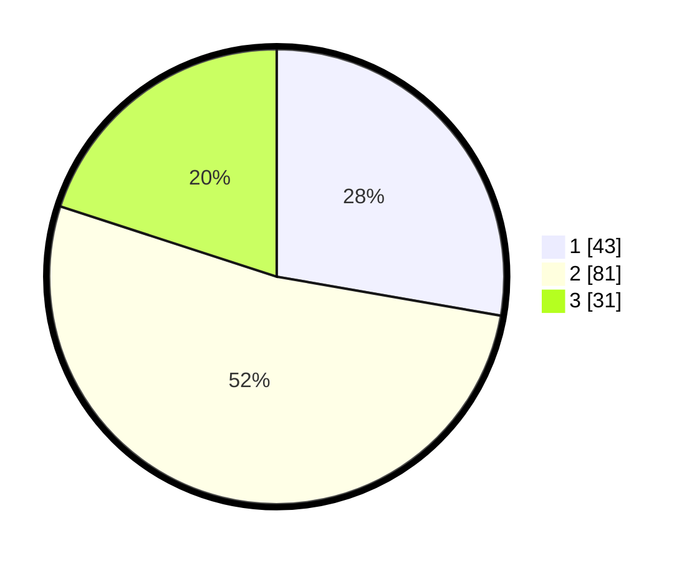

# Hasil

## Grafik

## Tabel

| No. | Nama Paslon    | Suara | Suara (raw) | Persentase |
|:--- |:-------------- | -----:| -----------:| ----------:|
| 1   | ANIES MUHAIMIN | 43    | [43][p-1]   | 27,74      |
| 2   | PRABOWO GIBRAN | 81    | [81][p-2]   | 52,26      |
| 3   | GANJAR MAHFUD  | 31    | [31][p-3]   | 20,00      |

[p-1]: https://github.com/gigit-pemilu/pemilu-2024/blob/main/pilpres/hitung-suara/sub/35-jawa-timur/sub/09-jember/sub/23-mumbulsari/sub/2003-tamansari/sub/018-tps/sub/paslon-1.txt
[p-2]: https://github.com/gigit-pemilu/pemilu-2024/blob/main/pilpres/hitung-suara/sub/35-jawa-timur/sub/09-jember/sub/23-mumbulsari/sub/2003-tamansari/sub/018-tps/sub/paslon-2.txt
[p-3]: https://github.com/gigit-pemilu/pemilu-2024/blob/main/pilpres/hitung-suara/sub/35-jawa-timur/sub/09-jember/sub/23-mumbulsari/sub/2003-tamansari/sub/018-tps/sub/paslon-3.txt

## Foto C Plano

https://sirekap-obj-formc.kpu.go.id/adb1/pemilu/ppwp/35/09/23/20/03/3509232003018-20240214-155626--5f8c1121-aaa2-40e7-850a-3973d2d994f6.jpg

https://sirekap-obj-formc.kpu.go.id/adb1/pemilu/ppwp/35/09/23/20/03/3509232003018-20240214-155646--d591ac13-48eb-403b-943c-a71e5a669da6.jpg

https://sirekap-obj-formc.kpu.go.id/adb1/pemilu/ppwp/35/09/23/20/03/3509232003018-20240216-225922--47eb6fdd-c97f-4459-ad88-636b3833736e.jpg

## Metadata

| Key        | Value               |
| ---------- | ------------------- |
| Time Stamp | 2024-02-16 23:00:00 |

