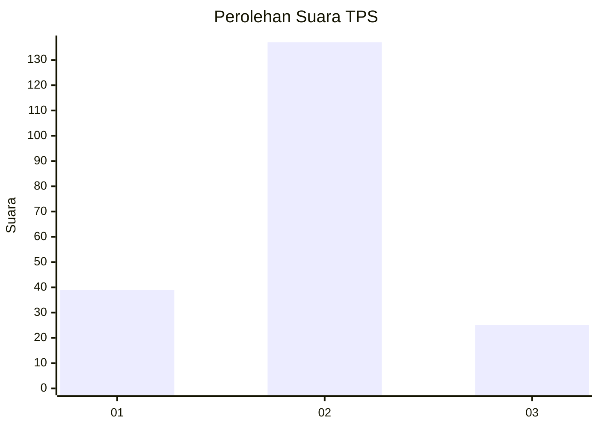
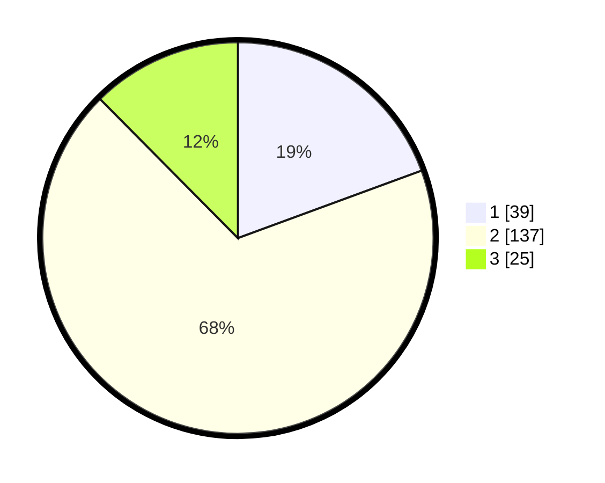

# Hasil

## Grafik

## Tabel

| No. | Nama Paslon    | Suara | Suara (raw) | Persentase |
|:--- |:-------------- | -----:| -----------:| ----------:|
| 1   | ANIES MUHAIMIN | 39    | [39][p-1]   | 19,40      |
| 2   | PRABOWO GIBRAN | 137   | [137][p-2]  | 68,16      |
| 3   | GANJAR MAHFUD  | 25    | [25][p-3]   | 12,44      |

[p-1]: https://github.com/gigit-pemilu/pemilu-2024/blob/main/pilpres/hitung-suara/sub/35-jawa-timur/sub/09-jember/sub/23-mumbulsari/sub/2004-mumbulsari/sub/003-tps/sub/paslon-1.txt
[p-2]: https://github.com/gigit-pemilu/pemilu-2024/blob/main/pilpres/hitung-suara/sub/35-jawa-timur/sub/09-jember/sub/23-mumbulsari/sub/2004-mumbulsari/sub/003-tps/sub/paslon-2.txt
[p-3]: https://github.com/gigit-pemilu/pemilu-2024/blob/main/pilpres/hitung-suara/sub/35-jawa-timur/sub/09-jember/sub/23-mumbulsari/sub/2004-mumbulsari/sub/003-tps/sub/paslon-3.txt

## Foto C Plano

https://sirekap-obj-formc.kpu.go.id/9e8b/pemilu/ppwp/35/09/23/20/04/3509232004003-20240214-214528--b9c4b168-a76f-4800-9d7d-6869d9a6de27.jpg

https://sirekap-obj-formc.kpu.go.id/9e8b/pemilu/ppwp/35/09/23/20/04/3509232004003-20240214-214535--fce0db36-192c-485c-abef-02850269d29c.jpg

https://sirekap-obj-formc.kpu.go.id/9e8b/pemilu/ppwp/35/09/23/20/04/3509232004003-20240214-211247--2bf3ab42-3fb4-42a6-aac1-5300ac09770f.jpg

## Metadata

| Key        | Value               |
| ---------- | ------------------- |
| Time Stamp | 2024-02-15 12:00:28 |

