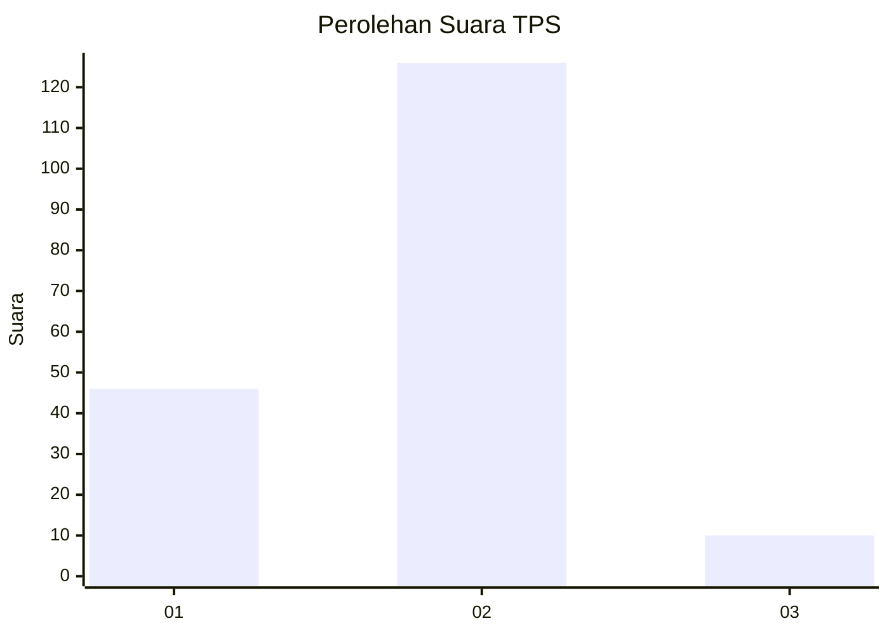
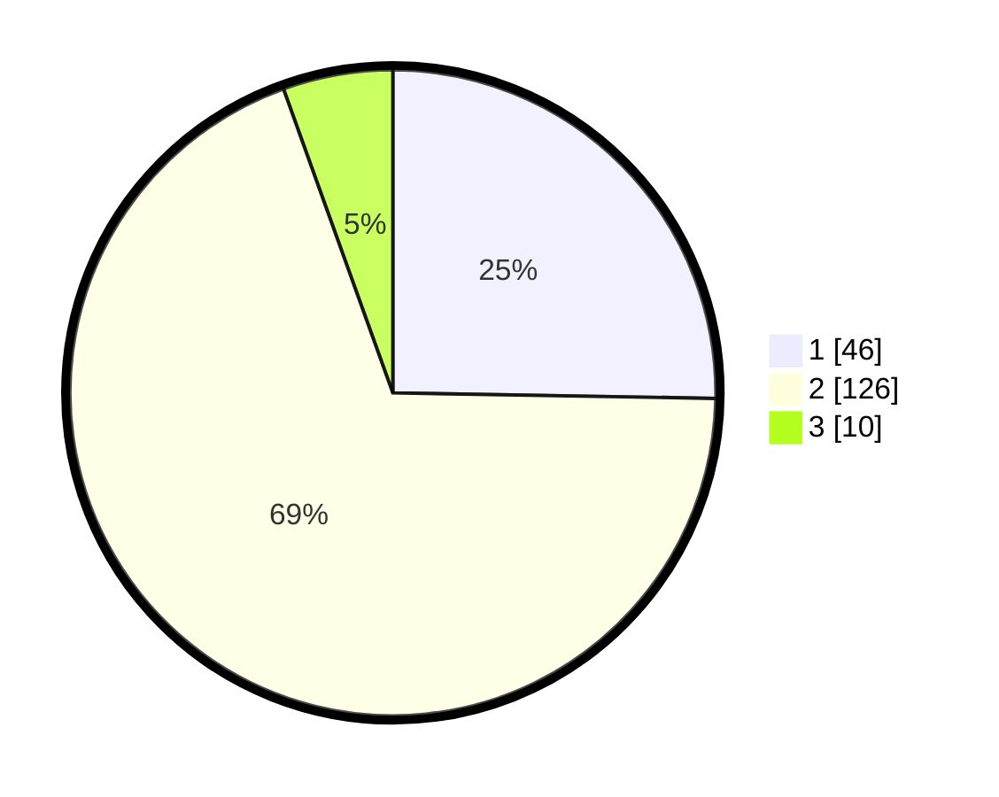

# Hasil

## Grafik

## Tabel

| No. | Nama Paslon    | Suara | Suara (raw) | Persentase |
|:--- |:-------------- | -----:| -----------:| ----------:|
| 1   | ANIES MUHAIMIN | 46    | [46][p-1]   | 25,27      |
| 2   | PRABOWO GIBRAN | 126   | [126][p-2]  | 69,23      |
| 3   | GANJAR MAHFUD  | 10    | [10][p-3]   | 5,49       |

[p-1]: https://github.com/gigit-pemilu/pemilu-2024-35-jawa-timur/blob/main/pilpres/hitung-suara/sub/35-jawa-timur/sub/09-jember/sub/23-mumbulsari/sub/2004-mumbulsari/sub/008-tps/sub/paslon-1.txt
[p-2]: https://github.com/gigit-pemilu/pemilu-2024-35-jawa-timur/blob/main/pilpres/hitung-suara/sub/35-jawa-timur/sub/09-jember/sub/23-mumbulsari/sub/2004-mumbulsari/sub/008-tps/sub/paslon-2.txt
[p-3]: https://github.com/gigit-pemilu/pemilu-2024-35-jawa-timur/blob/main/pilpres/hitung-suara/sub/35-jawa-timur/sub/09-jember/sub/23-mumbulsari/sub/2004-mumbulsari/sub/008-tps/sub/paslon-3.txt

## Foto C Plano

https://sirekap-obj-formc.kpu.go.id/c7c4/pemilu/ppwp/35/09/23/20/04/3509232004008-20240214-215056--9dba6c66-cf42-4afc-bc0b-829250c61e1a.jpg

https://sirekap-obj-formc.kpu.go.id/c7c4/pemilu/ppwp/35/09/23/20/04/3509232004008-20240215-001216--03ce669f-6f49-4fb9-89c1-066cfcca1c44.jpg

https://sirekap-obj-formc.kpu.go.id/c7c4/pemilu/ppwp/35/09/23/20/04/3509232004008-20240214-215250--25da76c7-ef50-44c0-8a65-bb13065a31f3.jpg

## Metadata

| Key        | Value               |
| ---------- | ------------------- |
| Time Stamp | 2024-02-15 23:29:50 |

