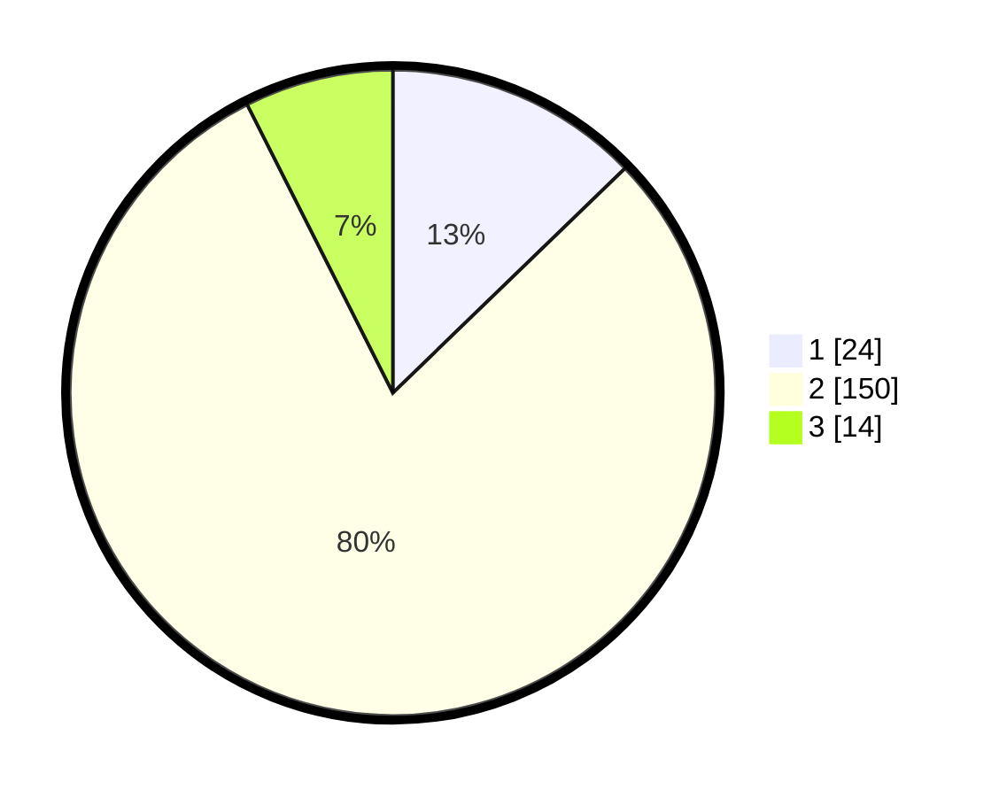

# Hasil

## Grafik

## Tabel

| No. | Nama Paslon    | Suara | Suara (raw) | Persentase |
|:--- |:-------------- | -----:| -----------:| ----------:|
| 1   | ANIES MUHAIMIN | 24    | [24][p-1]   | 12,77      |
| 2   | PRABOWO GIBRAN | 150   | [150][p-2]  | 79,79      |
| 3   | GANJAR MAHFUD  | 14    | [14][p-3]   | 7,45       |

[p-1]: https://github.com/gigit-pemilu/pemilu-2024/blob/main/pilpres/hitung-suara/sub/35-jawa-timur/sub/09-jember/sub/23-mumbulsari/sub/2004-mumbulsari/sub/019-tps/sub/paslon-1.txt
[p-2]: https://github.com/gigit-pemilu/pemilu-2024/blob/main/pilpres/hitung-suara/sub/35-jawa-timur/sub/09-jember/sub/23-mumbulsari/sub/2004-mumbulsari/sub/019-tps/sub/paslon-2.txt
[p-3]: https://github.com/gigit-pemilu/pemilu-2024/blob/main/pilpres/hitung-suara/sub/35-jawa-timur/sub/09-jember/sub/23-mumbulsari/sub/2004-mumbulsari/sub/019-tps/sub/paslon-3.txt

## Foto C Plano

https://sirekap-obj-formc.kpu.go.id/ad05/pemilu/ppwp/35/09/23/20/04/3509232004019-20240214-201525--c721a079-661c-4637-8417-09332af84f7e.jpg

https://sirekap-obj-formc.kpu.go.id/ad05/pemilu/ppwp/35/09/23/20/04/3509232004019-20240214-201956--ab1660d5-ea20-44e2-84fe-e22980fbfdf9.jpg

https://sirekap-obj-formc.kpu.go.id/ad05/pemilu/ppwp/35/09/23/20/04/3509232004019-20240214-202222--df14d52b-05fa-4c9c-b612-f5fc839d08af.jpg

## Metadata

| Key        | Value               |
| ---------- | ------------------- |
| Time Stamp | 2024-02-15 12:00:28 |

