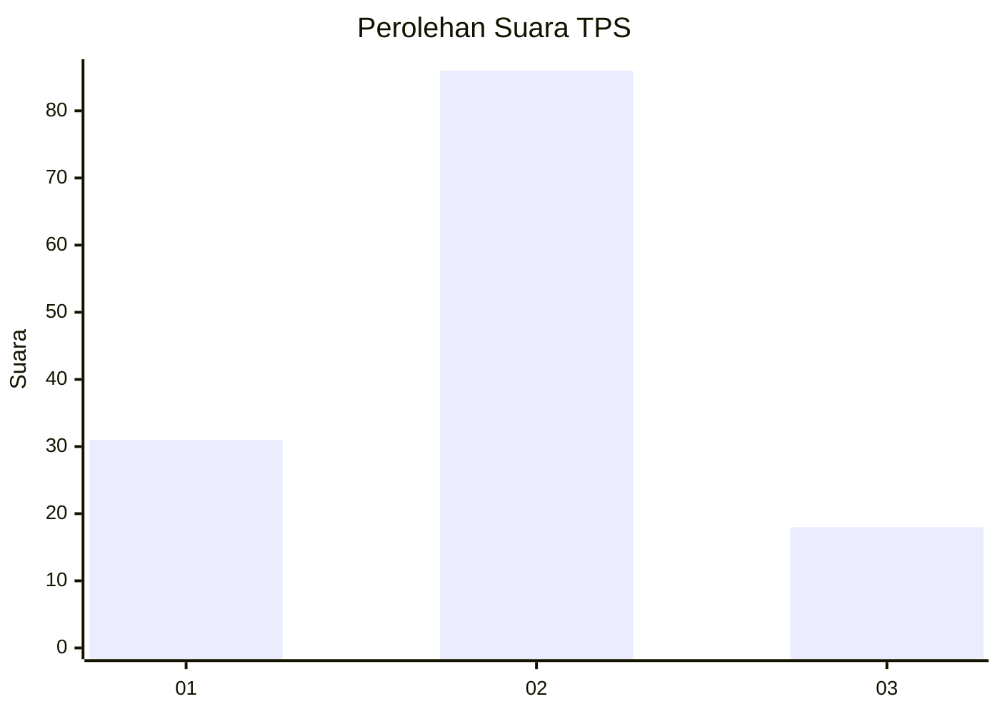
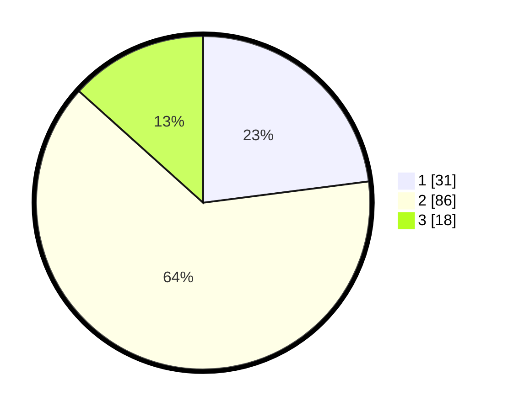

# Hasil

## Grafik

## Tabel

| No. | Nama Paslon    | Suara | Suara (raw) | Persentase |
|:--- |:-------------- | -----:| -----------:| ----------:|
| 1   | ANIES MUHAIMIN | 31    | [31][p-1]   | 22,96      |
| 2   | PRABOWO GIBRAN | 86    | [86][p-2]   | 63,70      |
| 3   | GANJAR MAHFUD  | 18    | [18][p-3]   | 13,33      |

[p-1]: https://github.com/gigit-pemilu/pemilu-2024-35-jawa-timur/blob/main/pilpres/hitung-suara/sub/35-jawa-timur/sub/09-jember/sub/23-mumbulsari/sub/2004-mumbulsari/sub/020-tps/sub/paslon-1.txt
[p-2]: https://github.com/gigit-pemilu/pemilu-2024-35-jawa-timur/blob/main/pilpres/hitung-suara/sub/35-jawa-timur/sub/09-jember/sub/23-mumbulsari/sub/2004-mumbulsari/sub/020-tps/sub/paslon-2.txt
[p-3]: https://github.com/gigit-pemilu/pemilu-2024-35-jawa-timur/blob/main/pilpres/hitung-suara/sub/35-jawa-timur/sub/09-jember/sub/23-mumbulsari/sub/2004-mumbulsari/sub/020-tps/sub/paslon-3.txt

## Foto C Plano

https://sirekap-obj-formc.kpu.go.id/0098/pemilu/ppwp/35/09/23/20/04/3509232004020-20240214-195540--9f0e0a72-bb85-444c-b088-f029e08bb5bc.jpg

https://sirekap-obj-formc.kpu.go.id/0098/pemilu/ppwp/35/09/23/20/04/3509232004020-20240214-201935--241dd00a-133e-47b3-96e4-c7d556352073.jpg

https://sirekap-obj-formc.kpu.go.id/0098/pemilu/ppwp/35/09/23/20/04/3509232004020-20240214-195944--69865b5c-a4b4-4235-9d60-ee1ca0c4cf84.jpg

## Metadata

| Key        | Value               |
| ---------- | ------------------- |
| Time Stamp | 2024-02-15 15:00:29 |

