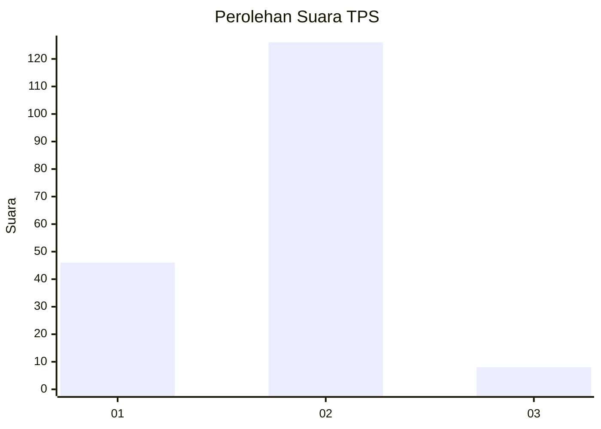
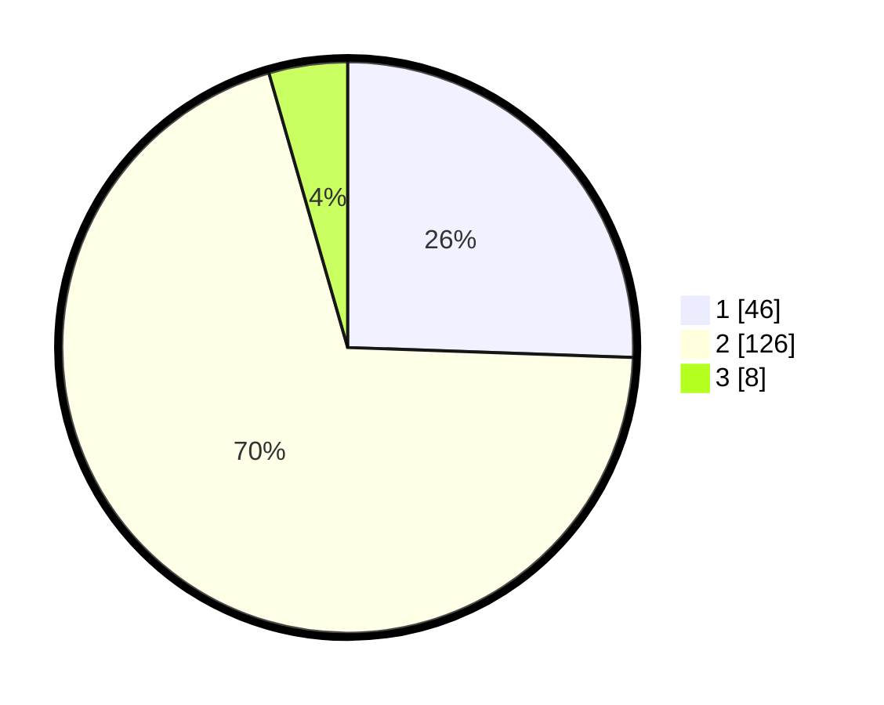

# Hasil

## Grafik

## Tabel

| No. | Nama Paslon    | Suara | Suara (raw) | Persentase |
|:--- |:-------------- | -----:| -----------:| ----------:|
| 1   | ANIES MUHAIMIN | 46    | [46][p-1]   | 25,56      |
| 2   | PRABOWO GIBRAN | 126   | [126][p-2]  | 70,00      |
| 3   | GANJAR MAHFUD  | 8     | [8][p-3]    | 4,44       |

[p-1]: https://github.com/gigit-pemilu/pemilu-2024-35-jawa-timur/blob/main/pilpres/hitung-suara/sub/35-jawa-timur/sub/09-jember/sub/23-mumbulsari/sub/2004-mumbulsari/sub/023-tps/sub/paslon-1.txt
[p-2]: https://github.com/gigit-pemilu/pemilu-2024-35-jawa-timur/blob/main/pilpres/hitung-suara/sub/35-jawa-timur/sub/09-jember/sub/23-mumbulsari/sub/2004-mumbulsari/sub/023-tps/sub/paslon-2.txt
[p-3]: https://github.com/gigit-pemilu/pemilu-2024-35-jawa-timur/blob/main/pilpres/hitung-suara/sub/35-jawa-timur/sub/09-jember/sub/23-mumbulsari/sub/2004-mumbulsari/sub/023-tps/sub/paslon-3.txt

## Foto C Plano

https://sirekap-obj-formc.kpu.go.id/5b3f/pemilu/ppwp/35/09/23/20/04/3509232004023-20240214-204817--9b657f41-54c3-4cf6-870f-31928314b44d.jpg

https://sirekap-obj-formc.kpu.go.id/5b3f/pemilu/ppwp/35/09/23/20/04/3509232004023-20240215-010600--981ab18f-3fe5-4d91-975a-7582514a567a.jpg

https://sirekap-obj-formc.kpu.go.id/5b3f/pemilu/ppwp/35/09/23/20/04/3509232004023-20240215-010702--abb07d42-f653-4fec-a60a-adc1b1eb3321.jpg

## Metadata

| Key        | Value               |
| ---------- | ------------------- |
| Time Stamp | 2024-02-15 12:00:28 |

