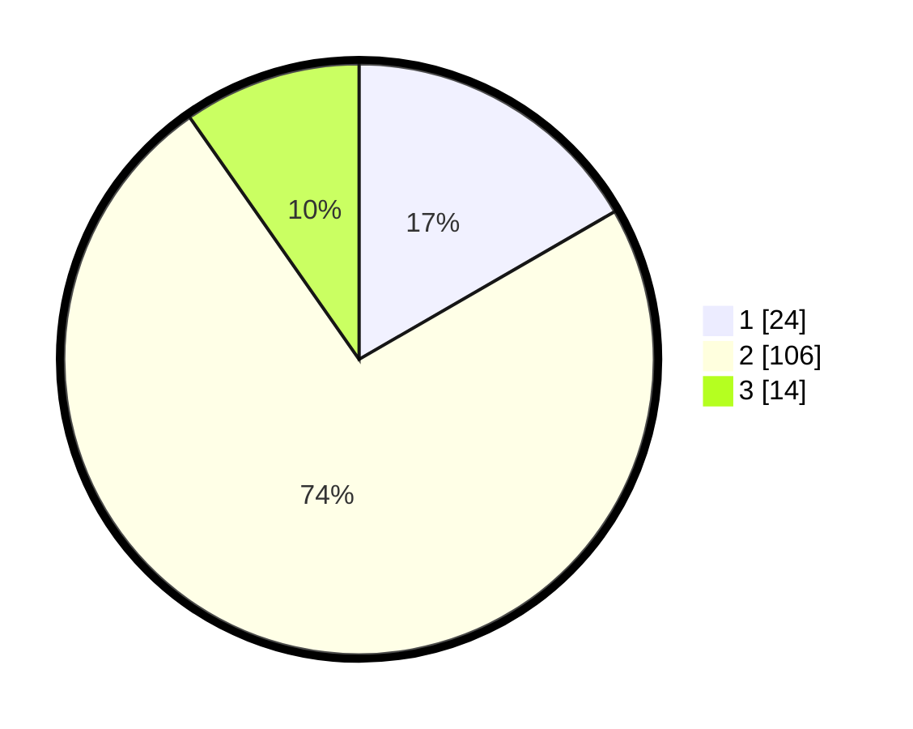

# Hasil

## Grafik

## Tabel

| No. | Nama Paslon    | Suara | Suara (raw) | Persentase |
|:--- |:-------------- | -----:| -----------:| ----------:|
| 1   | ANIES MUHAIMIN | 24    | [24][p-1]   | 16,67      |
| 2   | PRABOWO GIBRAN | 106   | [106][p-2]  | 73,61      |
| 3   | GANJAR MAHFUD  | 14    | [14][p-3]   | 9,72       |

[p-1]: https://github.com/gigit-pemilu/pemilu-2024-35-jawa-timur/blob/main/pilpres/hitung-suara/sub/35-jawa-timur/sub/09-jember/sub/23-mumbulsari/sub/2004-mumbulsari/sub/029-tps/sub/paslon-1.txt
[p-2]: https://github.com/gigit-pemilu/pemilu-2024-35-jawa-timur/blob/main/pilpres/hitung-suara/sub/35-jawa-timur/sub/09-jember/sub/23-mumbulsari/sub/2004-mumbulsari/sub/029-tps/sub/paslon-2.txt
[p-3]: https://github.com/gigit-pemilu/pemilu-2024-35-jawa-timur/blob/main/pilpres/hitung-suara/sub/35-jawa-timur/sub/09-jember/sub/23-mumbulsari/sub/2004-mumbulsari/sub/029-tps/sub/paslon-3.txt

## Foto C Plano

https://sirekap-obj-formc.kpu.go.id/b505/pemilu/ppwp/35/09/23/20/04/3509232004029-20240214-230159--70183883-1b5f-4111-a114-69e86d44bc5d.jpg

https://sirekap-obj-formc.kpu.go.id/b505/pemilu/ppwp/35/09/23/20/04/3509232004029-20240214-230259--79f4880f-d5b6-43b4-8ac8-1ca76b29be24.jpg

https://sirekap-obj-formc.kpu.go.id/b505/pemilu/ppwp/35/09/23/20/04/3509232004029-20240214-230411--f4e6f70c-59a1-4997-8ff7-2413ee17a5c6.jpg

## Metadata

| Key        | Value               |
| ---------- | ------------------- |
| Time Stamp | 2024-02-15 15:00:29 |

