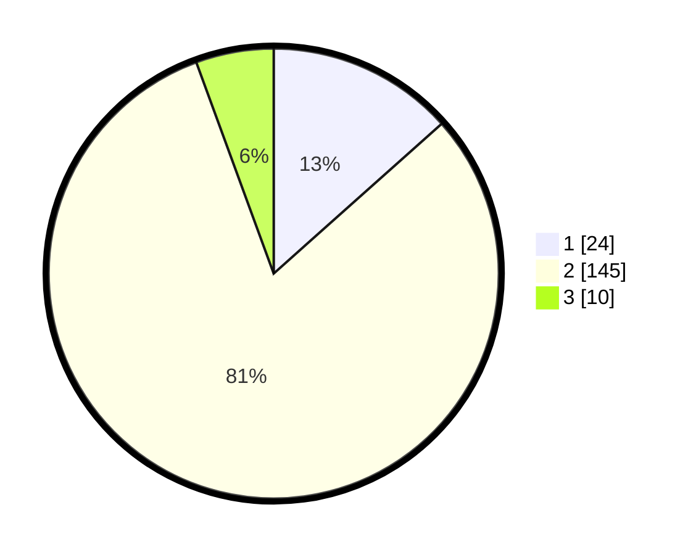

# Hasil

## Grafik

## Tabel

| No. | Nama Paslon    | Suara | Suara (raw) | Persentase |
|:--- |:-------------- | -----:| -----------:| ----------:|
| 1   | ANIES MUHAIMIN | 24    | [24][p-1]   | 13,41      |
| 2   | PRABOWO GIBRAN | 145   | [145][p-2]  | 81,01      |
| 3   | GANJAR MAHFUD  | 10    | [10][p-3]   | 5,59       |

[p-1]: https://github.com/gigit-pemilu/pemilu-2024-35-jawa-timur/blob/main/pilpres/hitung-suara/sub/35-jawa-timur/sub/09-jember/sub/23-mumbulsari/sub/2004-mumbulsari/sub/030-tps/sub/paslon-1.txt
[p-2]: https://github.com/gigit-pemilu/pemilu-2024-35-jawa-timur/blob/main/pilpres/hitung-suara/sub/35-jawa-timur/sub/09-jember/sub/23-mumbulsari/sub/2004-mumbulsari/sub/030-tps/sub/paslon-2.txt
[p-3]: https://github.com/gigit-pemilu/pemilu-2024-35-jawa-timur/blob/main/pilpres/hitung-suara/sub/35-jawa-timur/sub/09-jember/sub/23-mumbulsari/sub/2004-mumbulsari/sub/030-tps/sub/paslon-3.txt

## Foto C Plano

https://sirekap-obj-formc.kpu.go.id/0326/pemilu/ppwp/35/09/23/20/04/3509232004030-20240215-004746--3cdc94ff-d20b-4851-84eb-93313418da6e.jpg

https://sirekap-obj-formc.kpu.go.id/0326/pemilu/ppwp/35/09/23/20/04/3509232004030-20240214-232757--ca0d4e61-eda9-422a-845d-4f0fa7af2aea.jpg

https://sirekap-obj-formc.kpu.go.id/0326/pemilu/ppwp/35/09/23/20/04/3509232004030-20240214-232907--5c9e5b77-3f4e-46b5-a1ce-488314d2f378.jpg

## Metadata

| Key        | Value               |
| ---------- | ------------------- |
| Time Stamp | 2024-02-15 15:00:29 |

