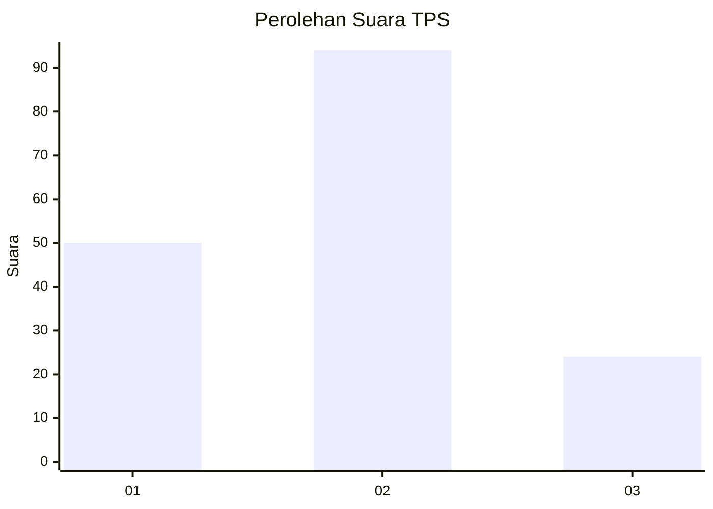
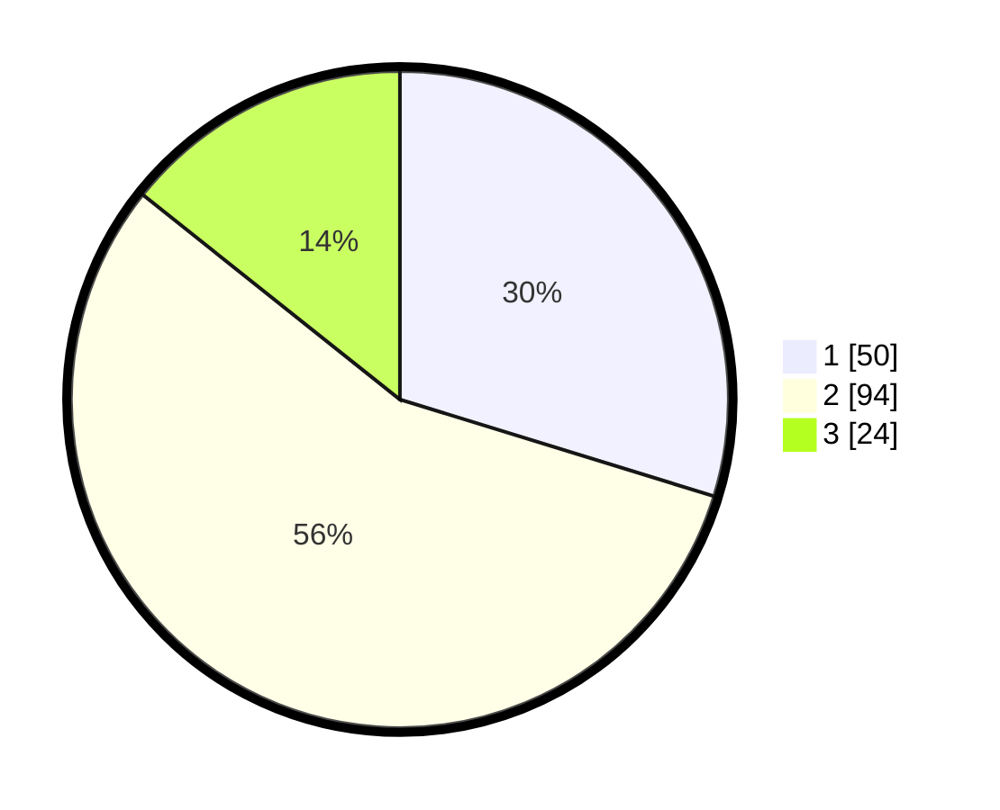

# Hasil

## Grafik

## Tabel

| No. | Nama Paslon    | Suara | Suara (raw) | Persentase |
|:--- |:-------------- | -----:| -----------:| ----------:|
| 1   | ANIES MUHAIMIN | 50    | [50][p-1]   | 29,76      |
| 2   | PRABOWO GIBRAN | 94    | [94][p-2]   | 55,95      |
| 3   | GANJAR MAHFUD  | 24    | [24][p-3]   | 14,29      |

[p-1]: https://github.com/gigit-pemilu/pemilu-2024-35-jawa-timur/blob/main/pilpres/hitung-suara/sub/35-jawa-timur/sub/09-jember/sub/23-mumbulsari/sub/2004-mumbulsari/sub/042-tps/sub/paslon-1.txt
[p-2]: https://github.com/gigit-pemilu/pemilu-2024-35-jawa-timur/blob/main/pilpres/hitung-suara/sub/35-jawa-timur/sub/09-jember/sub/23-mumbulsari/sub/2004-mumbulsari/sub/042-tps/sub/paslon-2.txt
[p-3]: https://github.com/gigit-pemilu/pemilu-2024-35-jawa-timur/blob/main/pilpres/hitung-suara/sub/35-jawa-timur/sub/09-jember/sub/23-mumbulsari/sub/2004-mumbulsari/sub/042-tps/sub/paslon-3.txt

## Foto C Plano

https://sirekap-obj-formc.kpu.go.id/67f4/pemilu/ppwp/35/09/23/20/04/3509232004042-20240215-034909--0100a029-8448-4788-a6ac-33b3e5edd9b7.jpg

https://sirekap-obj-formc.kpu.go.id/67f4/pemilu/ppwp/35/09/23/20/04/3509232004042-20240215-044456--e61cdab6-2a12-4535-b5f1-2300b3766a24.jpg

https://sirekap-obj-formc.kpu.go.id/67f4/pemilu/ppwp/35/09/23/20/04/3509232004042-20240215-044759--2ec10cf9-b08f-4282-9d8f-645b2c9eacd6.jpg

## Metadata

| Key        | Value               |
| ---------- | ------------------- |
| Time Stamp | 2024-02-15 12:00:28 |

