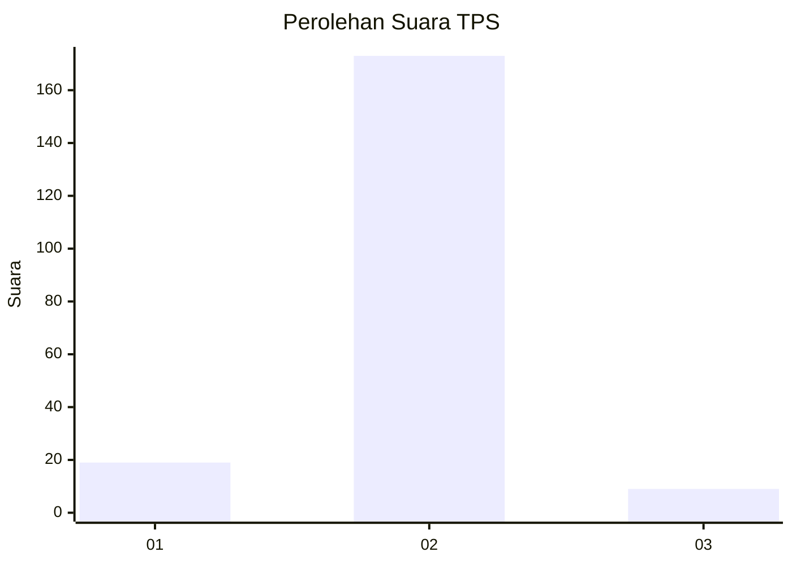
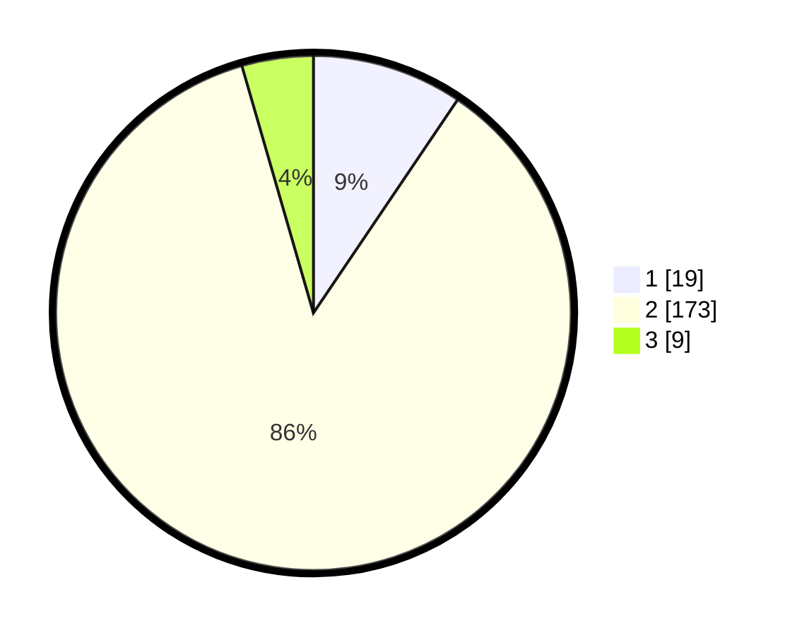

# Hasil

## Grafik

## Tabel

| No. | Nama Paslon    | Suara | Suara (raw) | Persentase |
|:--- |:-------------- | -----:| -----------:| ----------:|
| 1   | ANIES MUHAIMIN | 19    | [19][p-1]   | 9,45       |
| 2   | PRABOWO GIBRAN | 173   | [173][p-2]  | 86,07      |
| 3   | GANJAR MAHFUD  | 9     | [9][p-3]    | 4,48       |

[p-1]: https://github.com/gigit-pemilu/pemilu-2024/blob/main/pilpres/hitung-suara/sub/35-jawa-timur/sub/09-jember/sub/23-mumbulsari/sub/2005-suco/sub/003-tps/sub/paslon-1.txt
[p-2]: https://github.com/gigit-pemilu/pemilu-2024/blob/main/pilpres/hitung-suara/sub/35-jawa-timur/sub/09-jember/sub/23-mumbulsari/sub/2005-suco/sub/003-tps/sub/paslon-2.txt
[p-3]: https://github.com/gigit-pemilu/pemilu-2024/blob/main/pilpres/hitung-suara/sub/35-jawa-timur/sub/09-jember/sub/23-mumbulsari/sub/2005-suco/sub/003-tps/sub/paslon-3.txt

## Foto C Plano

https://sirekap-obj-formc.kpu.go.id/eaa7/pemilu/ppwp/35/09/23/20/05/3509232005003-20240215-134803--dc04f2ae-afed-4072-b4a3-6207c83dc23e.jpg

https://sirekap-obj-formc.kpu.go.id/eaa7/pemilu/ppwp/35/09/23/20/05/3509232005003-20240215-135029--038c45e4-79a9-47d6-aeff-481d21c8c33a.jpg

https://sirekap-obj-formc.kpu.go.id/eaa7/pemilu/ppwp/35/09/23/20/05/3509232005003-20240215-135113--9832bdb0-91c4-481f-9768-f7a3ad97eaff.jpg

## Metadata

| Key        | Value               |
| ---------- | ------------------- |
| Time Stamp | 2024-02-25 15:00:00 |

