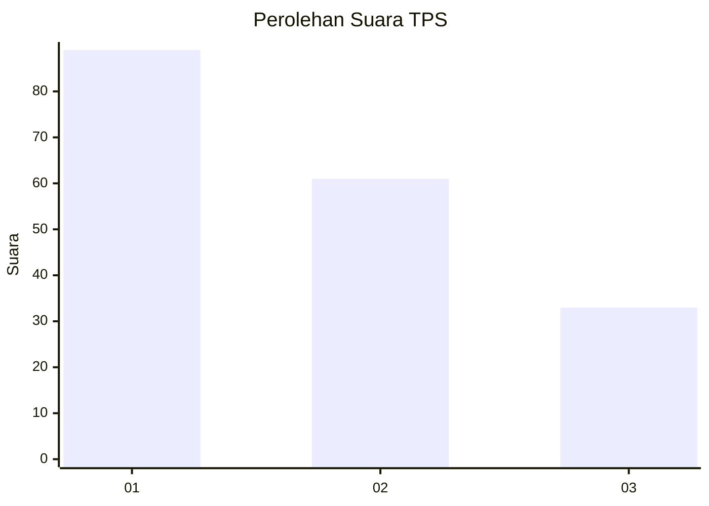
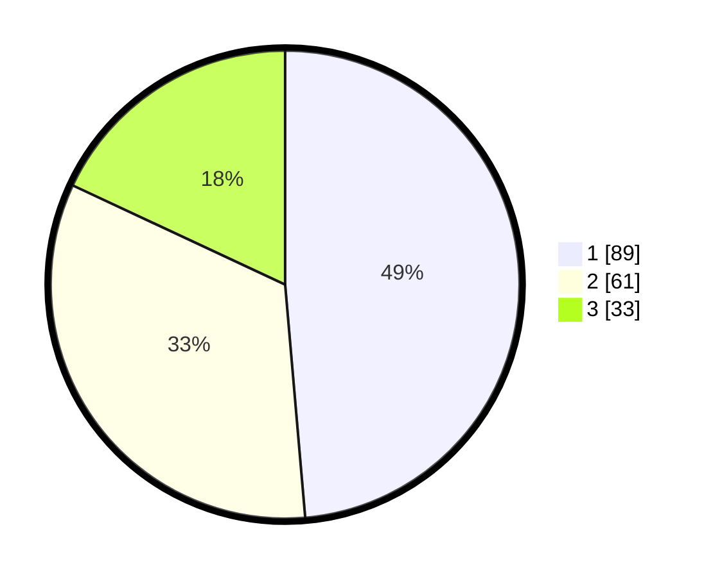

# Hasil

## Grafik

## Tabel

| No. | Nama Paslon    | Suara | Suara (raw) | Persentase |
|:--- |:-------------- | -----:| -----------:| ----------:|
| 1   | ANIES MUHAIMIN | 89    | [89][p-1]   | 48,63      |
| 2   | PRABOWO GIBRAN | 61    | [61][p-2]   | 33,33      |
| 3   | GANJAR MAHFUD  | 33    | [33][p-3]   | 18,03      |

[p-1]: https://github.com/gigit-pemilu/pemilu-2024-35-jawa-timur/blob/main/pilpres/hitung-suara/sub/35-jawa-timur/sub/09-jember/sub/23-mumbulsari/sub/2005-suco/sub/014-tps/sub/paslon-1.txt
[p-2]: https://github.com/gigit-pemilu/pemilu-2024-35-jawa-timur/blob/main/pilpres/hitung-suara/sub/35-jawa-timur/sub/09-jember/sub/23-mumbulsari/sub/2005-suco/sub/014-tps/sub/paslon-2.txt
[p-3]: https://github.com/gigit-pemilu/pemilu-2024-35-jawa-timur/blob/main/pilpres/hitung-suara/sub/35-jawa-timur/sub/09-jember/sub/23-mumbulsari/sub/2005-suco/sub/014-tps/sub/paslon-3.txt

## Foto C Plano

https://sirekap-obj-formc.kpu.go.id/aff5/pemilu/ppwp/35/09/23/20/05/3509232005014-20240215-195411--4dec8513-d87f-471c-8829-bd08e2210d87.jpg

https://sirekap-obj-formc.kpu.go.id/aff5/pemilu/ppwp/35/09/23/20/05/3509232005014-20240215-210824--f78a79c5-3e91-4268-a21d-04694238ab85.jpg

https://sirekap-obj-formc.kpu.go.id/aff5/pemilu/ppwp/35/09/23/20/05/3509232005014-20240215-200756--463b5655-322c-4d4a-8bf8-fa924a03441a.jpg

## Metadata

| Key        | Value               |
| ---------- | ------------------- |
| Time Stamp | 2024-02-15 22:40:13 |

