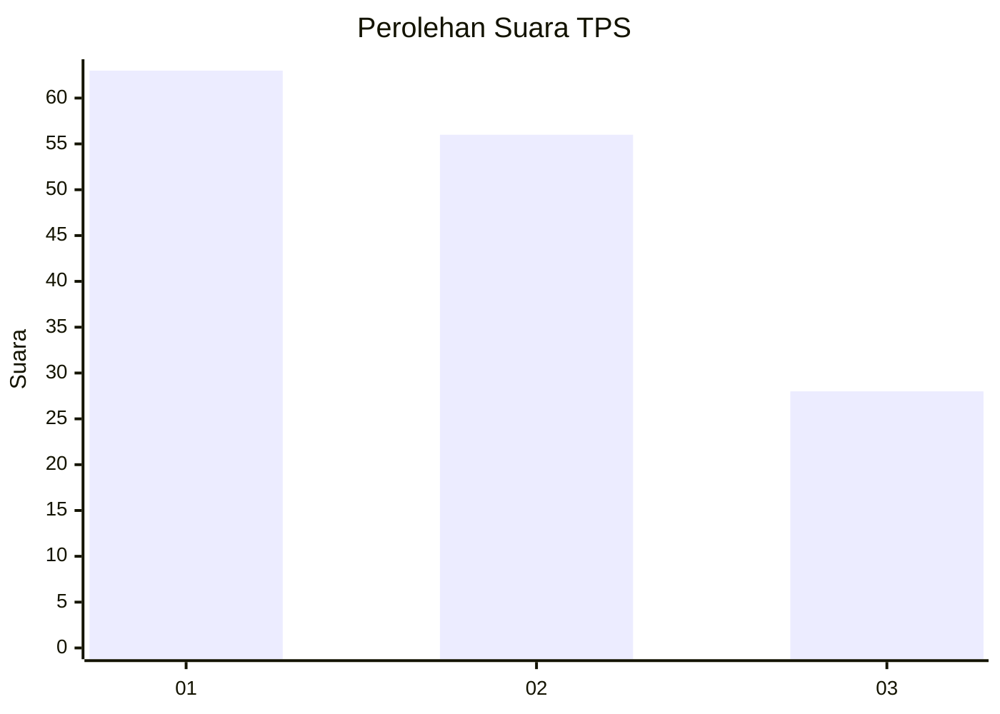
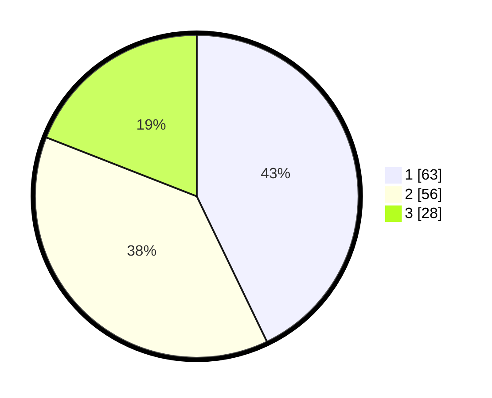

# Hasil

## Grafik

## Tabel

| No. | Nama Paslon    | Suara | Suara (raw) | Persentase |
|:--- |:-------------- | -----:| -----------:| ----------:|
| 1   | ANIES MUHAIMIN | 63    | [63][p-1]   | 42,86      |
| 2   | PRABOWO GIBRAN | 56    | [56][p-2]   | 38,10      |
| 3   | GANJAR MAHFUD  | 28    | [28][p-3]   | 19,05      |

[p-1]: https://github.com/gigit-pemilu/pemilu-2024-35-jawa-timur/blob/main/pilpres/hitung-suara/sub/35-jawa-timur/sub/09-jember/sub/23-mumbulsari/sub/2005-suco/sub/018-tps/sub/paslon-1.txt
[p-2]: https://github.com/gigit-pemilu/pemilu-2024-35-jawa-timur/blob/main/pilpres/hitung-suara/sub/35-jawa-timur/sub/09-jember/sub/23-mumbulsari/sub/2005-suco/sub/018-tps/sub/paslon-2.txt
[p-3]: https://github.com/gigit-pemilu/pemilu-2024-35-jawa-timur/blob/main/pilpres/hitung-suara/sub/35-jawa-timur/sub/09-jember/sub/23-mumbulsari/sub/2005-suco/sub/018-tps/sub/paslon-3.txt

## Foto C Plano

https://sirekap-obj-formc.kpu.go.id/e334/pemilu/ppwp/35/09/23/20/05/3509232005018-20240214-213458--76cc56eb-dfd1-4419-84bb-ee0593c03b78.jpg

https://sirekap-obj-formc.kpu.go.id/e334/pemilu/ppwp/35/09/23/20/05/3509232005018-20240214-213631--d2e74311-6167-42d5-a2f7-ed7968a69344.jpg

https://sirekap-obj-formc.kpu.go.id/e334/pemilu/ppwp/35/09/23/20/05/3509232005018-20240214-213736--0f3421aa-82b6-449d-9e67-9b8173708773.jpg

## Metadata

| Key        | Value               |
| ---------- | ------------------- |
| Time Stamp | 2024-02-15 12:00:28 |

