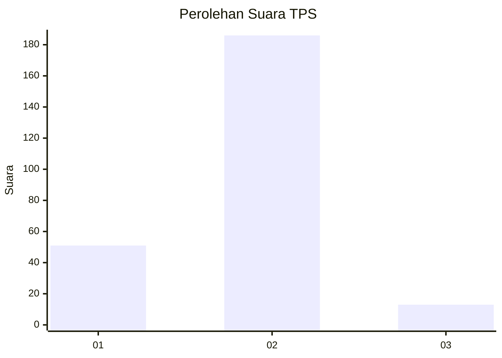
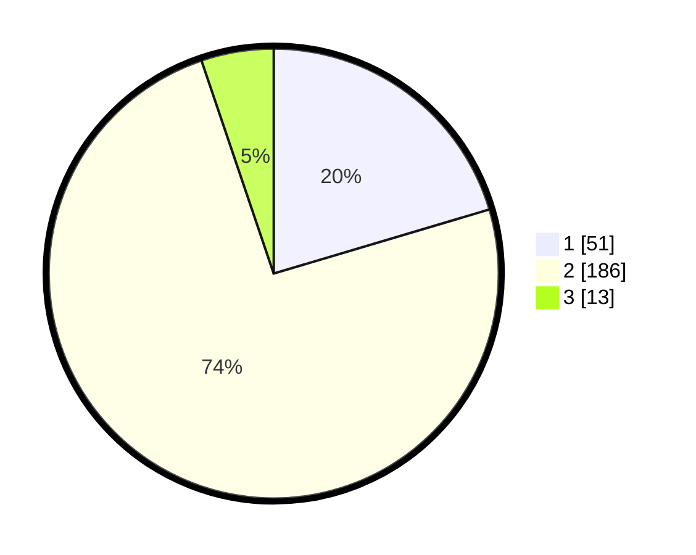

# Hasil

## Grafik

## Tabel

| No. | Nama Paslon    | Suara | Suara (raw) | Persentase |
|:--- |:-------------- | -----:| -----------:| ----------:|
| 1   | ANIES MUHAIMIN | 51    | [51][p-1]   | 20,40      |
| 2   | PRABOWO GIBRAN | 186   | [186][p-2]  | 74,40      |
| 3   | GANJAR MAHFUD  | 13    | [13][p-3]   | 5,20       |

[p-1]: https://github.com/gigit-pemilu/pemilu-2024/blob/main/pilpres/hitung-suara/sub/35-jawa-timur/sub/09-jember/sub/23-mumbulsari/sub/2005-suco/sub/019-tps/sub/paslon-1.txt
[p-2]: https://github.com/gigit-pemilu/pemilu-2024/blob/main/pilpres/hitung-suara/sub/35-jawa-timur/sub/09-jember/sub/23-mumbulsari/sub/2005-suco/sub/019-tps/sub/paslon-2.txt
[p-3]: https://github.com/gigit-pemilu/pemilu-2024/blob/main/pilpres/hitung-suara/sub/35-jawa-timur/sub/09-jember/sub/23-mumbulsari/sub/2005-suco/sub/019-tps/sub/paslon-3.txt

## Foto C Plano

https://sirekap-obj-formc.kpu.go.id/688f/pemilu/ppwp/35/09/23/20/05/3509232005019-20240214-224016--516417c3-35a3-4b13-95bb-c6e853851539.jpg

https://sirekap-obj-formc.kpu.go.id/688f/pemilu/ppwp/35/09/23/20/05/3509232005019-20240214-224310--323ef51a-c10e-4093-b369-408a7e7c5a40.jpg

https://sirekap-obj-formc.kpu.go.id/688f/pemilu/ppwp/35/09/23/20/05/3509232005019-20240214-224347--4c171250-c1a5-4a95-9a26-7f406490f967.jpg

## Metadata

| Key        | Value               |
| ---------- | ------------------- |
| Time Stamp | 2024-02-25 12:00:00 |

