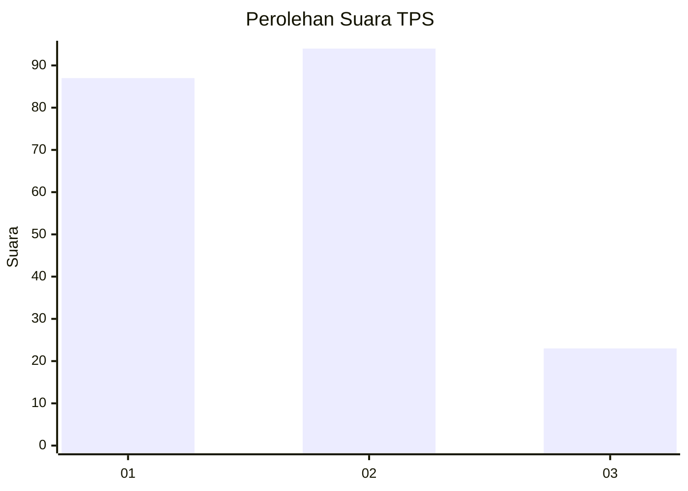
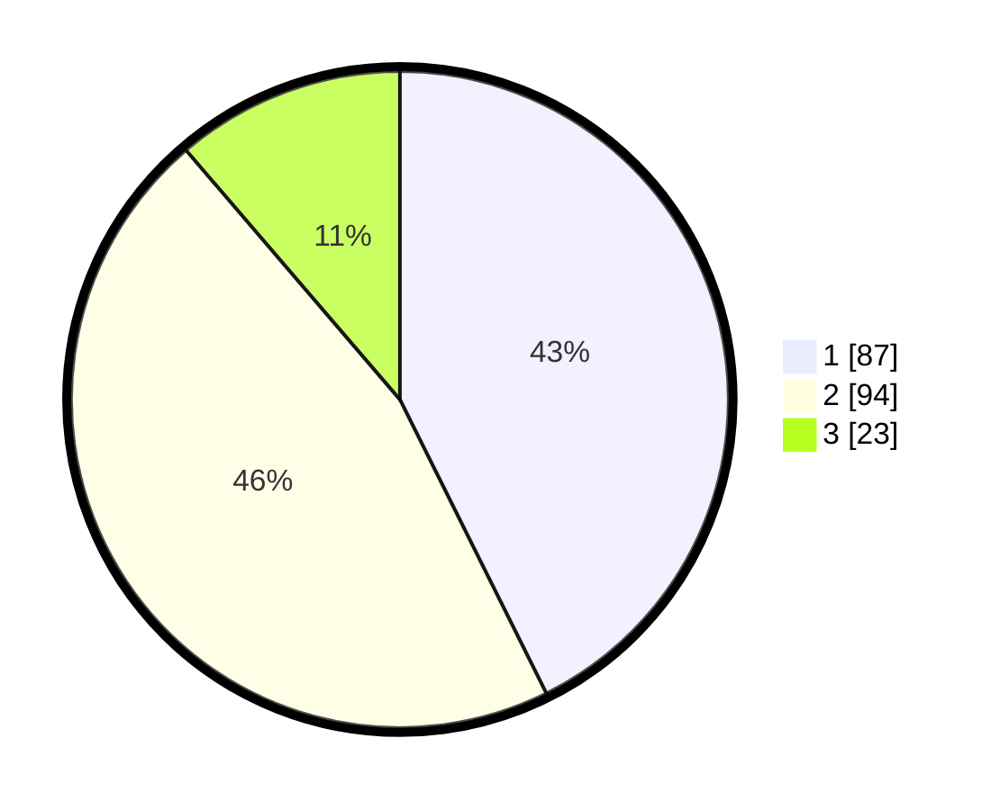

# Hasil

## Grafik

## Tabel

| No. | Nama Paslon    | Suara | Suara (raw) | Persentase |
|:--- |:-------------- | -----:| -----------:| ----------:|
| 1   | ANIES MUHAIMIN | 87    | [87][p-1]   | 42,65      |
| 2   | PRABOWO GIBRAN | 94    | [94][p-2]   | 46,08      |
| 3   | GANJAR MAHFUD  | 23    | [23][p-3]   | 11,27      |

[p-1]: https://github.com/gigit-pemilu/pemilu-2024-35-jawa-timur/blob/main/pilpres/hitung-suara/sub/35-jawa-timur/sub/09-jember/sub/23-mumbulsari/sub/2005-suco/sub/021-tps/sub/paslon-1.txt
[p-2]: https://github.com/gigit-pemilu/pemilu-2024-35-jawa-timur/blob/main/pilpres/hitung-suara/sub/35-jawa-timur/sub/09-jember/sub/23-mumbulsari/sub/2005-suco/sub/021-tps/sub/paslon-2.txt
[p-3]: https://github.com/gigit-pemilu/pemilu-2024-35-jawa-timur/blob/main/pilpres/hitung-suara/sub/35-jawa-timur/sub/09-jember/sub/23-mumbulsari/sub/2005-suco/sub/021-tps/sub/paslon-3.txt

## Foto C Plano

https://sirekap-obj-formc.kpu.go.id/3ff8/pemilu/ppwp/35/09/23/20/05/3509232005021-20240215-092701--cfdc853f-2402-44d4-bd8f-3be1b3b594b6.jpg

https://sirekap-obj-formc.kpu.go.id/3ff8/pemilu/ppwp/35/09/23/20/05/3509232005021-20240214-232502--7c60d097-9bcf-4261-bbb7-339276e66e7d.jpg

https://sirekap-obj-formc.kpu.go.id/3ff8/pemilu/ppwp/35/09/23/20/05/3509232005021-20240214-232659--0a44f640-90cb-454f-97ec-e0e44affad77.jpg

## Metadata

| Key        | Value               |
| ---------- | ------------------- |
| Time Stamp | 2024-02-15 12:00:28 |

