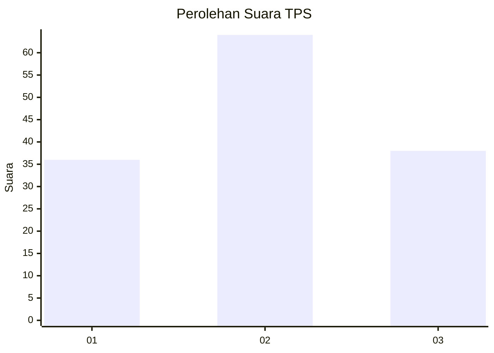
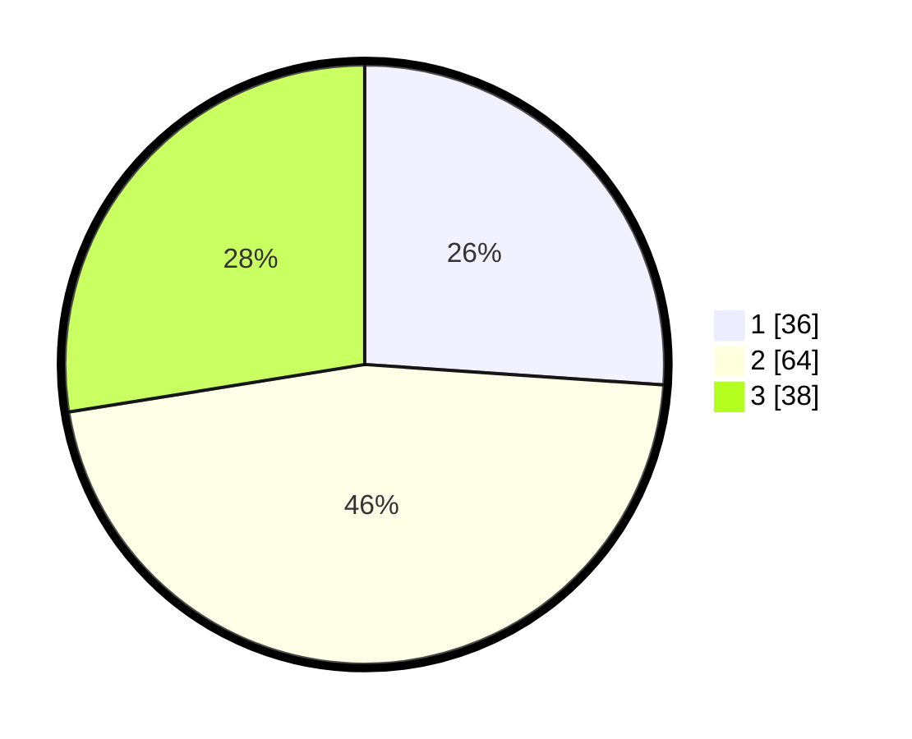

# Hasil

## Grafik

## Tabel

| No. | Nama Paslon    | Suara | Suara (raw) | Persentase |
|:--- |:-------------- | -----:| -----------:| ----------:|
| 1   | ANIES MUHAIMIN | 36    | [36][p-1]   | 26,09      |
| 2   | PRABOWO GIBRAN | 64    | [64][p-2]   | 46,38      |
| 3   | GANJAR MAHFUD  | 38    | [38][p-3]   | 27,54      |

[p-1]: https://github.com/gigit-pemilu/pemilu-2024/blob/main/pilpres/hitung-suara/sub/35-jawa-timur/sub/09-jember/sub/23-mumbulsari/sub/2005-suco/sub/033-tps/sub/paslon-1.txt
[p-2]: https://github.com/gigit-pemilu/pemilu-2024/blob/main/pilpres/hitung-suara/sub/35-jawa-timur/sub/09-jember/sub/23-mumbulsari/sub/2005-suco/sub/033-tps/sub/paslon-2.txt
[p-3]: https://github.com/gigit-pemilu/pemilu-2024/blob/main/pilpres/hitung-suara/sub/35-jawa-timur/sub/09-jember/sub/23-mumbulsari/sub/2005-suco/sub/033-tps/sub/paslon-3.txt

## Foto C Plano

https://sirekap-obj-formc.kpu.go.id/82a8/pemilu/ppwp/35/09/23/20/05/3509232005033-20240214-223343--4064cde9-f1dd-4b01-a22c-c6531ba42914.jpg

https://sirekap-obj-formc.kpu.go.id/82a8/pemilu/ppwp/35/09/23/20/05/3509232005033-20240214-223614--88db6bcc-046f-4721-9c7a-f97016ddd369.jpg

https://sirekap-obj-formc.kpu.go.id/82a8/pemilu/ppwp/35/09/23/20/05/3509232005033-20240214-231655--f82cc395-b870-4610-be89-b44d273950da.jpg

## Metadata

| Key        | Value               |
| ---------- | ------------------- |
| Time Stamp | 2024-02-15 12:00:28 |

