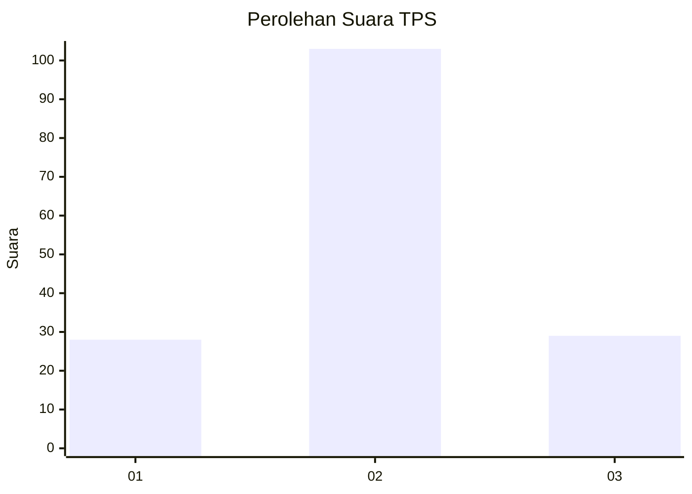
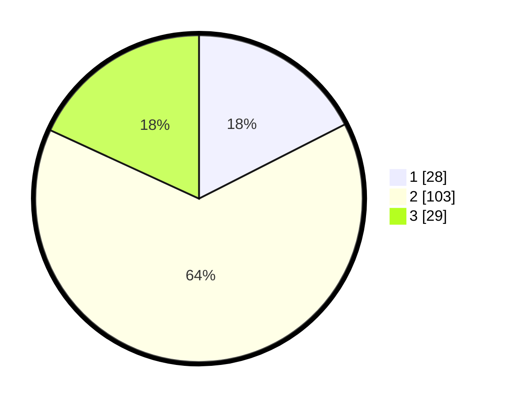

# Hasil

## Grafik

## Tabel

| No. | Nama Paslon    | Suara | Suara (raw) | Persentase |
|:--- |:-------------- | -----:| -----------:| ----------:|
| 1   | ANIES MUHAIMIN | 28    | [28][p-1]   | 17,50      |
| 2   | PRABOWO GIBRAN | 103   | [103][p-2]  | 64,38      |
| 3   | GANJAR MAHFUD  | 29    | [29][p-3]   | 18,13      |

[p-1]: https://github.com/gigit-pemilu/pemilu-2024/blob/main/pilpres/hitung-suara/sub/35-jawa-timur/sub/09-jember/sub/23-mumbulsari/sub/2005-suco/sub/038-tps/sub/paslon-1.txt
[p-2]: https://github.com/gigit-pemilu/pemilu-2024/blob/main/pilpres/hitung-suara/sub/35-jawa-timur/sub/09-jember/sub/23-mumbulsari/sub/2005-suco/sub/038-tps/sub/paslon-2.txt
[p-3]: https://github.com/gigit-pemilu/pemilu-2024/blob/main/pilpres/hitung-suara/sub/35-jawa-timur/sub/09-jember/sub/23-mumbulsari/sub/2005-suco/sub/038-tps/sub/paslon-3.txt

## Foto C Plano

https://sirekap-obj-formc.kpu.go.id/51cc/pemilu/ppwp/35/09/23/20/05/3509232005038-20240215-020318--b0b08c2d-4e5b-4e48-b380-e5db3c3bbee3.jpg

https://sirekap-obj-formc.kpu.go.id/51cc/pemilu/ppwp/35/09/23/20/05/3509232005038-20240214-222432--544424e4-ba47-4740-9f67-5ee65cc499d9.jpg

https://sirekap-obj-formc.kpu.go.id/51cc/pemilu/ppwp/35/09/23/20/05/3509232005038-20240214-203158--d024a1e5-281e-423e-af44-f2234fe7af09.jpg

## Metadata

| Key        | Value               |
| ---------- | ------------------- |
| Time Stamp | 2024-02-24 22:31:28 |

