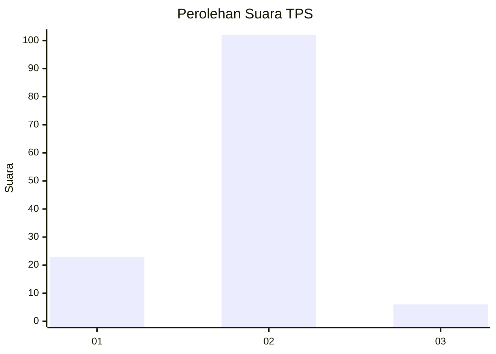
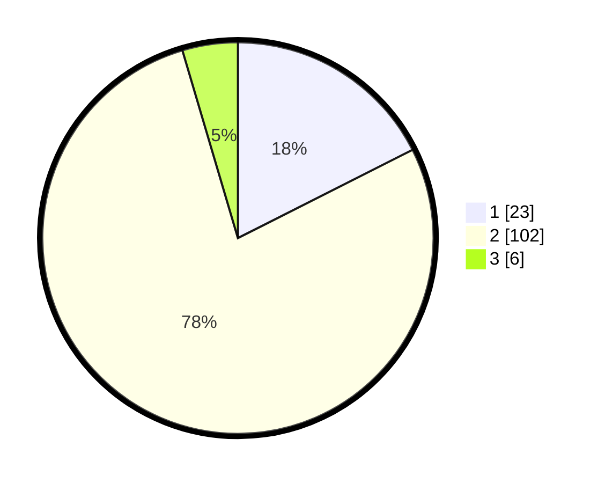

# Hasil

## Grafik

## Tabel

| No. | Nama Paslon    | Suara | Suara (raw) | Persentase |
|:--- |:-------------- | -----:| -----------:| ----------:|
| 1   | ANIES MUHAIMIN | 23    | [23][p-1]   | 17,56      |
| 2   | PRABOWO GIBRAN | 102   | [102][p-2]  | 77,86      |
| 3   | GANJAR MAHFUD  | 6     | [6][p-3]    | 4,58       |

[p-1]: https://github.com/gigit-pemilu/pemilu-2024-35-jawa-timur/blob/main/pilpres/hitung-suara/sub/35-jawa-timur/sub/09-jember/sub/23-mumbulsari/sub/2006-lampeji/sub/003-tps/sub/paslon-1.txt
[p-2]: https://github.com/gigit-pemilu/pemilu-2024-35-jawa-timur/blob/main/pilpres/hitung-suara/sub/35-jawa-timur/sub/09-jember/sub/23-mumbulsari/sub/2006-lampeji/sub/003-tps/sub/paslon-2.txt
[p-3]: https://github.com/gigit-pemilu/pemilu-2024-35-jawa-timur/blob/main/pilpres/hitung-suara/sub/35-jawa-timur/sub/09-jember/sub/23-mumbulsari/sub/2006-lampeji/sub/003-tps/sub/paslon-3.txt

## Foto C Plano

https://sirekap-obj-formc.kpu.go.id/faa6/pemilu/ppwp/35/09/23/20/06/3509232006003-20240214-215905--b06532ac-7b6f-45a2-8cd5-27437b806c2e.jpg

https://sirekap-obj-formc.kpu.go.id/faa6/pemilu/ppwp/35/09/23/20/06/3509232006003-20240214-220100--751e7eb5-cfdf-4a70-8d51-da60ac9eb36b.jpg

https://sirekap-obj-formc.kpu.go.id/faa6/pemilu/ppwp/35/09/23/20/06/3509232006003-20240214-220203--761723f2-2d9a-4623-9b90-282b1edf697a.jpg

## Metadata

| Key        | Value               |
| ---------- | ------------------- |
| Time Stamp | 2024-02-15 23:29:50 |

