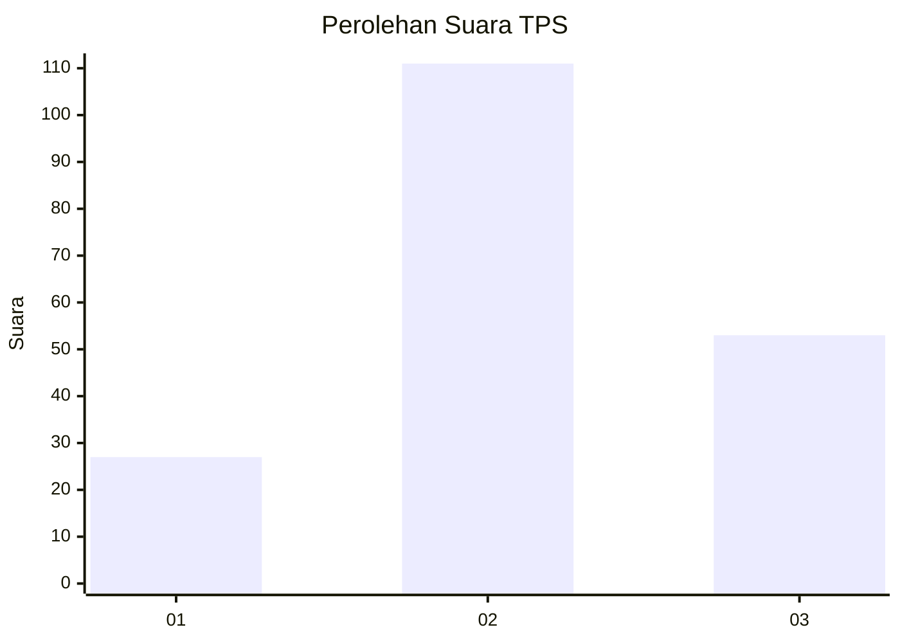
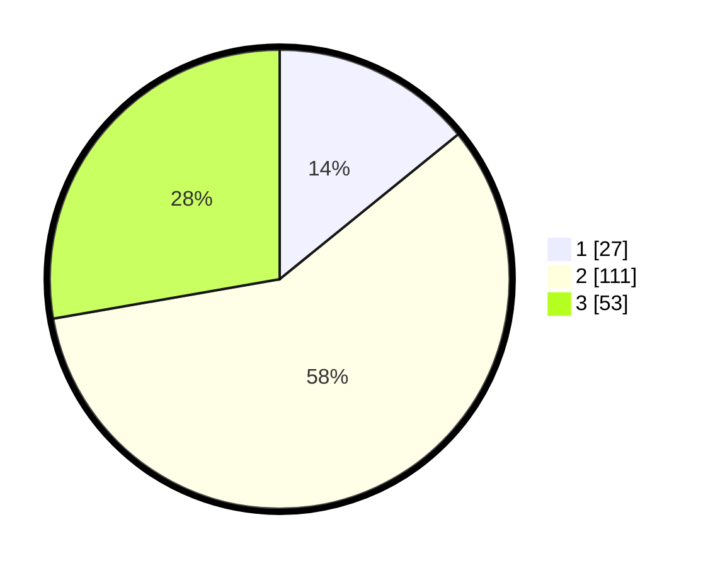

# Hasil

## Grafik

## Tabel

| No. | Nama Paslon    | Suara | Suara (raw) | Persentase |
|:--- |:-------------- | -----:| -----------:| ----------:|
| 1   | ANIES MUHAIMIN | 27    | [27][p-1]   | 14,14      |
| 2   | PRABOWO GIBRAN | 111   | [111][p-2]  | 58,12      |
| 3   | GANJAR MAHFUD  | 53    | [53][p-3]   | 27,75      |

[p-1]: https://github.com/gigit-pemilu/pemilu-2024-35-jawa-timur/blob/main/pilpres/hitung-suara/sub/35-jawa-timur/sub/09-jember/sub/23-mumbulsari/sub/2006-lampeji/sub/005-tps/sub/paslon-1.txt
[p-2]: https://github.com/gigit-pemilu/pemilu-2024-35-jawa-timur/blob/main/pilpres/hitung-suara/sub/35-jawa-timur/sub/09-jember/sub/23-mumbulsari/sub/2006-lampeji/sub/005-tps/sub/paslon-2.txt
[p-3]: https://github.com/gigit-pemilu/pemilu-2024-35-jawa-timur/blob/main/pilpres/hitung-suara/sub/35-jawa-timur/sub/09-jember/sub/23-mumbulsari/sub/2006-lampeji/sub/005-tps/sub/paslon-3.txt

## Foto C Plano

https://sirekap-obj-formc.kpu.go.id/739a/pemilu/ppwp/35/09/23/20/06/3509232006005-20240215-023123--288cd1b8-db08-484b-9ea8-778082bb7c9d.jpg

https://sirekap-obj-formc.kpu.go.id/739a/pemilu/ppwp/35/09/23/20/06/3509232006005-20240215-023428--50c30832-3e18-482c-b62c-a68fd5e520ff.jpg

https://sirekap-obj-formc.kpu.go.id/739a/pemilu/ppwp/35/09/23/20/06/3509232006005-20240215-023940--86b133f6-1b1b-4814-b666-a522cc223f7d.jpg

## Metadata

| Key        | Value               |
| ---------- | ------------------- |
| Time Stamp | 2024-02-15 12:00:28 |

