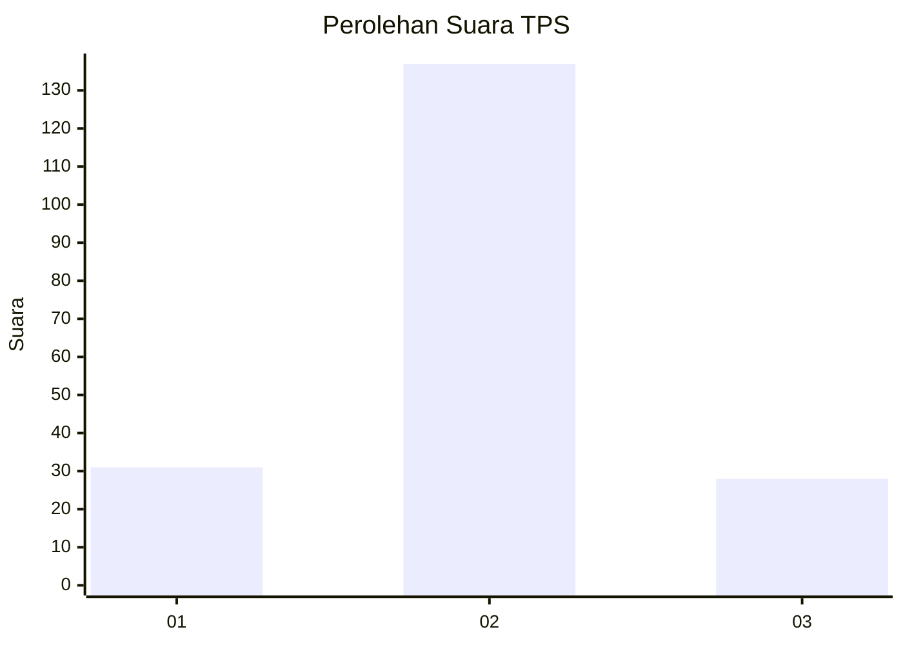

# Hasil

## Grafik

## Tabel

| No. | Nama Paslon    | Suara | Suara (raw) | Persentase |
|:--- |:-------------- | -----:| -----------:| ----------:|
| 1   | ANIES MUHAIMIN | 31    | [31][p-1]   | 15,82      |
| 2   | PRABOWO GIBRAN | 137   | [137][p-2]  | 69,90      |
| 3   | GANJAR MAHFUD  | 28    | [28][p-3]   | 14,29      |

[p-1]: https://github.com/gigit-pemilu/pemilu-2024/blob/main/pilpres/hitung-suara/sub/35-jawa-timur/sub/09-jember/sub/23-mumbulsari/sub/2006-lampeji/sub/013-tps/sub/paslon-1.txt
[p-2]: https://github.com/gigit-pemilu/pemilu-2024/blob/main/pilpres/hitung-suara/sub/35-jawa-timur/sub/09-jember/sub/23-mumbulsari/sub/2006-lampeji/sub/013-tps/sub/paslon-2.txt
[p-3]: https://github.com/gigit-pemilu/pemilu-2024/blob/main/pilpres/hitung-suara/sub/35-jawa-timur/sub/09-jember/sub/23-mumbulsari/sub/2006-lampeji/sub/013-tps/sub/paslon-3.txt

## Foto C Plano

https://sirekap-obj-formc.kpu.go.id/4ef7/pemilu/ppwp/35/09/23/20/06/3509232006013-20240214-211047--e7778c19-d4df-4427-9fdc-464f9fe93eed.jpg

https://sirekap-obj-formc.kpu.go.id/4ef7/pemilu/ppwp/35/09/23/20/06/3509232006013-20240214-211202--7b8290fc-6376-4b5e-b435-1b74c05ac18f.jpg

https://sirekap-obj-formc.kpu.go.id/4ef7/pemilu/ppwp/35/09/23/20/06/3509232006013-20240214-211402--274e784d-5b59-4c1a-9c08-63ce3ec58052.jpg

## Metadata

| Key        | Value               |
| ---------- | ------------------- |
| Time Stamp | 2024-02-24 22:31:28 |

