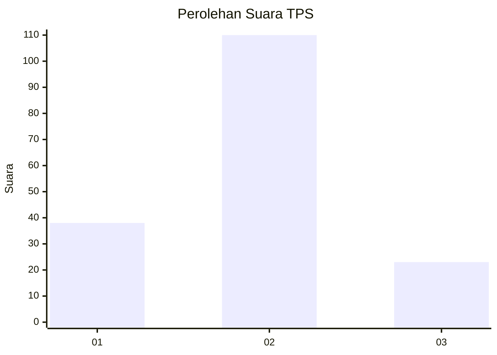
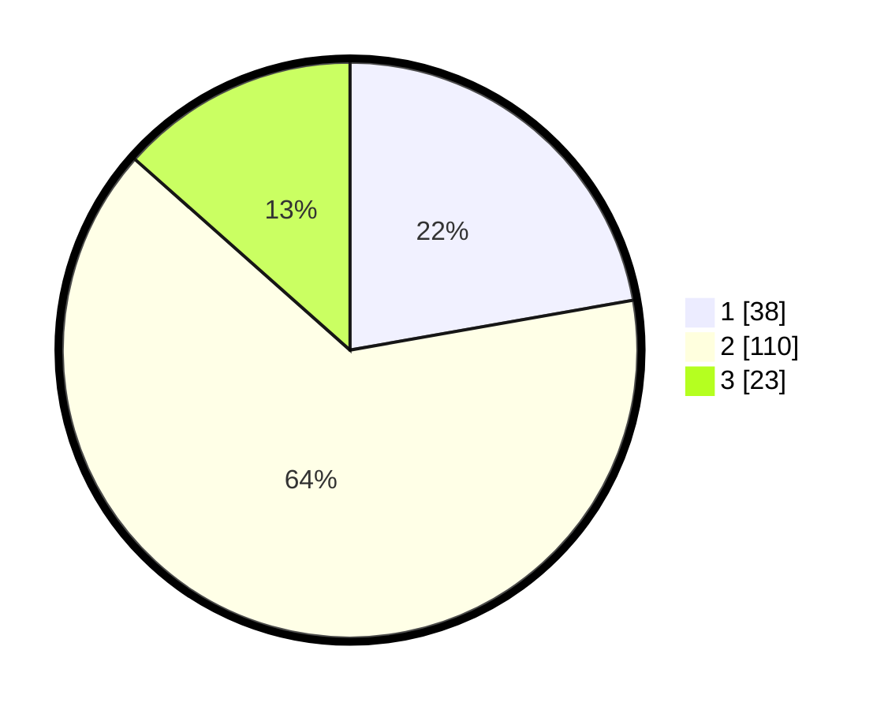

# Hasil

## Grafik

## Tabel

| No. | Nama Paslon    | Suara | Suara (raw) | Persentase |
|:--- |:-------------- | -----:| -----------:| ----------:|
| 1   | ANIES MUHAIMIN | 38    | [38][p-1]   | 22,22      |
| 2   | PRABOWO GIBRAN | 110   | [110][p-2]  | 64,33      |
| 3   | GANJAR MAHFUD  | 23    | [23][p-3]   | 13,45      |

[p-1]: https://github.com/gigit-pemilu/pemilu-2024/blob/main/pilpres/hitung-suara/sub/35-jawa-timur/sub/09-jember/sub/23-mumbulsari/sub/2006-lampeji/sub/021-tps/sub/paslon-1.txt
[p-2]: https://github.com/gigit-pemilu/pemilu-2024/blob/main/pilpres/hitung-suara/sub/35-jawa-timur/sub/09-jember/sub/23-mumbulsari/sub/2006-lampeji/sub/021-tps/sub/paslon-2.txt
[p-3]: https://github.com/gigit-pemilu/pemilu-2024/blob/main/pilpres/hitung-suara/sub/35-jawa-timur/sub/09-jember/sub/23-mumbulsari/sub/2006-lampeji/sub/021-tps/sub/paslon-3.txt

## Foto C Plano

https://sirekap-obj-formc.kpu.go.id/797e/pemilu/ppwp/35/09/23/20/06/3509232006021-20240214-231453--583f1ddb-37b9-43d8-bee4-2eaaed19d2e9.jpg

https://sirekap-obj-formc.kpu.go.id/797e/pemilu/ppwp/35/09/23/20/06/3509232006021-20240214-231733--97cb1c77-9d35-43fd-9884-285b49b8f4a3.jpg

https://sirekap-obj-formc.kpu.go.id/797e/pemilu/ppwp/35/09/23/20/06/3509232006021-20240214-231901--55bf2c4f-ae12-4f80-b277-eaba9e67d325.jpg

## Metadata

| Key        | Value               |
| ---------- | ------------------- |
| Time Stamp | 2024-02-15 12:00:28 |

