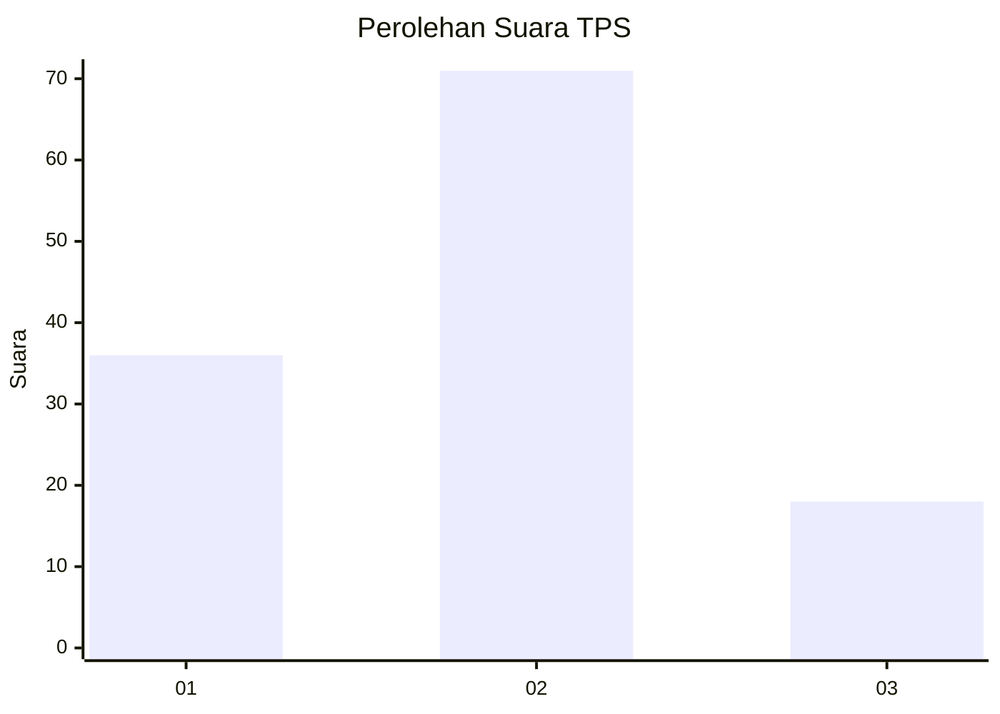
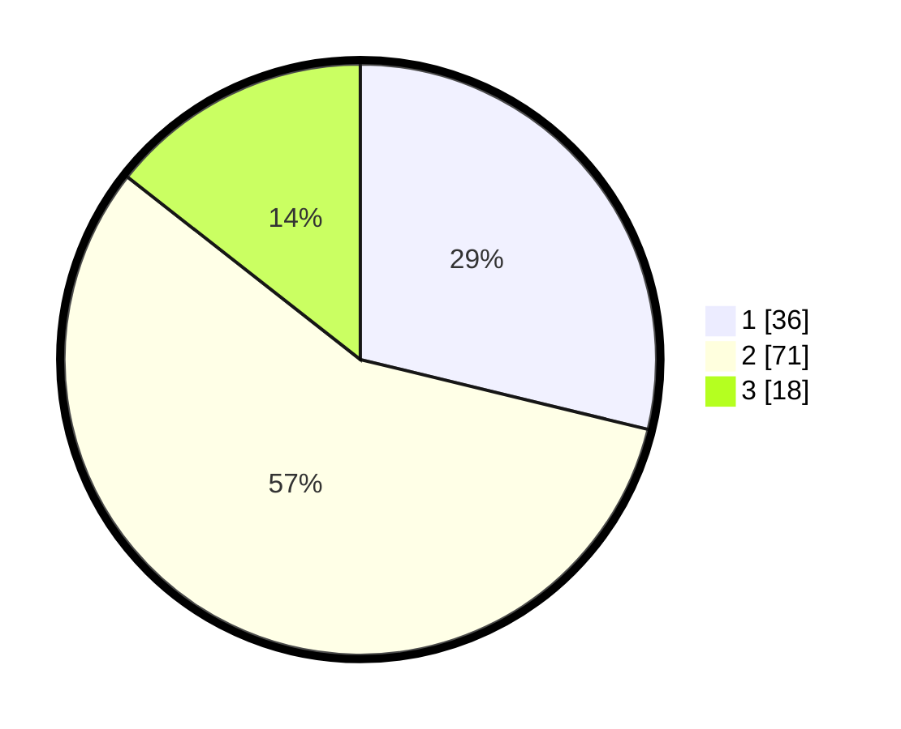

# Hasil

## Grafik

## Tabel

| No. | Nama Paslon    | Suara | Suara (raw) | Persentase |
|:--- |:-------------- | -----:| -----------:| ----------:|
| 1   | ANIES MUHAIMIN | 36    | [36][p-1]   | 28,80      |
| 2   | PRABOWO GIBRAN | 71    | [71][p-2]   | 56,80      |
| 3   | GANJAR MAHFUD  | 18    | [18][p-3]   | 14,40      |

[p-1]: https://github.com/gigit-pemilu/pemilu-2024/blob/main/pilpres/hitung-suara/sub/35-jawa-timur/sub/09-jember/sub/23-mumbulsari/sub/2006-lampeji/sub/024-tps/sub/paslon-1.txt
[p-2]: https://github.com/gigit-pemilu/pemilu-2024/blob/main/pilpres/hitung-suara/sub/35-jawa-timur/sub/09-jember/sub/23-mumbulsari/sub/2006-lampeji/sub/024-tps/sub/paslon-2.txt
[p-3]: https://github.com/gigit-pemilu/pemilu-2024/blob/main/pilpres/hitung-suara/sub/35-jawa-timur/sub/09-jember/sub/23-mumbulsari/sub/2006-lampeji/sub/024-tps/sub/paslon-3.txt

## Foto C Plano

https://sirekap-obj-formc.kpu.go.id/4c19/pemilu/ppwp/35/09/23/20/06/3509232006024-20240214-233455--2cdcc41e-1b69-4bc6-8068-44e6a07144ab.jpg

https://sirekap-obj-formc.kpu.go.id/4c19/pemilu/ppwp/35/09/23/20/06/3509232006024-20240214-233559--a95db172-8a42-44ba-8731-a0036cc76709.jpg

https://sirekap-obj-formc.kpu.go.id/4c19/pemilu/ppwp/35/09/23/20/06/3509232006024-20240214-233701--9b853a9d-0b3d-46db-8b0f-908a0fd45394.jpg

## Metadata

| Key        | Value               |
| ---------- | ------------------- |
| Time Stamp | 2024-02-16 06:00:27 |

