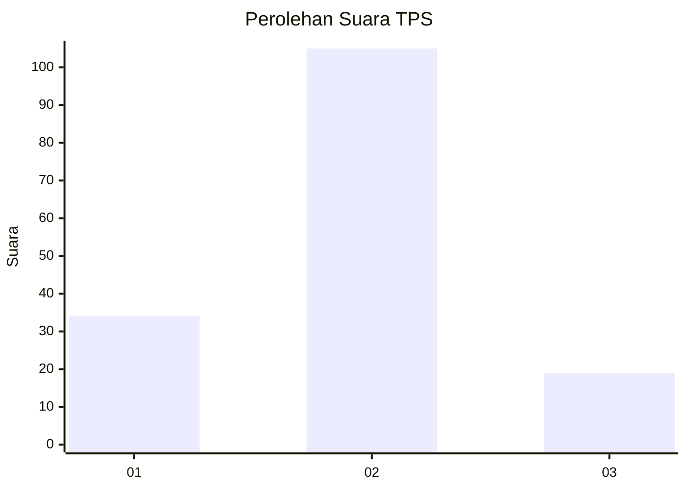
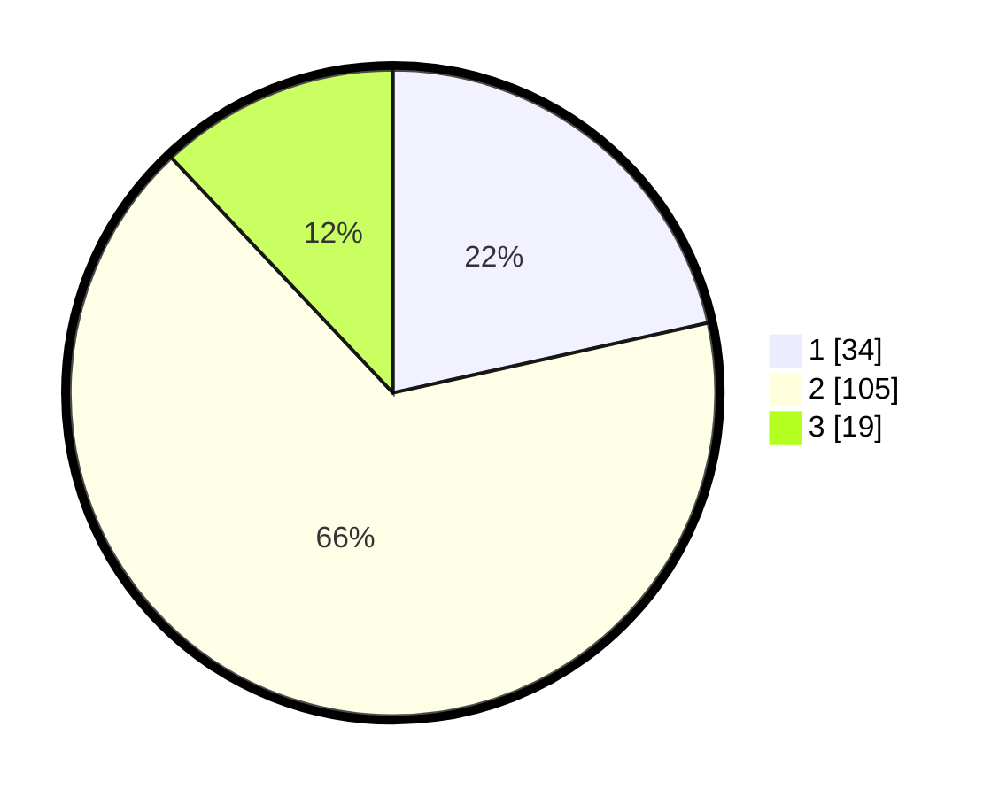

# Hasil

## Grafik

## Tabel

| No. | Nama Paslon    | Suara | Suara (raw) | Persentase |
|:--- |:-------------- | -----:| -----------:| ----------:|
| 1   | ANIES MUHAIMIN | 34    | [34][p-1]   | 21,52      |
| 2   | PRABOWO GIBRAN | 105   | [105][p-2]  | 66,46      |
| 3   | GANJAR MAHFUD  | 19    | [19][p-3]   | 12,03      |

[p-1]: https://github.com/gigit-pemilu/pemilu-2024/blob/main/pilpres/hitung-suara/sub/35-jawa-timur/sub/09-jember/sub/23-mumbulsari/sub/2006-lampeji/sub/028-tps/sub/paslon-1.txt
[p-2]: https://github.com/gigit-pemilu/pemilu-2024/blob/main/pilpres/hitung-suara/sub/35-jawa-timur/sub/09-jember/sub/23-mumbulsari/sub/2006-lampeji/sub/028-tps/sub/paslon-2.txt
[p-3]: https://github.com/gigit-pemilu/pemilu-2024/blob/main/pilpres/hitung-suara/sub/35-jawa-timur/sub/09-jember/sub/23-mumbulsari/sub/2006-lampeji/sub/028-tps/sub/paslon-3.txt

## Foto C Plano

https://sirekap-obj-formc.kpu.go.id/bf78/pemilu/ppwp/35/09/23/20/06/3509232006028-20240215-004535--243b73d4-6fd9-4fb1-b10e-6036ccdae179.jpg

https://sirekap-obj-formc.kpu.go.id/bf78/pemilu/ppwp/35/09/23/20/06/3509232006028-20240214-232023--2a288673-fb25-4179-ba90-3e53d63476c1.jpg

https://sirekap-obj-formc.kpu.go.id/bf78/pemilu/ppwp/35/09/23/20/06/3509232006028-20240215-005100--0bfe26b7-7116-4468-9ba2-96e7904fccd2.jpg

## Metadata

| Key        | Value               |
| ---------- | ------------------- |
| Time Stamp | 2024-02-25 13:00:00 |

