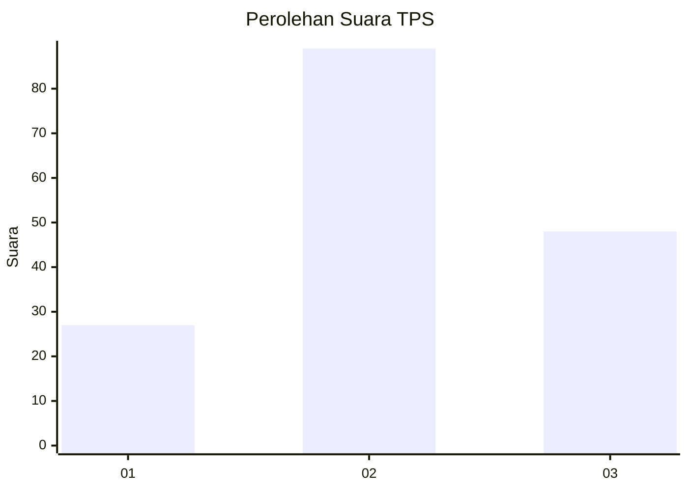
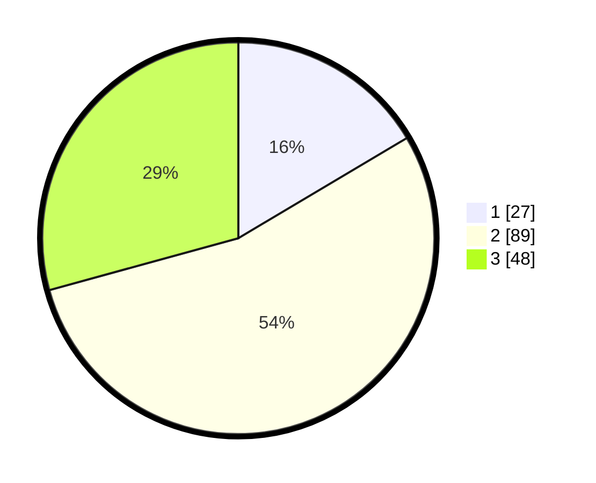

# Hasil

## Grafik

## Tabel

| No. | Nama Paslon    | Suara | Suara (raw) | Persentase |
|:--- |:-------------- | -----:| -----------:| ----------:|
| 1   | ANIES MUHAIMIN | 27    | [27][p-1]   | 16,46      |
| 2   | PRABOWO GIBRAN | 89    | [89][p-2]   | 54,27      |
| 3   | GANJAR MAHFUD  | 48    | [48][p-3]   | 29,27      |

[p-1]: https://github.com/gigit-pemilu/pemilu-2024-35-jawa-timur/blob/main/pilpres/hitung-suara/sub/35-jawa-timur/sub/09-jember/sub/23-mumbulsari/sub/2007-karang-kedawung/sub/031-tps/sub/paslon-1.txt
[p-2]: https://github.com/gigit-pemilu/pemilu-2024-35-jawa-timur/blob/main/pilpres/hitung-suara/sub/35-jawa-timur/sub/09-jember/sub/23-mumbulsari/sub/2007-karang-kedawung/sub/031-tps/sub/paslon-2.txt
[p-3]: https://github.com/gigit-pemilu/pemilu-2024-35-jawa-timur/blob/main/pilpres/hitung-suara/sub/35-jawa-timur/sub/09-jember/sub/23-mumbulsari/sub/2007-karang-kedawung/sub/031-tps/sub/paslon-3.txt

## Foto C Plano

https://sirekap-obj-formc.kpu.go.id/f19f/pemilu/ppwp/35/09/23/20/07/3509232007031-20240214-141312--609dc73a-6f44-49a7-8a98-0f3919f1a3cf.jpg

https://sirekap-obj-formc.kpu.go.id/f19f/pemilu/ppwp/35/09/23/20/07/3509232007031-20240214-141702--cd845c5d-e534-41fa-a196-25911aaffd9d.jpg

https://sirekap-obj-formc.kpu.go.id/f19f/pemilu/ppwp/35/09/23/20/07/3509232007031-20240214-141539--efa99c5e-78fc-4df2-a679-fb2ae3268e5b.jpg

## Metadata

| Key        | Value               |
| ---------- | ------------------- |
| Time Stamp | 2024-02-15 15:00:29 |

