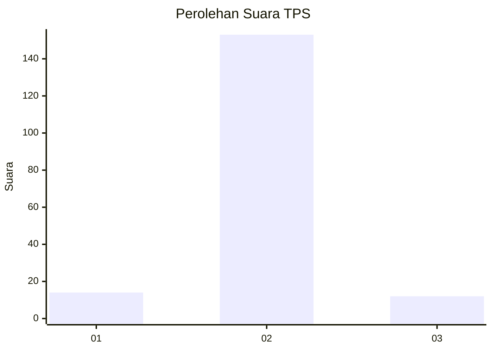
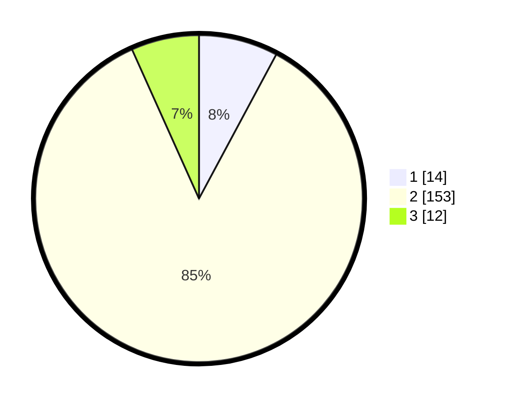

# Hasil

## Grafik

## Tabel

| No. | Nama Paslon    | Suara | Suara (raw) | Persentase |
|:--- |:-------------- | -----:| -----------:| ----------:|
| 1   | ANIES MUHAIMIN | 14    | [14][p-1]   | 7,82       |
| 2   | PRABOWO GIBRAN | 153   | [153][p-2]  | 85,47      |
| 3   | GANJAR MAHFUD  | 12    | [12][p-3]   | 6,70       |

[p-1]: https://github.com/gigit-pemilu/pemilu-2024-35-jawa-timur/blob/main/pilpres/hitung-suara/sub/35-jawa-timur/sub/09-jember/sub/24-pakusari/sub/2001-patemon/sub/009-tps/sub/paslon-1.txt
[p-2]: https://github.com/gigit-pemilu/pemilu-2024-35-jawa-timur/blob/main/pilpres/hitung-suara/sub/35-jawa-timur/sub/09-jember/sub/24-pakusari/sub/2001-patemon/sub/009-tps/sub/paslon-2.txt
[p-3]: https://github.com/gigit-pemilu/pemilu-2024-35-jawa-timur/blob/main/pilpres/hitung-suara/sub/35-jawa-timur/sub/09-jember/sub/24-pakusari/sub/2001-patemon/sub/009-tps/sub/paslon-3.txt

## Foto C Plano

https://sirekap-obj-formc.kpu.go.id/4340/pemilu/ppwp/35/09/24/20/01/3509242001009-20240219-103517--2fa75839-901a-4501-91cd-3776780fe1e6.jpg

https://sirekap-obj-formc.kpu.go.id/4340/pemilu/ppwp/35/09/24/20/01/3509242001009-20240219-103642--58a140c5-9a58-4167-88a6-10f231b1ba41.jpg

https://sirekap-obj-formc.kpu.go.id/4340/pemilu/ppwp/35/09/24/20/01/3509242001009-20240216-135107--85c6de81-9765-49b8-91e2-34dc90842990.jpg

## Metadata

| Key        | Value               |
| ---------- | ------------------- |
| Time Stamp | 2024-02-24 22:31:28 |

