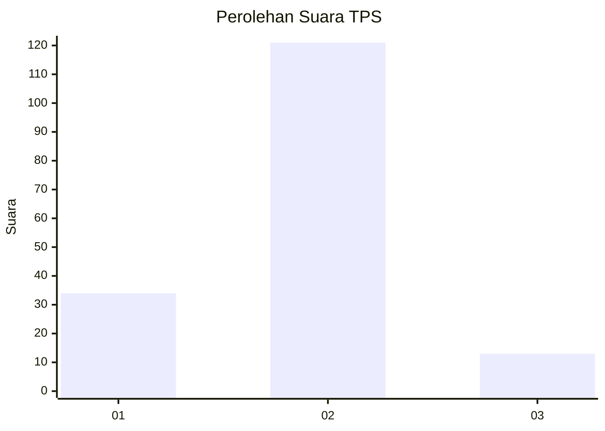
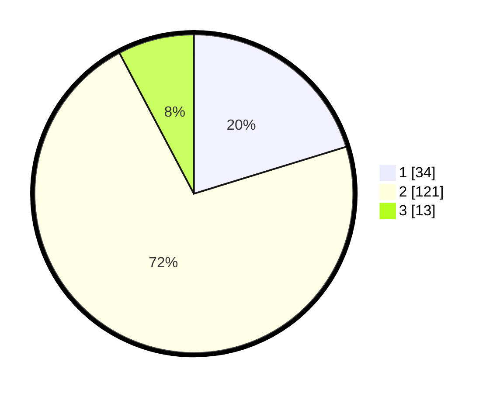

# Hasil

## Grafik

## Tabel

| No. | Nama Paslon    | Suara | Suara (raw) | Persentase |
|:--- |:-------------- | -----:| -----------:| ----------:|
| 1   | ANIES MUHAIMIN | 34    | [34][p-1]   | 20,24      |
| 2   | PRABOWO GIBRAN | 121   | [121][p-2]  | 72,02      |
| 3   | GANJAR MAHFUD  | 13    | [13][p-3]   | 7,74       |

[p-1]: https://github.com/gigit-pemilu/pemilu-2024-35-jawa-timur/blob/main/pilpres/hitung-suara/sub/35-jawa-timur/sub/09-jember/sub/24-pakusari/sub/2005-kertosari/sub/004-tps/sub/paslon-1.txt
[p-2]: https://github.com/gigit-pemilu/pemilu-2024-35-jawa-timur/blob/main/pilpres/hitung-suara/sub/35-jawa-timur/sub/09-jember/sub/24-pakusari/sub/2005-kertosari/sub/004-tps/sub/paslon-2.txt
[p-3]: https://github.com/gigit-pemilu/pemilu-2024-35-jawa-timur/blob/main/pilpres/hitung-suara/sub/35-jawa-timur/sub/09-jember/sub/24-pakusari/sub/2005-kertosari/sub/004-tps/sub/paslon-3.txt

## Foto C Plano

https://sirekap-obj-formc.kpu.go.id/c221/pemilu/ppwp/35/09/24/20/05/3509242005004-20240215-191121--96d17ed7-8ea4-46db-ae7d-e524041df304.jpg

https://sirekap-obj-formc.kpu.go.id/c221/pemilu/ppwp/35/09/24/20/05/3509242005004-20240215-110338--08c68d79-1ecd-445b-832c-beb6ce3a34bd.jpg

https://sirekap-obj-formc.kpu.go.id/c221/pemilu/ppwp/35/09/24/20/05/3509242005004-20240214-202832--e8c2a3cd-f4a7-4c46-b83d-be1046ac5ffb.jpg

## Metadata

| Key        | Value               |
| ---------- | ------------------- |
| Time Stamp | 2024-02-24 22:31:28 |

