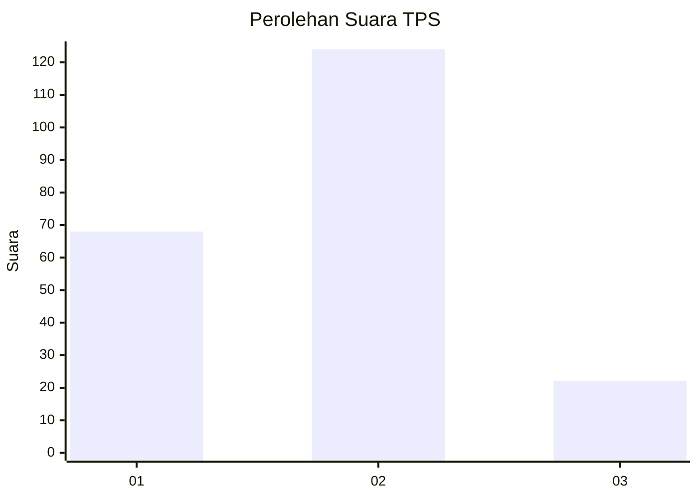
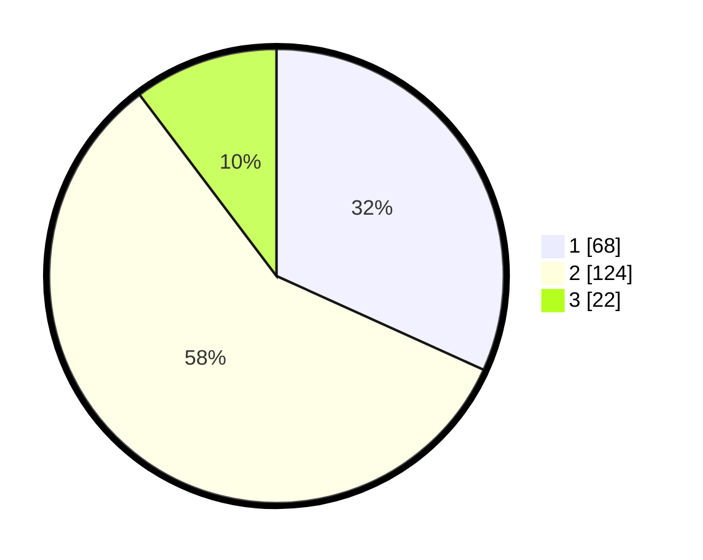

# Hasil

## Grafik

## Tabel

| No. | Nama Paslon    | Suara | Suara (raw) | Persentase |
|:--- |:-------------- | -----:| -----------:| ----------:|
| 1   | ANIES MUHAIMIN | 68    | [68][p-1]   | 31,78      |
| 2   | PRABOWO GIBRAN | 124   | [124][p-2]  | 57,94      |
| 3   | GANJAR MAHFUD  | 22    | [22][p-3]   | 10,28      |

[p-1]: https://github.com/gigit-pemilu/pemilu-2024/blob/main/pilpres/hitung-suara/sub/35-jawa-timur/sub/09-jember/sub/25-jelbuk/sub/2001-sucopangepok/sub/001-tps/sub/paslon-1.txt
[p-2]: https://github.com/gigit-pemilu/pemilu-2024/blob/main/pilpres/hitung-suara/sub/35-jawa-timur/sub/09-jember/sub/25-jelbuk/sub/2001-sucopangepok/sub/001-tps/sub/paslon-2.txt
[p-3]: https://github.com/gigit-pemilu/pemilu-2024/blob/main/pilpres/hitung-suara/sub/35-jawa-timur/sub/09-jember/sub/25-jelbuk/sub/2001-sucopangepok/sub/001-tps/sub/paslon-3.txt

## Foto C Plano

https://sirekap-obj-formc.kpu.go.id/050f/pemilu/ppwp/35/09/25/20/01/3509252001001-20240220-093200--a565d21a-f44f-450a-b074-d33239f317ea.jpg

https://sirekap-obj-formc.kpu.go.id/050f/pemilu/ppwp/35/09/25/20/01/3509252001001-20240220-093341--636ba983-3c5e-4830-bdf2-936e7933c681.jpg

https://sirekap-obj-formc.kpu.go.id/050f/pemilu/ppwp/35/09/25/20/01/3509252001001-20240220-094254--6fe84e0b-3ca9-464b-a4f5-aec28b159367.jpg

## Metadata

| Key        | Value               |
| ---------- | ------------------- |
| Time Stamp | 2024-02-25 13:00:00 |

